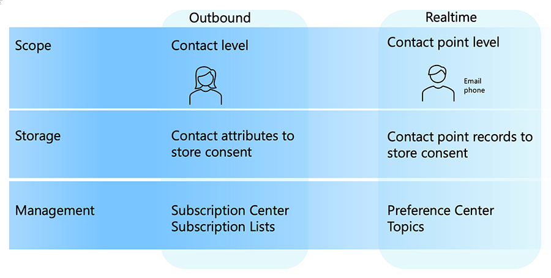
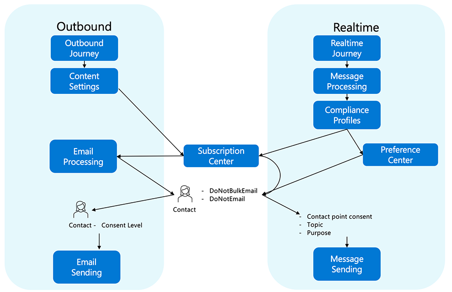
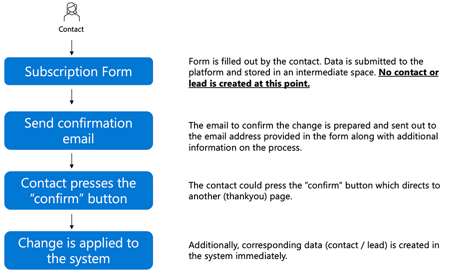
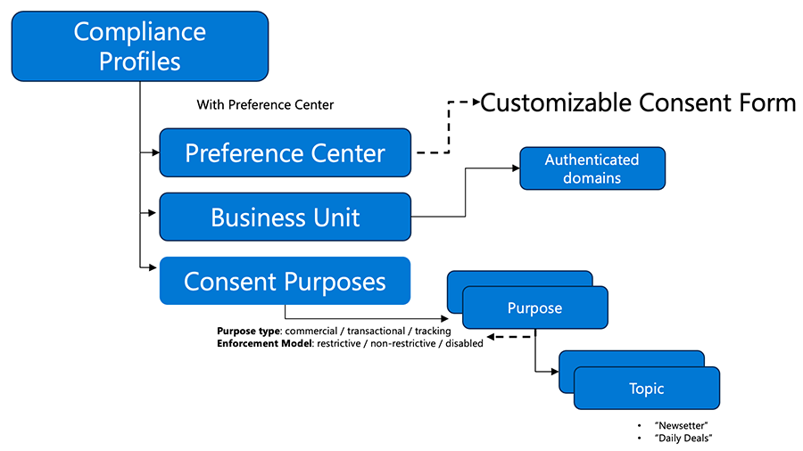
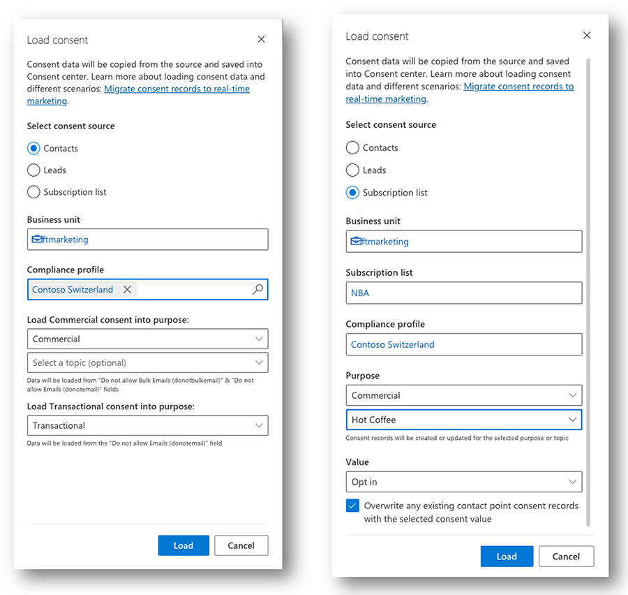

# Consent Management and double opt-in (DOI) - current situation and scenarios

Dynamics 365 Marketing – as any other Dynamics 365 first party app – is equipped with more functionality each month. We are in a situation where there are two engines available: Outbound Marketing and Realtime Marketing.
The two engines work differently so feature parity can come in different forms. In addition, real-time marketing is continuously evolving and some features in its roadmap correspond to aspects which today can only be achieved in outbound marketing.
When it comes to consent management and related topics, those two engines have their own concepts:

> [!div class="mx-imgBorder"]
> 

To determine if a message is sent out to a contact / lead, the following processing will take place.

In Outbound Marketing, the journey will verify the information within the indicated Content Settings to identify the relevant subscription center and use that information to start email processing. The system will then check the attributes **DoNotBulkEmail** and **DoNotEmail**  on the contact profile, before proceeding to an evaluation of the contact’s consent level versus the consent level indicated for the journey.
In Real-Time Marketing, the processing is different as the journey starts then, when a message is to be processed, it checks against the compliance profile selected for the message to be sent. RTM uses two types of profiles (Preference Center and Subscription Center) depending on the type of consent management page to be used in the message but in either scenario processing will then check the attributes **DoNotBulkEmail** and **DoNotEmail**  on the contact profile and then use to the information on the topic and purpose for the compliance profile to finish preparing and eventually send the message.

> [!div class="mx-imgBorder"]
> 

One key characteristic to note is that the use of Subscription Center (as the page where consent can be captured) and the use of the **DoNotBulkEmail** and **DoNotEmail** attributes on the contact profile is common to both Outbound and Real-Time Marketing is the same, making the transition easier from the former to the latter.
One important consideration with Outbound Marketing is that the consent given by a contact is tracked on contact level, which has the following consequences:

- it isn't possible to distinguish between two different marketing communications, for example for two different products.
- there was no support to manage consent for other channels within the product

The real-time Marketing module follows a different concept from the beginning, allowing marketeers to use channels other than Email, for example SMS or Push notifications. A contact (or lead) potentially can receive messages through those multiple channels and all these different contact points can have different consent preferences, for example contact allows commercial marketing via email, but doesn't want those messages via SMS.
As of today, both modules respect the settings on contact level in the attributes **DoNotBulkEmail** and **DoNotEmail** which reflect a general opt-in or opt-out (see also [Consent Preview](real-time-marketing-email-text-consent-preview.md)).

## Double opt-in and GDPR

In certain geographies, to be able to execute marketing campaigns and target customers, it is required that those customers agree (opt-in) to that communication.
According to [the general data protection regulation (GDPR)](https://gdpr-info.eu/), only a single opt-in is required to comply with this regulation. However, this is probably not the only one legislation that needs to be considered. Companies also have to comply with additional local regulations or internal policies that can be even more strict that GDPR (see also [Is double opt-in really required for email marketing in Germany? | Demodia](https://www.demodia.com/articles/data-processes/is-double-opt-in-really-required-for-email-marketing-in-germany)) and require a double opt-in.
Customers provide their consent typically via a form and a checkbox which explicitly needs to be checked by the customer to submit the form (single opt-in).
In situations where double opt-in is required, the submission of the form alone doesn't satisfy the privacy requirements. Companies are required to send a confirmation email that their customers must open and click on a confirmation link to verify that it was indeed their idea to opt-in.

> [!div class="mx-imgBorder"]
> 

With this process, also the corresponding marketing preferences attributes are updated (**DoNotBulkEmail** and **DoNotEmail**).

## Global vs. form-based opt-in

Management of DOI is currently only available in OBM. However, it is also possible to use real-time Marketing with the DOI settings in OBM. This means that customers can use RTM for the execution of their marketing campaigns, while using OBM to manage the double opt-in process. As we can see in the picture above, both engines evaluate marketing preferences attributes on contact level. [This article](https://community.dynamics.com/blogs/post/?postid=24df8cbc-5724-4734-b898-24cfe57d3c33) describes how to set everything up to use DOI in real-time marketing.
 When global DOI is enabled, a customer always receives an email message to confirm a new subscription or if a change of consent occurs. This could also be setup for specific forms only (vs. globally).

## Real-time Marketing enhancements to consent

Compliance Profiles summarize and bundle specific consent settings. There is always at least one Compliance Profile in the system. Compliance Profiles for RTM are linked to a Preference Center – a customizable form which provides the ability to change the consent settings.
Compliance Profiles allow an organization to define consent settings by using purposes. One compliance profile can contain different consent purposes which represent a reason for which consent is collected, typically **Commercial**, **Transactional** or **Tracking**. These are created by default when a new compliance profile is created.
For each purpose, it is also possible to define topics. Topics allow to further refine the communication preferences. For each commercial purpose it is possible to add general topics such as “Newsletter” or “Daily Deals”. Topics can be seen as a successor of subscription lists.
The following picture shows the connection between these entities.

> [!div class="mx-imgBorder"]
> 

It is possible for an organization to have multiple compliance profiles in place, for example for each subsidiary or country and each with different consent purposes.

## Scenarios

Now that we have discussed the differences between opt-ins and the capabilities in the product, let’s take a look at some scenarios and how compliance settings can be utilized.

### Migrate consent from OBM

The Real-time Marketing app stores the consent point consent information in the consent center which is available as a menu item in the app. 
To migrate consent settings from OBM, there is a **Load consent** button which will initiate a copy of the consent settings to the RTM consent center. With the enhanced options in RTM mentioned above, it is possible to copy the OBM consent information to a specific compliance profile and define to which commercial and transactional purpose the data should be copied. For the commercial purpose, it is also possible to optionally define a topic to store the consent for. This would result in a contact point consent record of type **topic** and could potentially be used to migrate a subscription list to a RTM topic.
This can be used for the following procedures:

1. copy contact consent to a specific purpose or topic for a purpose
1. copy lead consent to a specific purpose or topic for a purpose
1. copy the opt-in information of a subscription list to a purpose or a topic for a purpose
The following picture shows the different settings:

> [!div class="mx-imgBorder"]
> 

The **Load consent** function loads the data from the **DoNotBulkEmail** and **DoNotEmail** attributes for contact and lead consent. The function should be used when the contact point consent center should be populated because RTM relies on those settings. The function can also be used multiple times, for example if multiple subscription lists should be migrated to different topics in RTM.
See also: ce/marketing/real-time-marketing-migrate-consent
Because the contact point consent settings are only updated when using preference centers, OBM-related forms and pages to update consent should not be used once the migration has been done.

### Implement DOI and RTM at the same time and contact level consent is required

As mentioned above, DOI is currently supported only in OBM. The functionality will be implemented later in the year to be natively available in RTM. If possible, it would be best to wait for this functionality to become available natively in RTM.
If that is not an option, it is also possible to set up DOI in OBM and make use of those settings in real-time Marketing. In this scenario, it is very important that you understand how the two modules are working together:

1. Forms and DOI must be setup in outbound marketing.
1. If DOI is enabled on a (OBM) form, any contact that gets created won't actually be in the system until clicking the link in the confirmation email triggered by completing that form
  - That means that you can "trust" that a contact has double opted-in if they were created from a form that requires double opt-in. 
  - As part of the form, they could sign up for various subscription lists, or just have **DoNotBulkEmail** and **DoNotEmail** fields set to **0** (equals **Allow**), depending on whether the customer is using subscription lists
  - If subscription lists are used and the customer decides to opt into additional subscription lists via the Subscription Center and Global Double Opt-in is enabled, any changes a customer makes to join a new subscription list will trigger a confirmation email

3. RTM will respect the **DoNotBulkEmail** and **DoNotEmail** fields on the contact. 
1. If a customer unsubscribes from a subscription list that is used to create a segment in an RTM journey, the customer won't receive messages from the journey.
To use both modules at the same time is considered as a temporary solution until DOI becomes available natively in real-time marketing. 
There are situations where double opt-in is only required the first time. In this case, the setup is still the same as described above. In addition, it is possible to leverage RTM features like purposes and topics. It is possible to use the RTM Preference Center that allow customers to opt-in for new topics and in that case, the corresponding RTM email will not require a second (double) opt-in. 

### Use RTM and lead consent / manage consent on contact point level

In this scenario, RTM compliance settings must be used since contact point level consent is not available in OBM. Purposes and topics should be used to handle the consent. The process of creating the required artefacts is described here (link to “Manage user compliance settings in real-time marketing”). The **Load Consent** function in the RTM Consent center should be used to copy the required values from OBM.
Once the consent is available in RTM and contacts / leads are able to change their consent via a preference center, no OBM artefacts like forms should be used anymore. 

### Multiple brands and consent by topic

In this scenario, a customer has multiple brands, each one needing to capture consent for their own purposes and would like to have their own topics to which consumers would opt in/out. This can be achieved by creating multiple compliance profiles, one for each of the involved brands. Within the compliance profile, each brand could define their own topics that are appropriate for their communication. Once topics are set, they could be added to the brand’s preference center to allow customers to opt-in/out for the areas that are of interest.  

### Operating in multiple countries and / or requiring preference center in multiple languages 

Similar to the multiple brand scenario but in this scenario the company is looking to structure around the multiple geographies it may operate in rather than by the brands it markets it’s products. This woo can be addressed with multiple compliance profiles created for each country. Once defined, each compliance profile would have its own preference center page, with content written in the appropriate language and reference the appropriate supporting material.