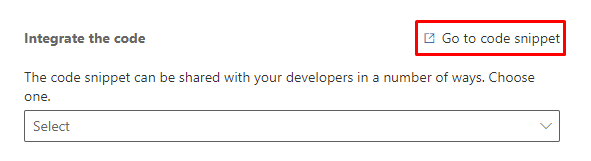

# Use binding IDs to correlate across triggers

[!INCLUDE[consolidated-sku-rtm-only](../includes/consolidated-sku-rtm-only.md)]

For trigger-based, repeatable journeys, a customer can repeat a journey without having completed the previous run. For example, consider a journey that sends appointment confirmations and reminders. When a person registers for their first appointment, they enter the journey and receive a confirmation. They'll continue to wait in the journey until they receive a reminder a day before the appointment. During this time, the same person could register for a second appointment. The journey participant will start the same journey a second time for the second appointment. In other words, the same person is now going through two instances of the same journey.

In such a situation, if the journey participant cancels one of the appointments, they should exit only the journey associated with the canceled appointment. For example, if they cancel the first appointment, they should exit the journey associated with the first appointment but continue the journey associated with the second appointment. If you're using out-of-the-box Dataverse-based events, then the behavior is automatic and no other action is needed. However, if you're using custom triggers, you must configure the trigger to correctly identify the specific instance of the journey that the trigger must be associated with.

## Using the *bindingId* attribute to uniquely identify each instance of the journey

Every custom trigger has an optional *bindingId* attribute that can be used to bind the trigger to specific instances of a journey. When the *bindingId* attribute isn't present, the trigger will act on all instances of the journey that the person is participating in. For example, if the person has registered for two appointments but cancels one, and if the canceled trigger didn't use a *bindingId*, then that person will exit both instances of the journey. If you intend to use triggers in repeatable journeys, it's highly recommended that you include a *bindingId* in the trigger.

When the trigger that starts a journey contains a *bindingId*, that ID is used to identify the journey instance. To identify the journey instance, any other event should use the same *bindingId*. The format for the *bindingId* is as follows: ``{entityType}/{entityId}``. For example, if your start event is an Appointment entity called *Appointment Confirmed* and it has a entityId of “123,” the *bindingId* would be ``Appointment/123``. Your exit event *Appointment Canceled* should be of the same entity type and should use the same *bindingId* (``Appointment/123``) to uniquely identify the journey instance.

If you're only using custom triggers in the journey, you can rely on unique strings to identify the journey instances.

> [!NOTE]
> A custom trigger will act on all instances of a journey that someone is participating in if the *bindingId* is missing *or* if the binding is for a different entity type.

## Correlate across custom triggers and out-of-the-box events or custom business events

If you want to use a combination of custom triggers and out-of-the-box or custom business events, *bindingId* uses special formatting to uniquely identify the Dataverse table and row. For example, your journey could start with the out-of-the-box event *Opportunity Created*. You could then use a custom trigger called *Opportunity Won* for the exit event. The custom trigger *Opportunity Won* must contain a *bindingId* that follows the pattern of the *Opportunity Created* event to uniquely identify each instance.

Whenever a journey is started by an out-of-the-box or custom business event, each instance of the journey can be uniquely identified by the pattern ``{entityType}/{unique row ID}``. This pattern must be included in the *bindingId* attribute of any custom trigger to correlate across custom triggers and out-of-the-box or custom business events.

In the case of the *Opportunity Won* custom trigger, the *bindingId* could be:

- *bindingId* = ``opportunity/{unique ID of the opportunity row}``

If custom triggers follow the *bindingId* pattern described above, they can be used to identify the exact journey instance, even when used with other business events. When the *bindingId* is implemented, it acts on all instances of the journey.

> [!NOTE]
> The binding only works across the same entity types.

## How to add a *bindingId* to a custom trigger

You can modify the *bindingId* attribute in the code snippet for a custom trigger.

To access the code snippet for an existing custom trigger:

1. Go to **Real-time marketing** > **Engagement** > **Triggers**.
1. Select the custom trigger you want to add a *bindingId* to.
1. Select **Go to code snippet**.
    > [!div class="mx-imgBorder"]
    > 
1. Copy the snippet and paste it into your code editor of choice. Modify the *bindingId* attribute following the formats mentioned above (a unique string if you're using it only with custom triggers or ``{table_name}/{unique row ID}`` when correlating across custom triggers and out-of-the-box events or custom business events).

You can follow the same steps to add a *bindingId* when creating a new custom trigger.

## *bindingId* interpretation
The `/` character is reserved. It's always assumed that the *bindingId* is in a `/` separated format and any leading or trailing `/` will be removed. Also, there's no `/` in the result. The app always tries to interpret it in this ``{entityType}/{entityId}`` fashion.

Examples:
```
"A/B"
will be interpreted as 
{entityType = "A"}/{entityId = "B"}
```
```
"A"
will be interpreted as 
{entityType = ""}/{entityId = "A"}
```
```
"A/B/C" 
will be interpreted as 
{entityType = "AB"}/{entityId = "C"}
```
```
""
will be interpreted as 
{entityType = ""}/{entityId = ""}
```
```
"A/B/"
will be interpreted as 
{entityType = "A"}/{entityId = "B"}
```
```
"///A/B////"
will be interpreted as 
{entityType = "A"}/{entityId = "B"}
```

## Comparison algorithm:
```
[Case 0] trigger has bindingId = "", meaning no restriction at all
    Always resume.
[Case 1] entityType matches, and entityId matches:
    Resume.
[Case 2] entityType matches, but entityId doesn't match:
    No resume.
[Case 3] entityType doesn't match trigger:
    It doesn't make sense to apply binding, so we fall back to what we have now and let it resume the journey instance. 
```
Examples: 
```
Trigger event: "incident/000"
Resume event: "incident/000"
Result: Case 1 resume
```
```
Trigger event: "incident/000"
Resume event: "incident/001"
Result: Case 2 no resume
```
```
Trigger event: "incident/000"
Resume event: "opportunity/001"
Result: Case 3 resume
```
```
Trigger event: "incident/000"
Resume event: "opportunity/000"
Result: Case 3 resume
```
```
Trigger event: "incident/000"
Resume event: "random string"
Result: Case 3 resume
```
```
Trigger event: "random string"
Resume event: "random string"
Result: Case 1 resume
```
```
Trigger event: "random string 1"
Resume event: "random string 2"
Result: Case 2 no resume
```
```
Trigger event: "random string 2"
Resume event: ""
Result: Case 2 no resume
```
```
Trigger event: ""
Resume event: ""
Result: Case 0 resume
```
```
Trigger event: ""
Resume event: "incident/000"
Result: Case 0 resume
```
```
Trigger event: "incident/000"
Resume event: ""
Result: Case 3 resume
```

[!INCLUDE[footer-include](../includes/footer-banner.md)]
