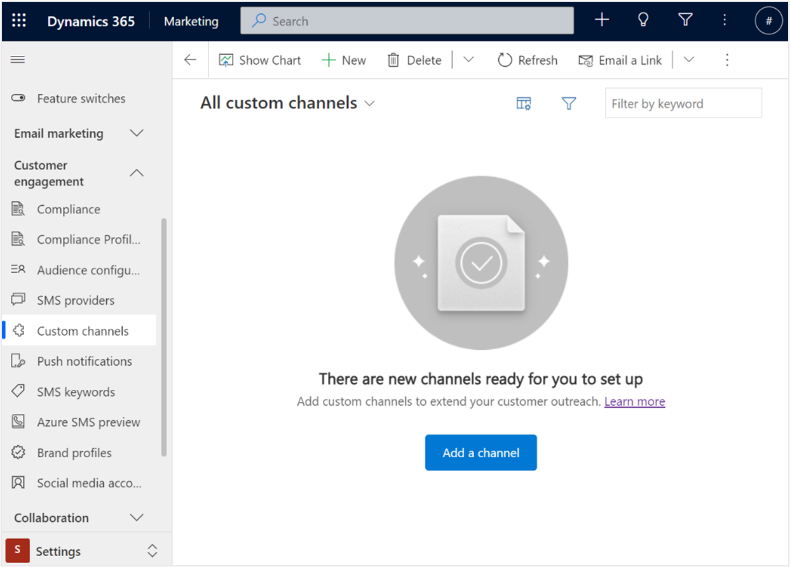
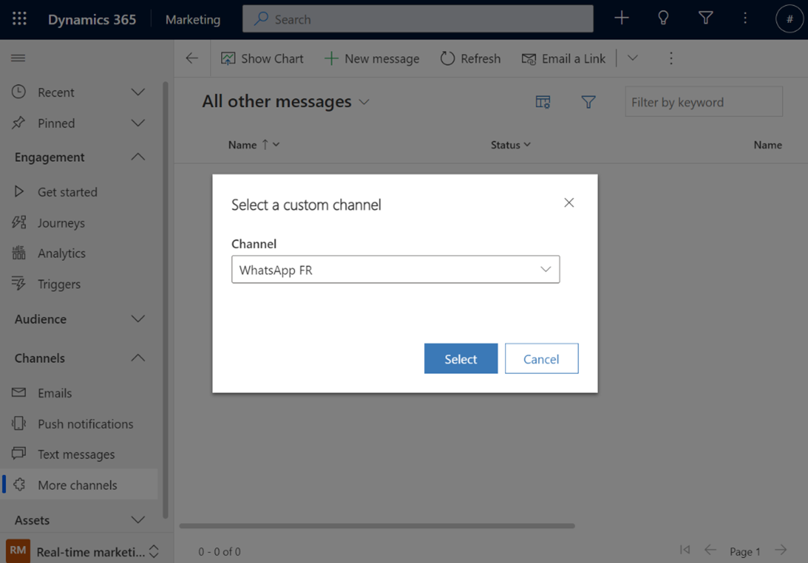
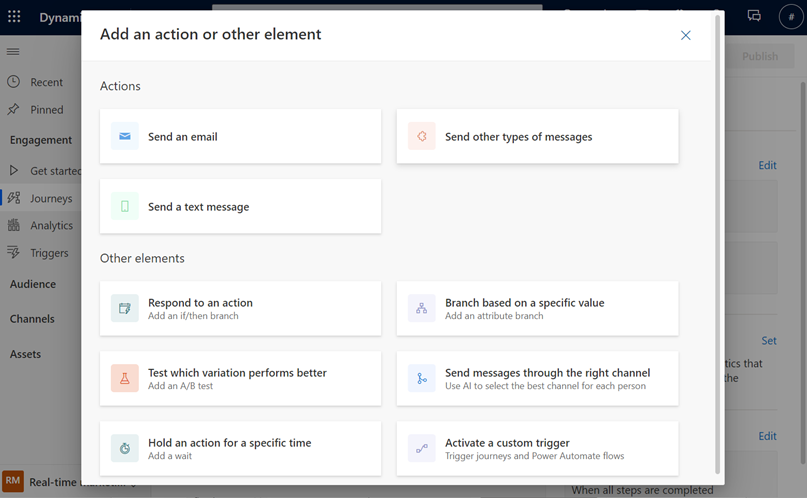

# Preview: Create custom channels in real-time marketing

> [!IMPORTANT]
> A preview feature is a feature that is not complete, but is made available before it’s officially in a release so customers can get early access and provide feedback. Preview features aren’t meant for production use and may have limited or restricted functionality.
> 
> Microsoft doesn't provide support for this preview feature. Microsoft Dynamics 365 Technical Support won’t be able to help you with issues or questions. Preview features aren’t meant for production use, especially to process personal data or other data that are subject to legal or regulatory compliance requirements.

This article details how to extend real-time marketing using the communication channels you're familiar with to engage your customers in moments that matter. Use real-time marketing personalization, consent, and analytics tools to create compelling content and deliver it over your preferred communication channels such as a local SMS provider or WhatsApp. Capitalize on proven channels, plug any of them into your new or existing journeys, and unfold their true potential with Dynamics 365 Marketing to maximize customer engagement.

## Install a custom channel app

To create a new custom channel, begin by first installing the corresponding custom channel app.

There are two ways to install a custom channel app:

1. Manually create and install the package. Learn more: [Manually add a custom channel](/developer/real-time-marketing-extend-outreach-custom-channels).
1. Install the package through AppSource if the app is listed by your service provider.

## Create a new custom channel

1. After installing the corresponding custom channel app, start the custom channel creation process by going to  **Settings** > **Custom channels**.

    > [!div class="mx-imgBorder"]
    > 

1. Select **+New channel** (or **Add a channel** if you have no custom channels created yet).
1. Select the custom channel app you want to use to create your new channel.
1. Enter all the details required to connect the channel.
1. Review and finish the setup.

## Create a custom channel message

To create a new custom channel message for an existing channel, go to **Real-time marketing** > **Channels** > **More channels**.

> [!div class="mx-imgBorder"]
> 

To create a new message:

1. Select **+New message**.
1. Select the custom channel you’d like to create a message for.
1. Use the editor to add your message content.
1. Select **Save** to save a draft or **Ready to Send** if your message is ready.

## Use a custom channel in journeys

You can use custom channel messages in customer journeys the same way you would use an email or text message template.

To add a custom channel message action:

1. Select the **+** button on the canvas and choose the **Send other types of messages** action.

    > [!div class="mx-imgBorder"]
    > 

2. Select the custom channel and the relevant message you want to send in the right pane.

    > [!div class="mx-imgBorder"]
    > 
