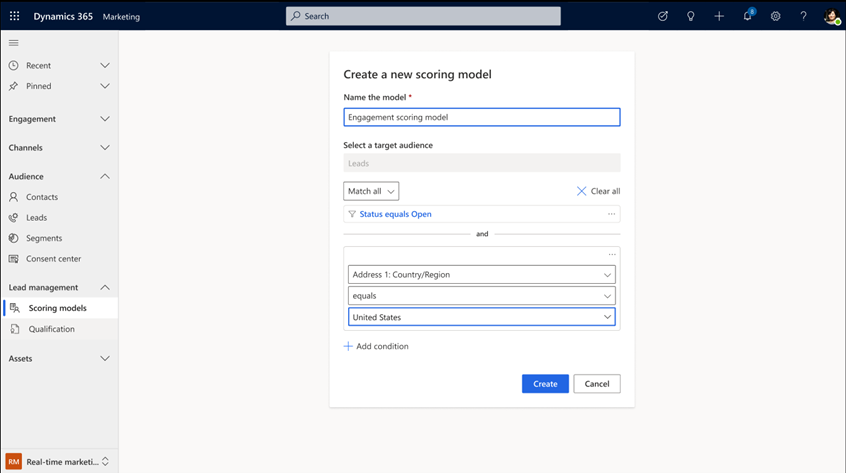
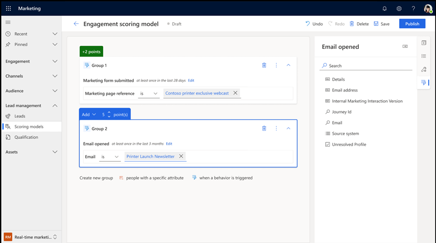
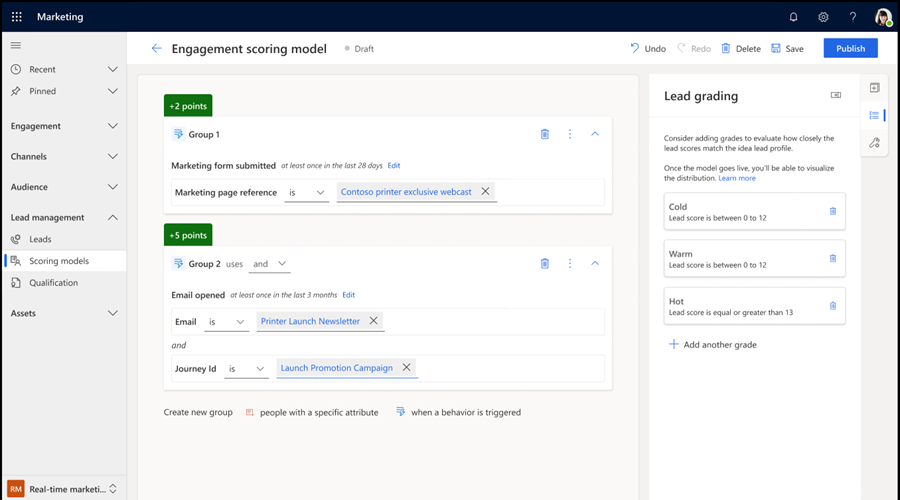

# Create scoring models

To maximize return on investment from marketing activities, it's essential to identify the best prospects at the right moment. With real-time marketing, you can use a new but powerful lead scoring builder to define your scoring criteria and model more efficiently. Dynamics 365 Marketing scores leads using demographic attributes and interactions. An entity who meets your target demographic profile and has interacted with your marketing materials (for example, by opening emails, registering for downloads, browsing your website, or attending an event) will get a high score, provided you've set up your scoring model correctly.  

This article covers the experience of creating a scoring model.

> [!IMPORTANT]
> Automatic scoring models can introduce data privacy issues. It is your organization's responsibility to ensure that it's operating in full compliance with all relevant data privacy regulations when you use lead scoring and all other features of Dynamics 365 Marketing. More information: [Data protection and privacy](privacy.md)  

## Enable the feature

To use scoring models, an administrator needs to enable the feature switch in the settings. To enable the feature:
1. Go to **Settings** > **Overview** > **Feature switches**.
1. Enable the **Lead Management** feature switch and select **Save** in the upper right corner.

Once the feature switch is enabled, a new feature appears on your Dynamics 365 real-time marketing navigation bar at **Lead management** > **Scoring models**.

## Create a new scoring model

To create a new scoring model:
1. Go to **Lead Management** > **Scoring Models**. Here, you see a list of all your models.
1. To start creating a new scoring model, select the **New** button.
1. Provide a name for the model. After naming the model, you can specify conditions to target a specific audience and avoid generating extra scores that aren't needed. Conditions are based on attributes of the audience entity, in this case lead attributes. For example, you can set a condition to target leads from a specific country.
1. When you're ready to start building your model, select the **Create** button.

> [!div class="mx-imgBorder"]
> 

> [!NOTE]
> The scoring model will initially target only lead entities. In the future, the feature will expand to support other entities as well. Stay tuned for updates and enhancements to the scoring model capabilities.

## Build conditions for your scoring model

After selecting the **Create** button, you'll be directed to the model builder experience. On the right-side of the builder interface, you'll see the data to start building your conditions. Data includes **Attributes** and **Interactions**. Attributes refer to demographic information. These attributes come from the entity being scored or related tables to the entity, such as contacts or accounts. The next section of this article goes deeper into related tables. Interactions represent engagements or activities.

To create a new condition, start by selecting attributes or interactions on the right. For example, to create a new condition for customers reviewing emails, go to **Interactions** and select **Emails opened**. The condition is added to the center of the screen. Now, you can define how many points a customer would get by fulfilling this condition (points can be negative or positive). For this condition, you can also define the volume of emails (example: at least five emails) and timeframe (example: in the last 28 days) by selecting **Edit** in the condition. You further refine the condition by leveraging interaction metadata, such as the specific email asset. Once your condition is ready, you can continue adding new groups by selecting the **Create new group** option.

> [!div class="mx-imgBorder"]
> 

> [!NOTE]
> As of July 2023, you can only use Dynamics 365 standard interactions to create conditions.

## Create a demographic condition using related tables

As mentioned above, you can also build more complex queries that reference other tables (such as "Event Registration" or "Account") to improve your scoring model. When adding an attribute that relates to a different table, you can search for the attribute, define how the two tables are related, and use the related table in your scoring model.

## Grade your leads

Scores help identify the best customers, however, not everyone in your organization will easily understand what a good or poor score is. To solve this, you can assign a grade. To do this, select the second option on the vertical bar on the right of the window and add a new grade. You can add multiple grades, but for each grade you must name the grade (example: Hot or Cold), define the operator (such as less than, more than, or between), and define the score range that applies to that grade (example: 0 to 12 points). Once you publish your model, leads are scored but also assigned a grade. As a reminder, grades aren't mandatory and you can publish the model without defining any grades.

> [!div class="mx-imgBorder"]
> 

## Review scoring model settings

The third option in the vertical bar on the right of the window allows you to access the model settings. Here, you can visualize the entities getting scored, modify the conditions initially defined in the entry card, and view the Business Unit the model is scoring (in case it applies). If you're working within a Business Unit, then the model will score only leads from that Business Unit. You'll also be able to decide if you want to leverage parent contact interactions or just lead interactions. More information on this in the next section.

## Leverage parent contact interactions in your scoring model

> [!IMPORTANT]
> If you've been using outbound marketing and want to start using real-time scoring models, remember that your interactions are likely stored at contact level. Thus, when you start using real-time marketing lead scoring you'll need to consider parent contact interactions.

Real-time marketing allows you to market directly to leads without the need for a parent contact. Outbound marketing, on the other hand, markets only to contacts and requires that all leads have a parent contact. Marketing to leads offers extra flexibility but also changes how interactions are stored.
1. **Outbound marketing**: All interactions are stored at the contact level.
1. **Real-time marketing**: Interactions can be stored at the lead level if you market to leads (example: a lead journey), or at the contact level if you market to contacts.

Real-time marketing scoring models empower you to decide whether parent contact interactions should be accounted for in the scoring model. To do this, go to **Settings** on the right bar when creating a scoring model and select “Count parent contact interactions.” If the option is selected, the model considers all interactions for the lead entity and the respective parent contact entity, otherwise just the lead entity.

## Publish a scoring model and start calculating scores

Once your model is ready, select **Publish** to start calculating scores. You'll still be able to view the conditions but you won’t be able to modify any of them. Depending on the volume of leads and complexity of the model, the amount of time to calculate scores varies.