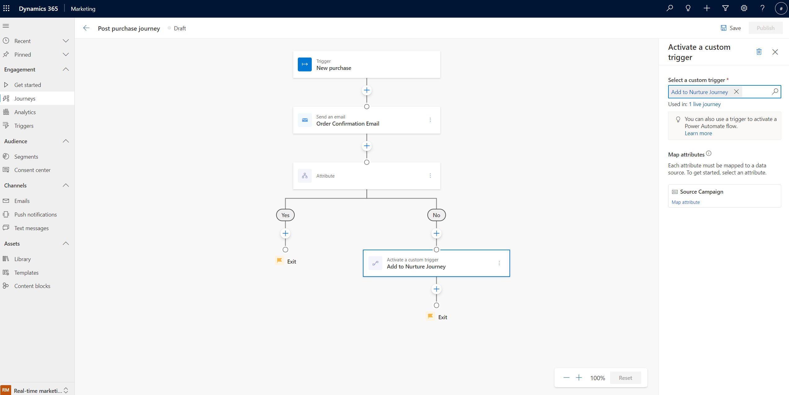
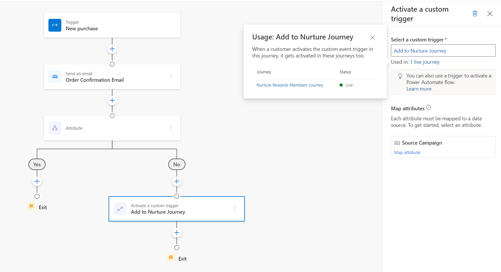
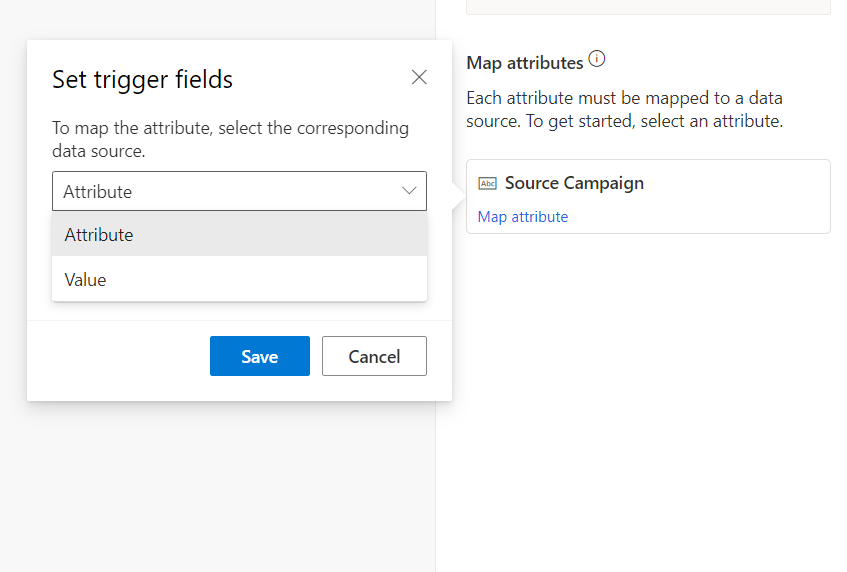
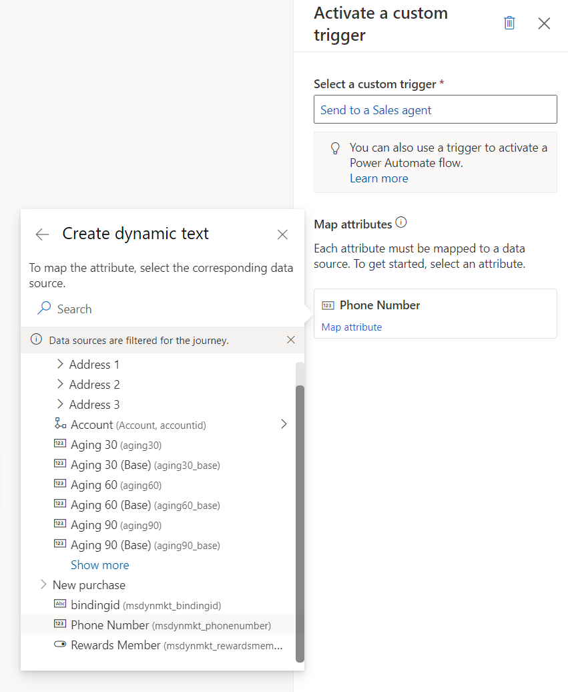
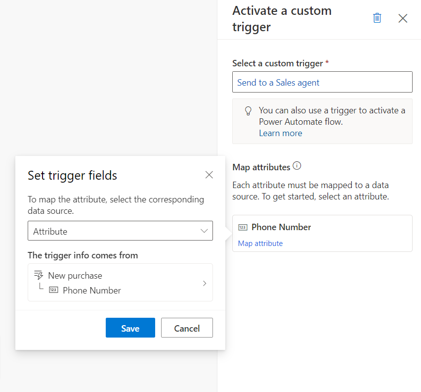
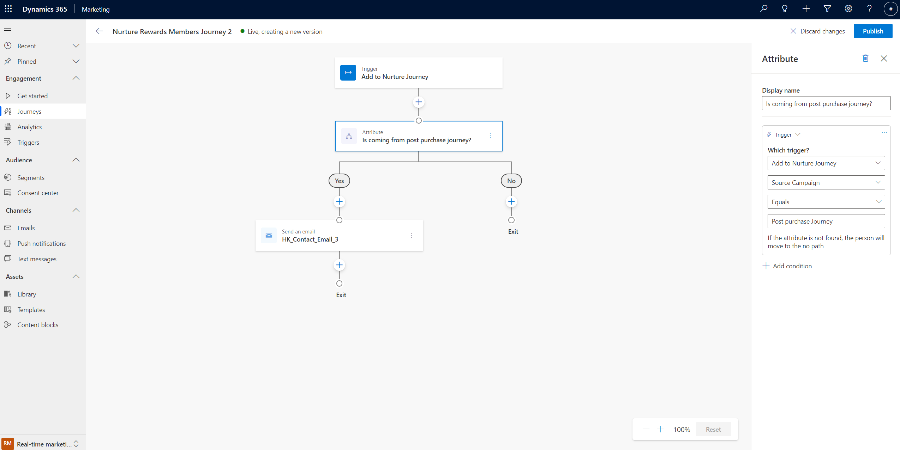
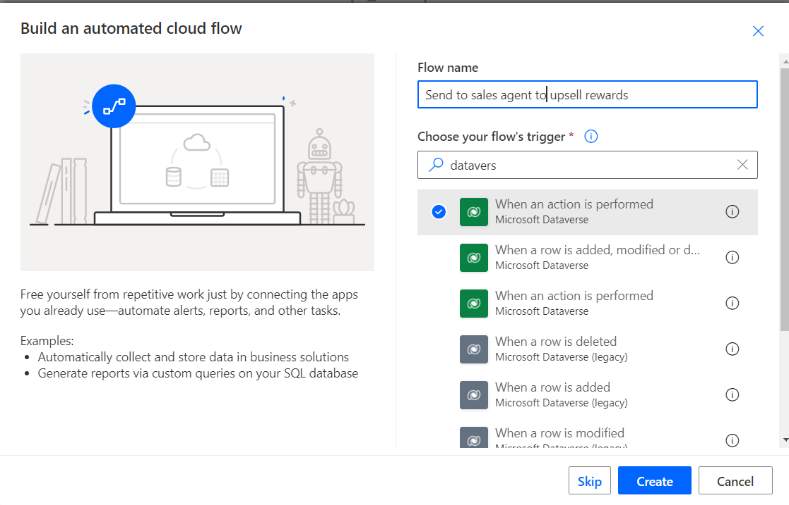
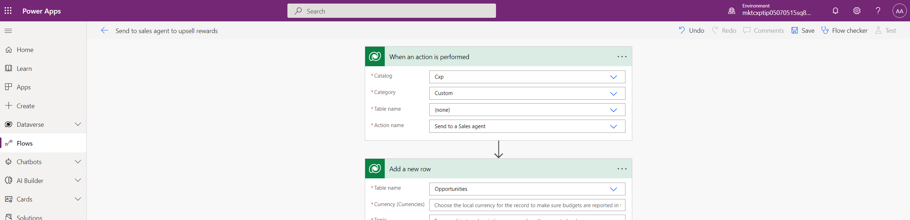

# Raise triggers from a journey to run another journey or Power Automate flow

Based on the unique needs of your business, you may want to trigger custom processes or Power Automate flows at certain points in a customer journey. Or, you might want to create multiple journeys that logically function together. Triggering custom actions allows you to accomplish these tasks, working as the glue between journeys, or between journeys and custom processes.

Here are some examples of where you might trigger custom actions:

1. You’re engaging customers so that they can purchase a subscription, but if they don’t do so by the end of the customer journey, you need to add them to a nurture journey. You can route the customers by activating a custom trigger from the subscription journey and using that as the entry trigger from the nurture journey.
1. A loan application journey has various steps that require a human agent’s approval. By creating a separate customer journey or Power Automate Flow for loan exception approval, you can trigger it from various points in the loan application journeys where exceptions can occur by activating the custom trigger.
1. You need to engage customers through another application or channel, such as Microsoft Teams, which has a Power Automate connector. You can create a Power Automate flow using this connector and have it start using the custom trigger that you can activate from relevant points in your journey.
1. You need to create Dynamics 365 activities (such as a sales call or service tickets) from any point in the customer journey. By activating a custom trigger, you can trigger a Power Automate flow that creates these activities on behalf of the journey.

To learn more about creating custom triggers, see [Create custom triggers in real-time marketing](real-time-marketing-custom-triggers.md).

## Launch an action outside of a journey using a custom trigger

Let's say you create a journey with the goal of nurturing shoppers who have made purchases and building loyalty with first time shoppers. Shoppers enter the journey when they’ve made a purchase from an online store and you want to respond to them using the relevant purchase data. This journey uses an **Attribute** tile that sends customers to the **Yes** branch if they’re a new shopper and the **No** branch if they’re a current shopper or rewards member. Each branch contains a custom trigger that fulfills a specific task.

Given Customer 1 and Customer 2, here’s how the custom triggers work in the journey:

*Customer 1: Enters the journey as an existing rewards member and proceeds to the **No** branch of the attribute tile. Since this shopper is an existing rewards member, you simply want to continue nurturing them. The **No** branch contains a custom trigger that sends Customer 1 to a separate journey designed to nurture rewards members.*

*Customer 2: Enters the journey as a new shopper and proceeds down the **Yes** branch of the attribute tile. In the **Yes** branch, you want to send the shopper to a human agent who can talk to the shopper about becoming a loyalty member by getting a branded credit card. This is enabled by using a custom trigger that you've connected to a Power Automate flow. Through this flow, you're routing the shopper to an agent.*

Setting up a custom trigger action requires three steps: selecting a custom trigger, understanding the selected trigger usage, and mapping the attributes.

### 1. Select a custom trigger

After placing a **Custom trigger** tile on the journey canvas, select which custom trigger will be activated when a customer reaches this point in the journey.

> [!div class="mx-imgBorder"]
> 

### 2. Understand the selected trigger usage

After you select the custom trigger, the current usage of the custom trigger in all journeys will be displayed in **Used in:** field in the properties pane. By selecting the **Used in:** link, you’ll be able to see all journeys and corresponding states that use the same custom trigger.

> [!div class="mx-imgBorder"]
> 

> [!NOTE]
> Power Automate flows that reference the custom event are not tracked or displayed here.

> [!TIP]
> Live journeys displayed in the **Used in:** menu will activate the same custom trigger when a customer reaches this tile in the respective journeys. This will trigger other journeys using the same custom trigger as an entry trigger. It will also trigger steps in other journeys that reference the custom trigger, for instance, the if/then branches, exit conditions, or goals.

### 3. Map attributes

When a customer reaches this stage of the journey, the custom trigger activated needs to know where to get the customer information that it will carry. The **Map attributes** shown in the custom trigger side pane allow you to set/populate the trigger fields in two ways:

1. **Specify a fixed value:** In the example here, you can pass the name of the source journey that's activating the custom trigger and, in turn, send the shopper to the nurture journey connected to that custom trigger. This is shown in the screenshot below.

      > [!div class="mx-imgBorder"]
      > 

      > [!div class="mx-imgBorder"]
      > 

    Passing the name of the source journey allows the nurture journey to do journey filtering/branching and take specific steps when being activated by a post-purchase journey (versus when being activated by other sources). This is discussed further below in the [Using custom triggers to activate chained journeys](real-time-marketing-custom-actions.md#using-custom-triggers-to-activate-chained-journeys) section.

2. **Specify a value using a field from the customer profile or another trigger in the journey:** To illustrate this approach, let's assume you want to activate another custom trigger to send shoppers to a human agent in the "No" branch of the journey ("Send to a Sales agent" in the screenshot below). With this trigger, we also want to pass on relevant customer details to the human agent so that they can have all the context for the call. Since the customer data will be different for each specific shopper going through the journey, the above approach of specifying a fixed value can't be used. In this case, the mapping step can be done using the attribute option, where attribute refers to a field from the customer profile or from an existing trigger in the journey. You're able to see all these fields in the flyout that appears when you select the **Attribute** mapping option. You can then search for the relevant fields. 

    In the example shown in the screenshot below, you can map the phone number from the customer profile to the "Phone number" field of the custom trigger:

      > [!div class="mx-imgBorder"]
      > 

      > [!div class="mx-imgBorder"]
      > 

> [!NOTE]
> Custom trigger attributes are data-type-specific. So you can only map, for instance, a numeric field from the customer profile into the phone number field of the custom trigger (since the field is of type "Number").

## Using custom triggers to activate chained journeys

Custom triggers that are activated in one journey (as done above) can then trigger other journeys (when they're used as triggers for those journeys) or trigger other journey steps (when they're used for if/then branches, exit criteria, etc.). Continuing with the example here, the "Yes" branch of the post-purchase journey is sending the shopper (an existing loyalty member) to a nurture journey using the "Add to Nurture Journey" custom trigger.

The screenshot below illustrates how the nurture journey is set up using the "Add to Nurture Journey" custom trigger. It also shows how the nurture journey is able to read the "Source Campaign" field that was part of the custom trigger (that was set to a fixed value of "Post purchase journey"). Using this field, you can branch the journey to provide a specific kind of a nurture treatment when shoppers come through the post purchase journey.

> [!div class="mx-imgBorder"]
> 

## Trigger Power Automate flows from real-time marketing journeys

Custom triggers activated through a customer journey can also trigger Power Automate flows. In the example used here, the shopper is routed to a human agent via a Power Automate flow. This flow creates a phone call activity for sales agents using Dynamics 365 Sales. The sales agents then can be alerted that a new shopper needs to be called so that they can be made aware of the loyalty program. 

To use a custom trigger with a Power Automate flow, navigate to [Power Apps Portal](http://make.powerapps.com):

> [!IMPORTANT]
> Ensure that you're using the same **environment** in Power Automate as you are for your Dynamics 365 Marketing application. The environment can be viewed and switched in the top right corner of the Power Apps navigation bar (shown at the top of the screenshots in this section).
    
1. Create a cloud flow that starts with **When an action is performed (Microsoft Dataverse)**. 

      > [!div class="mx-imgBorder"]
      > 

2. Fill in the required fields as follows:
    - Set Catalog to "Cxp"
    - Set Category to "Custom"
    - Set Table name to "(none)"
    - Set Action name to the name of the custom trigger you activated in your customer journey--in this example, the name of the custom trigger is "Send to Sales agent"

3. Start adding the subsequent step to the flow. In each of these steps, you can use the data fields that came with the custom trigger. In this example, the phone number field mapped in the earlier steps will be available in all the steps of this flow.

      > [!div class="mx-imgBorder"]
      > 

> [!IMPORTANT]
> All attributes must be defined to perform the trigger successfully.

> [!TIP]
> If you can't find your custom trigger name in the **Action name** list, go to **Real-time marketing** > **Triggers**, select the custom trigger you want to use, then select **Go to code snippet**. The trigger name (beginning with "msdynmkt") is shown in the first line of the code.

To learn more about this [Dataverse connector](/power-automate/dataverse/overview) action, see [Trigger flows with actions](/power-automate/dataverse/action-trigger).
