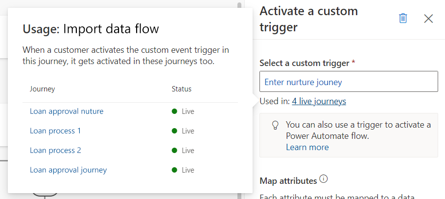

# Preview: Trigger an action outside of a journey

> [!IMPORTANT]
> A preview feature is a feature that is not complete, but is made available before it’s officially in a release so customers can get early access and provide feedback. Preview features aren’t meant for production use and may have limited or restricted functionality.
> 
> Microsoft doesn't provide support for this preview feature. Microsoft Dynamics 365 Technical Support won’t be able to help you with issues or questions. Preview features aren’t meant for production use, especially to process personal data or other data that are subject to legal or regulatory compliance requirements.

Based on the unique needs of your business, you may want to trigger custom processes or Power Automate flows at certain points in a customer journey. Or, you might want to create multiple journeys that logically function together. Triggering custom actions allows you to accomplish these tasks, working as the glue between journeys, or between journeys and custom processes.

Here are some examples of where you might trigger custom actions:

1. You’re engaging customers so that they can purchase a subscription, but if they don’t do so by the end of the customer journey, you need to add them to a nurture journey. You can route the customers by activating a custom trigger from the subscription journey and using that as the entry trigger from the nurture journey.
1. A loan application journey has various steps that require a human agent’s approval. By creating a separate customer journey or Power Automate Flow for loan exception approval, you can trigger it from various points in the loan application journeys where exceptions can occur by activating the custom trigger.
1. You need to engage customers through another application or channel, such as Microsoft Teams, which has a Power Automate connector. You can create a Power Automate flow using this connector and have it start using the custom trigger that you can activate from relevant points in your journey.
1. You need to create Dynamics 365 activities (such as a sales call or service tickets) from any point in the customer journey. By activating a custom trigger, you can trigger a Power Automate flow that creates these activities on behalf of the journey.

To learn more about creating custom triggers, see [Create custom triggers in real-time marketing](real-time-marketing-custom-triggers.md).

## Launch an action outside of a journey using a custom trigger

Let's say you create a journey with the goal of nurturing customers who have made purchases. Customers enter the journey when they’ve made a purchase from an online store and you want to respond to them using the relevant purchase data. This journey uses an **Attribute** tile that sends customers to the **Yes** branch if they’re a new customer and the **No** branch if they’re a current customer or rewards member. Each branch contains a custom trigger that fulfills a specific task.

Given Customer 1 and Customer 2, here’s how the custom triggers work in the journey:

*Customer 1: Enters the journey as an existing rewards member and proceeds to the **No** branch of the attribute tile. The **No** branch contains a custom trigger that sends Customer 1 to a separate journey designed to nurture rewards members.*

*Customer 2: Enters the journey as a new customer and proceeds down the **Yes** branch of the attribute tile. In the **Yes** branch, they reach a custom trigger that you've connected to a Power Automate flow. Because the customer has never made a prior purchase, you want to pre-fill relevant information about the customer using the purchase data. The flow assigns a rewards number to the customer if there’s a valid phone number provided at the time of registration.*

Setting up a custom trigger action requires three steps: selecting a custom trigger, understanding the selected trigger usage, and mapping the attributes.

## 1. Select a custom trigger

After placing a **Custom trigger** tile on the journey canvas, select which custom trigger will be activated when a customer reaches this point in the journey.

## 2. Understand the selected trigger usage

After you select the custom trigger, the current usage of the custom trigger in all journeys will be displayed in **Used in:** field in the properties pane. By selecting the **Used in:** link, you’ll be able to see all journeys and corresponding states that use the same custom trigger.

> [!div class="mx-imgBorder"]
> 

> [!NOTE]
> Power Automate flows that reference the custom event are not tracked or displayed here.

> [!TIP]
> Live journeys displayed in the **Used in:** menu will activate the same custom trigger when a customer reaches this tile in the respective journeys. This will trigger other journeys using the same custom trigger as an entry trigger. It will also trigger steps in other journeys that reference the custom trigger, for instance, the if/then branches, exit conditions, or goals.

## 3. Map attributes

When a customer reaches this stage of the journey, the custom trigger activated needs to know where to get the customer information. The **Map attributes** shown in the custom trigger side pane allow dynamic mapping for the information sent in the trigger action.

To map each attribute, select the attribute, then select the data field that the trigger data comes from. After you map the data, select **Save** for each attribute.

> [!NOTE]
> Custom trigger attributes are data-type-specific.

## Trigger Power Automate flows from real-time marketing journeys

Custom triggers activated through a customer journey can also trigger Power Automate flows.

To use a custom trigger with a Power Automate flow:

1. Create a cloud flow that starts with a change to a Dataverse table, such as **When a row is added, modified or deleted**. Fill in the relevant **Change type**, **Table name**, and **Scope**.
1. The custom trigger in Dynamics 365 Marketing is actually an "unbound action," so you'll want to add an action to your flow to **Perform an unbound action**.
1. In the **Action name** field, choose your custom trigger. The format for your trigger name will be *mdynmky_yourtriggersnamewithoutspaces*.
1. After the custom trigger loads, the attributes you defined in the Marketing app will appear.

    >[!NOTE]
    > In addition to the attributes you defined, you will see the following:
    > - msdynmkt_signaltimestamp: The time the trigger was sent to the client.
    > - msdynmkt_signalingestiontimestamp: The time the trigger data was ingested.
    >     - Set these attributes to **utcNow()** or any date/time of your choosing.
    > - msdynmkt_signaluserauthid: Set to the Contact ID.
    > - msdynmkt_profileid: Set to the Contact ID.

    > [!IMPORTANT]
    > All attributes must be defined to perform the trigger successfully.

    > [!TIP]
    > If you can't find your custom trigger name in the **Action name** list, go to **Real-time marketing** > **Triggers**, select the custom trigger you want to use, then select **Go to code snippet**. The trigger name (beginning with "msdynmkt") is shown in the first line of the code.

To learn more about this [Dataverse connector](/power-automate/dataverse/overview) action, see [Trigger flows with actions](/power-automate/dataverse/action-trigger).