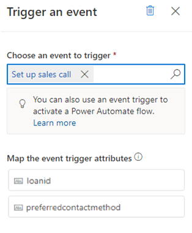
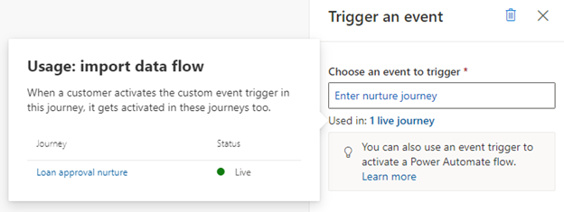
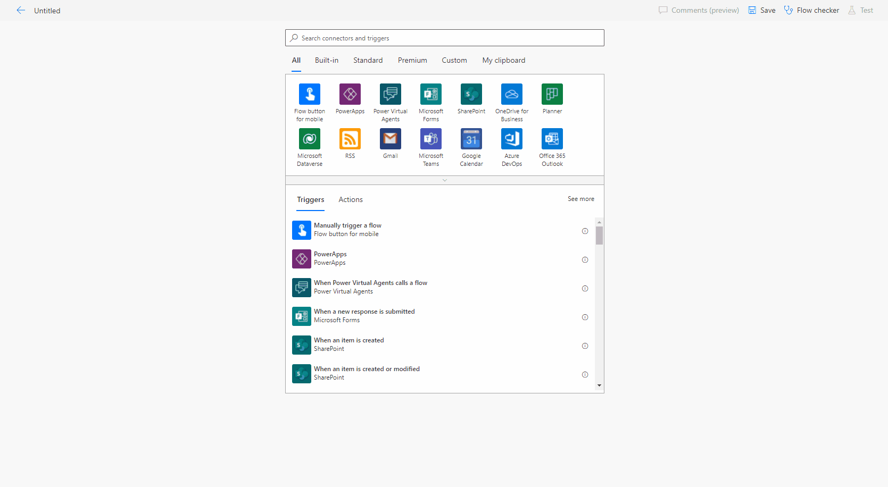
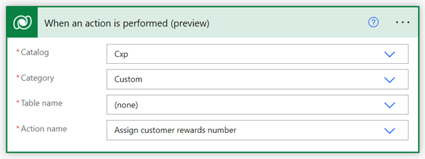

# Preview: Trigger custom event actions in real-time marketing journeys

> [!IMPORTANT]
> A preview feature is a feature that is not complete, but is made available before it’s officially in a release so customers can get early access and provide feedback. Preview features aren’t meant for production use and may have limited or restricted functionality.
> 
> Microsoft doesn't provide support for this preview feature. Microsoft Dynamics 365 Technical Support won’t be able to help you with issues or questions. Preview features aren’t meant for production use, especially to process personal data or other data that are subject to legal or regulatory compliance requirements.

Based on the unique needs of your business, you may want to trigger custom processes or Power Automate flows at certain points in a customer journey. Or, you might want to create multiple journeys that logically function together. Triggering custom events allows you to accomplish these actions, working as the glue between journeys or between journeys and custom processes.

Here are some examples of where you might trigger custom event actions:

1. You’re engaging customers so that they can purchase a subscription, but if they don’t do so by the end of the customer journey, you need to add them to a nurture journey. You can route the customers by activating a custom event trigger from the subscription journey and using that as the entry event trigger from the nurture journey.
1. A loan application journey has various steps that require a human agent’s approval. By creating a separate customer journey or Power Automate Flow for loan exception approval, you can trigger it from various points in the loan application journeys where exceptions can occur by activating the custom event trigger.
1. You need to engage customers through another application or channel, such as Microsoft Teams, which has a Power Automate connector. You can create a Power Automate flow using this connector and have it start using the custom event trigger that you can activate from relevant points in your journey.
1. You need to create Dynamics 365 activities (such as a sales call, service tickets, etc.) from any point in the customer journey. By activating a custom event trigger, you can trigger a Power Automate flow that creates these activities on behalf of the journey.

To learn more about creating custom event triggers, see [Customize event triggers in real-time marketing](real-time-marketing-custom-events.md).

## Trigger an action using a custom event

Take an example using a journey with the goal of nurturing customers who have made purchases. Customers enter this journey when they’ve made a purchase on an online store, and you want to respond to them using the relevant information you have. This simple journey uses an **Attribute branch** that sends customers to the **Yes** branch if they’re a new customer and the **No** branch if they’re a current customer or rewards member. Each branch contains a custom event trigger designed to fulfill a specific task.

Given Customer 1 and Customer 2, here’s how this action performs in the journey:

*Customer 1: Enters the journey as an existing rewards member and proceeds to the **No** branch. The **No** branch contains an action that activates a custom event trigger that enters them into a separate journey designed to nurture rewards members.*

*Customer 2: Enters the journey as a new customer and proceeds down the **Yes** branch. In the **Yes** branch, they reach a custom event trigger that you've connected to a Power Automate flow. Because the customer has never made a prior purchase, you want to pre-fill relevant information about the customer using the purchase data. The flow assigns a rewards number to the customer if there’s a valid phone number provided at the time of registration.*

Setting up a custom event trigger action requires three steps: selecting a custom event, understanding the selected event usage, and mapping the attributes.

## 1. Select a custom event

After placing a **Trigger an event** tile on the journey canvas, select which custom event will be activated when a customer reaches this point in the journey.

> [!div class="mx-imgBorder"]
> 

## 2. Understand the selected event usage

After you select a custom event, the current usage of the custom event in all journeys will be displayed. By selecting the clickthrough link, you’ll be able to see all journeys and corresponding states that use the same custom event.

> [!div class="mx-imgBorder"]
> 

> [!NOTE]
> Power Automate flows that reference the custom event are not tracked or displayed here.

> [!TIP]
> Live journeys displayed in the event usage tooltip will also activate the same custom event within them when a customer reaches this action in the journey. This will trigger other journeys using the same custom event trigger as an entry trigger. It will also trigger steps in other journeys that reference the custom event trigger, for instance, the if/then branches, exit conditions, or goals.

## 3. Map attributes

When a customer reaches this stage of the journey, the custom event activated needs to know where to get the customer information. The attributes shown in the side pane allow dynamic mapping for the information sent in the event action.

> [!NOTE]
> Custom event attributes are data-type-specific.

## Trigger Power Automate flows from real-time marketing journeys

Custom events activated through a customer journey can also be used to trigger Power Automate flows.

> [!div class="mx-imgBorder"]
> 

The Power Automate flow above assigns a customer rewards number when the custom event tile is triggered.

> [!div class="mx-imgBorder"]
> 

To learn more about this [Dataverse connector](/power-automate/dataverse/overview) action, see [Trigger flows with actions](/power-automate/dataverse/action-trigger).