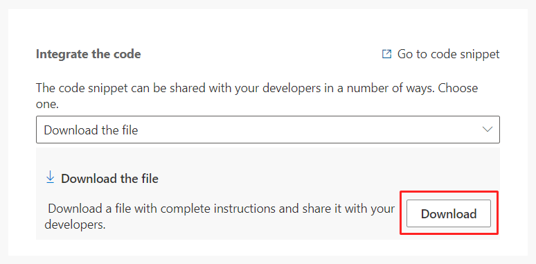

# Create custom triggers in real-time marketing

Custom triggers are a flexible way to capture important moments and interactions, allowing you to orchestrate uniquely engaging customer interactions.

A custom trigger is a user-defined signal that can contain and transport any type of information that a customer journey can act upon. Real-time marketing users are in full control of what custom triggers represent and what kind of information they convey.

Creating a custom trigger in real-time marketing is straightforward. However, custom triggers require collaboration between marketing users and a developer team who will be responsible for integration of small snippets of code in systems that will ultimately allow the trigger to function.

Creating a custom trigger involves three steps: initial trigger creation, trigger integration, and finalization.

## 1. Initial trigger creation

This step is performed in the **Triggers** section of real-time marketing. To create the custom trigger, select **+New trigger** from the top ribbon and follow the on-screen instructions to define:

- **Title and Description**

  Give the trigger a short, descriptive title. Include a description to help other users find the right trigger in the catalog.  

- **Attributes**

  Trigger attributes enrich the trigger and provide additional context for the journey to create branches or personalize content. For example, a *Wi-Fi sign-up* custom trigger might contain a *Location* attribute that represents the physical location where a customer has completed a sign-up. The value of the *Location* attribute could then be used in a journey to send a different message depending on whether the sign-up comes from the parking lot or the main lobby.

  Attributes have a **Name** and a **Data type**. Choosing the correct data type (text, number, true or false, or date/time) is important to ensure that customer journeys can provide appropriate comparators in conditions. For example, if an attribute is of data type **Number**, the journey will provide a comparator such as *less than* or *equal to*. If an attribute is of type **Date/time**, the journey will provide comparators such as *before*, *on*, and *after*.

- **Special Attributes**
  
    **Customer data** is a special attribute present by default in every custom trigger. This attribute contains information about the customer that performs the trigger action. The data type can either be a Dynamics 365 contact or lead, or a [Customer Insights profile](/dynamics365/customer-insights/customer-profiles). In code, this attribute is referred to as *authID*.

    **contactpoint_email** is a special attribute that is present in a custom trigger that is tied to a Customer Insights profile. This attribute will be used as a fall back in case the full Customer Insights profile isn't available. Developers should include the customer's email in this attribute to ensure the customer can be reached by email even if their full profile information isn't available.

    **contactpoint_phone** is a special attribute that is present in a custom trigger that is tied to a Customer Insights profile. This attribute will be used as a fall back in case the full Customer Insights profile isn't available. Developers should include the customer's phone number in this attribute to ensure the customer can be reached by text messages even if their full profile information isn't available.

## 2. Trigger integration

Once the trigger is created, a code snippet is generated by the system. You can download the code snippet and share it with developers. Or, developers can access the snippet directly through the link provided by the app.

> [!div class="mx-imgBorder"]
> 

> [!NOTE]
> To directly access the code snippet, developers will need access to the Dynamics 365 Marketing app.

The code snippet enables a customer action on an external app or website to trigger a customer journey in real-time marketing. For instance, when a customer clicks on the checkout button on an e-commerce website, the code kicks off an order confirmation customer journey using an “order confirmation” trigger that is invoked on the button click. By adding the code snippet, the developer simply connects the button click to the “order confirmation” trigger.

The code snippet contains instructions detailing how to integrate the trigger code on external systems. You can integrate the trigger using JavaScript (for web pages), C# or Python (for standalone systems), or through the iOS and Android SDKs.

> [!TIP]
> Some integration of custom triggers can present security implications. The code snippet that is provided with the trigger contains an *ingestion key* that uniquely identifies the real-time marketing instance. An attacker with access to the ingestion key could possibly send spurious triggers that can trigger unintended customer journeys. It's a good practice to:
> - Protect the ingestion key wherever possible.
> - Limit the use of attributes in custom triggers, especially when those attributes can be used to personalize content and act as potential attack vectors such as cross-site scripting.

## 3. Finalize the trigger

Once the integration has been completed, the **Triggers** page will show information to confirm that the custom trigger is working as expected. With the integration complete and verified, the trigger will be marked as **Ready to use**, which will make the trigger visible and available in journeys.

> [!TIP]
> When you're looking at the list of triggers, custom triggers have a plain lightning bolt icon . Out-of-the-box triggers have a lightning bolt with a suitcase icon .
