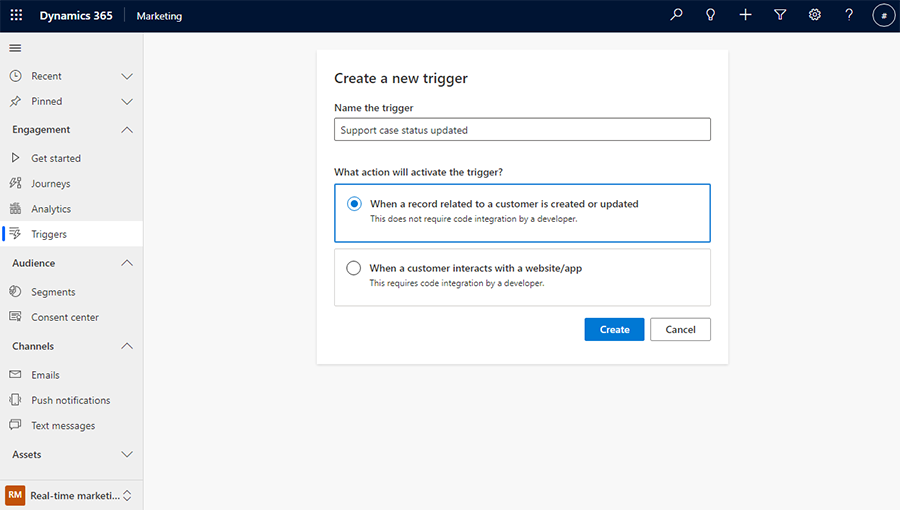
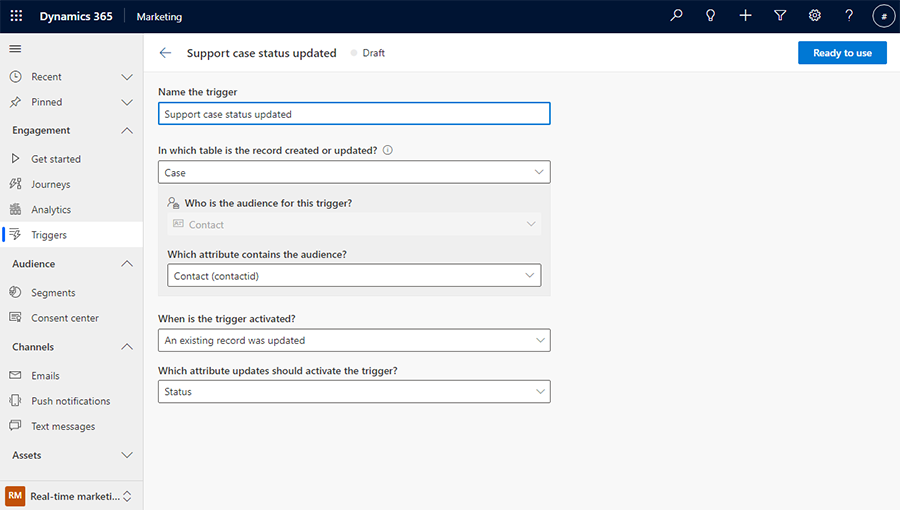
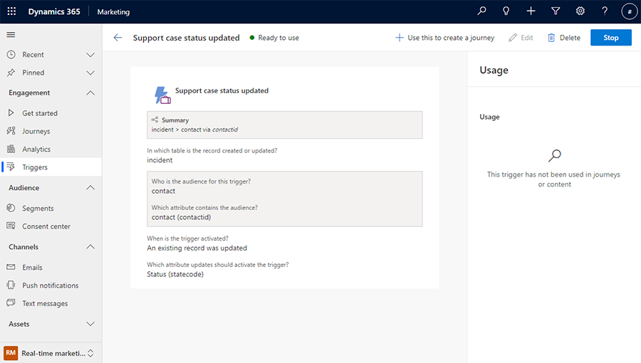
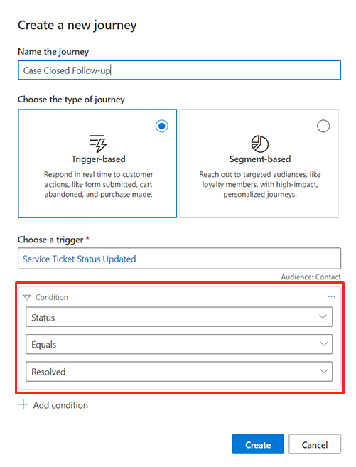
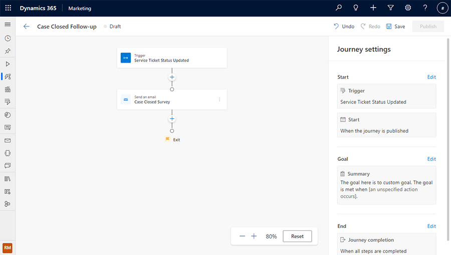
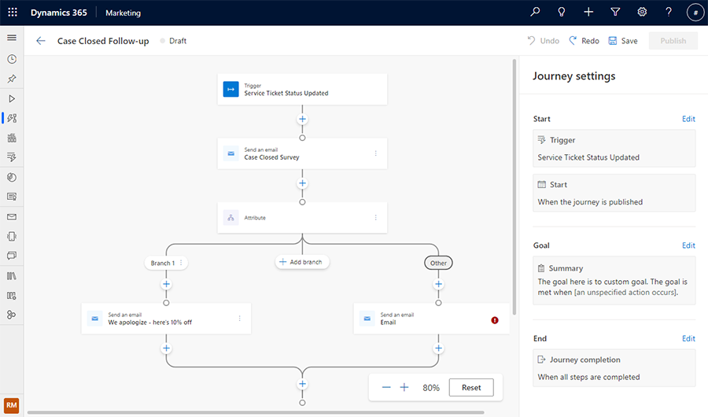

# Trigger a journey based on a Dataverse record change

Business transactions, whether they're initiated by a customer, a Dynamics 365 user, or by a system action are significant opportunities to create meaningful engagements with customers. Your customers commonly interact with several departments and functions throughout their lifetime. And many of these departments and functions have their own data associated with them.

Each of these interactions--such as a completed application, a renewed contract, or a service ticket being closed--represents an opportunity to engage more deeply with your customers. However, the data remains siloed within the apps and out of reach of your customer engagement or marketing automation tools.

Now, all of those interactions can be used to kick off, drive, and measure customer journeys in just a few clicks, without requiring developers or customizations. Dataverse triggers allow you to use customer interaction data changes in [Dataverse](/power-apps/maker/data-platform/) to trigger and personalize engagements. This gives you ultimate flexibility to start, personalize, and measure customers' journeys based on any Dynamics 365 customer data.

With Dataverse triggers, you can:

- Take actions or send messages based on common customer data changes such as registering a new customer, an application completion, a contract renewal, or a service ticket being closed
- Use one or more specified conditions on any Dataverse table connected to the audience such as contact, opportunity, account, lead, custom fields, etc. (including custom tables)

Beyond the out-of-the-box triggers, this gives you flexibility to deepen engagement in specific scenarios across the customer lifecycle. Common scenarios include:

- Sending the customer a survey when their support ticket is closed
- Notifying the customer whenever their order is ready
- When a new lead signs up, sending them a link to register for an upcoming webinar

## Dataverse triggers vs custom triggers

Custom triggers and Dataverse triggers are similar in that they allow you to orchestrate a journey based on an event or signal. However, there are some important differences. While custom triggers provide developers a quick way to integrate and invoke triggers from any source (such as a website, an IoT device, an app, a service, etc.) using small snippets of code, Dataverse triggers, in contrast, provide a no-code option to trigger a journey based on any change in a Dataverse table (also known as a Dataverse entity).

The process of defining and using a trigger varies between custom and Dataverse triggers because with Dataverse triggers, there are no steps involved to integrate the trigger using a code snippet. Instead, as soon as a Dataverse trigger is created, it can be invoked from any business process, user interaction, or customer engagement based on changes to the underlying table (entity) associated with the interaction.

## How to create a Dataverse trigger

The first step in the orchestration process is creating the Dataverse trigger itself. This example follows a common use case that integrates Customer Service and Marketing into a unified customer experience.

In this example, a journey will be created that sends the customer a survey when their support ticket is closed.

1. To create the Dataverse trigger, go to the **Triggers** page in the Real-time marketing area of the Marketing app.
1. To create a new trigger, select the **New trigger** button in the top toolbar.
1. On the "Create a new trigger" screen, specify a name for the trigger, such as "Support case status updated."
1. Select the **When a record related to a customer is created or updated** option, then select the **Create** button.

    > [!div class="mx-imgBorder"]
    > 

1. Next, select the table from Dataverse that contains the information related to a support case. Here, the "Case" table is selected.
1. Because a Dataverse table can have more than one audience attribute, the next step ("Which attribute contains the audience?") allows you to select the attribute that contains the intended audience.
1. In the final step, you can select the action that will activate the Dataverse trigger. This includes selecting which columns need to be part of the update or change.

    > [!div class="mx-imgBorder"]
    > 

1. Once created, you can publish the trigger by selecting the **Ready to use** button. This will enable the trigger to be used as part of a live journey.

    > [!div class="mx-imgBorder"]
    > 

    > [!NOTE]
    > The trigger created in this example does not necessarily capture the support case being closed. It captures any changes to the "Status" field in the support case. This gives you the flexibility to use the same trigger for activating journeys at each status change, through the lifecycle of the case. In this example, because we want to send a survey to the customer after the case is closed, we will later add a filter condition to capture the "Status" field changing to "Resolved." See the next section to learn how to do this.

## Using a Dataverse trigger inside a journey

A Dataverse trigger can be used anywhere inside a journey where a trigger can be specified. Locations where a Dataverse trigger may be used in a journey include:

1. Journey entry, goal, and exit
1. Attribute condition
1. Wait tile
1. Content personalization (such as email)

Continuing on the scenario described above, the journey now needs to send a survey to a customer when the support case is marked as resolved and closed. You can create a journey by selecting the **Use this to create a journey** button at the top of the trigger description screen (pictured in the screenshot above).

Because the trigger only captures a status update for the case, you can add a filter condition to specify what the status should be updated to. In this example, it should be updated to "Resolved."

> [!div class="mx-imgBorder"]
> 

The journey is now ready and you can add the follow-up survey.

> [!div class="mx-imgBorder"]
> 

In addition, you can use the attributes from the trigger to add conditions or branches to the journey. For instance, you can send the customer a discount if they indicated that they weren't satisfied with the support experience. The satisfaction field from the case table can be used to create this condition.

> [!NOTE]
> The case table is carried with the “Support case status updated” trigger, as the trigger was based on this table. This also makes all the attributes of the case table available inside journeys and for personalization in messages.

> [!div class="mx-imgBorder"]
> 

## Invoking/testing a Dataverse trigger

There are several options available when testing Dataverse triggers:

1. Because all modern Dynamics 365 modern apps (Sales, Service, Field, Marketing, etc.) are built on Dataverse, Dynamics 365 app users can invoke a Dataverse trigger by performing an operation in the Dynamics 365 app that operates on the same table as the trigger. For example, to test the "Case resolved" trigger, a Dynamics 365 app user can open an existing Case in the Dynamics 365 Customer Service app and select the "Resolve Case" button.
1. Using Power Apps, you can manually trigger the Dataverse trigger by performing the operation on the table that triggers it. For example, to trigger a "Lead created" Dataverse trigger, you can navigate to the Lead table in Power Apps and add a new row. This will invoke the trigger, which will then orchestrate the journey.
1. The third approach is targeted at advanced users. Using the Dataverse SDK, to trigger a Dataverse trigger, a developer can perform an operation on the table related to the trigger. For example, to test an "Order completed" trigger, a developer can call a Dataverse API to update the status of an Order.

[!INCLUDE[footer-include](../includes/footer-banner.md)]