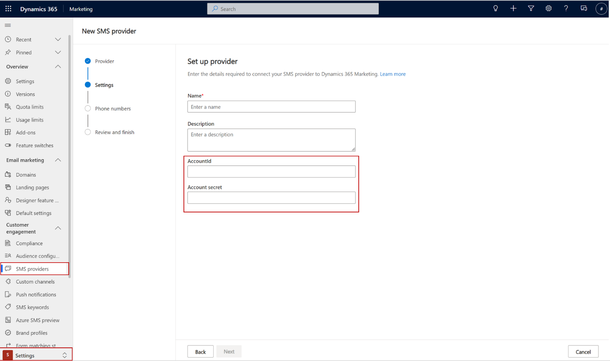

# Define your extended configuration entity for the Channel Instance account

## Applicable channels: SMS only

### Why you need it:

If you're creating a custom SMS channel, you must define an entity representing extended configuration for **Channel Instance Account** (**msdyn_channelinstanceaccount**). For example, you could have a MessageBird   account and have enabled multiple numbers for it. The **Channel Instance Account** has a 1:N relationship with the **Channel Instances** (for example, phone numbers) that we examined in [Step 1](real-time-marketing-define-custom-channel-instance.md).

> [!IMPORTANT]
> To allow Marketing to access the extended configuration entity during submission, you need to add **Read** privileges for the extended configuration entity to the "Cxp Channel Definitions Services User" role.

### How to define it:

For each custom channel solution, you need to:

1. Create your own custom entity that will represent the extended configuration of the **Channel Instance Account** entity, defined in the base solution. The name of the entity will be assigned to the attribute **msdyn_channeldefinitionaccountexternalentity** at the [channel definition step](real-time-marketing-define-channel-definition.md).

1. Add a relationship to the base **Channel Instance Account** entity on **msdyn_extendedentityId** attribute. This attribute is a polymorphic lookup.   Example of the new relationship in xml:

```
<?xml version="1.0" encoding="utf-8"?>
<EntityRelationships xmlns:xsi="http://www.w3.org/2001/XMLSchema-instance">
  <EntityRelationship Name="msdyn_ChannelInstanceAccount_extendedentityid_cr65f_samplechannelinstanceaccount">
    <EntityRelationshipType>OneToMany</EntityRelationshipType>
    <IsCustomizable>0</IsCustomizable>
    <IntroducedVersion>1.0.0.0</IntroducedVersion>
    <IsHierarchical>0</IsHierarchical>
    <ReferencingEntityName>msdyn_ChannelInstanceAccount</ReferencingEntityName>
    <ReferencedEntityName>cr65f_samplechannelinstanceaccount</ReferencedEntityName>
    <CascadeAssign>NoCascade</CascadeAssign>
    <CascadeDelete>RemoveLink</CascadeDelete>
    <CascadeReparent>NoCascade</CascadeReparent>
    <CascadeShare>NoCascade</CascadeShare>
    <CascadeUnshare>NoCascade</CascadeUnshare>
    <CascadeRollupView>NoCascade</CascadeRollupView>
    <IsValidForAdvancedFind>1</IsValidForAdvancedFind>
    <ReferencingAttributeName>msdyn_extendedentityId</ReferencingAttributeName>
    <RelationshipDescription>
      <Descriptions>
        <Description description="" languagecode="1033" />
      </Descriptions>
    </RelationshipDescription>
    <EntityRelationshipRoles>
      <EntityRelationshipRole>
        <NavPaneDisplayOption>UseCollectionName</NavPaneDisplayOption>
        <NavPaneArea>Details</NavPaneArea>
        <NavPaneOrder>10000</NavPaneOrder>
        <NavigationPropertyName>msdyn_extendedentityid_cr65f_samplechannelinstanceaccount</NavigationPropertyName>
        <RelationshipRoleType>1</RelationshipRoleType>
      </EntityRelationshipRole>
      <EntityRelationshipRole>
        <NavigationPropertyName>msdyn_ChannelInstanceAccount_extendedentityid_cr65f_samplechannelinstanceaccount</NavigationPropertyName>
        <RelationshipRoleType>0</RelationshipRoleType>
      </EntityRelationshipRole>
    </EntityRelationshipRoles>
  </EntityRelationship>
</EntityRelationships>
```
3. Create a form to expose configuration fields. The form doesn’t have to contain attributes like name or description since they come from Marketing Custom controls. The form will be loaded at the Marketing SMS setup wizard (settings step). The form ID will be assigned to the attribute **msdyn_channeldefinitionaccountexternalformid** at the [channel definition step](real-time-marketing-define-channel-definition.md).  

For example, in SMS, the form will look like this:

> [!div class="mx-imgBorder"]
> 

[!INCLUDE[footer-include](../includes/footer-banner.md)]