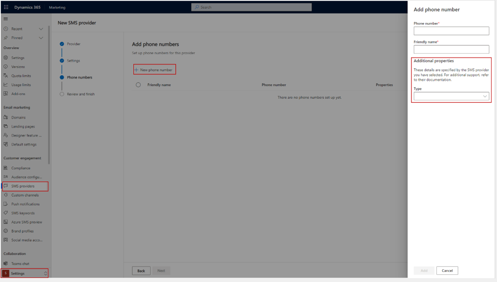
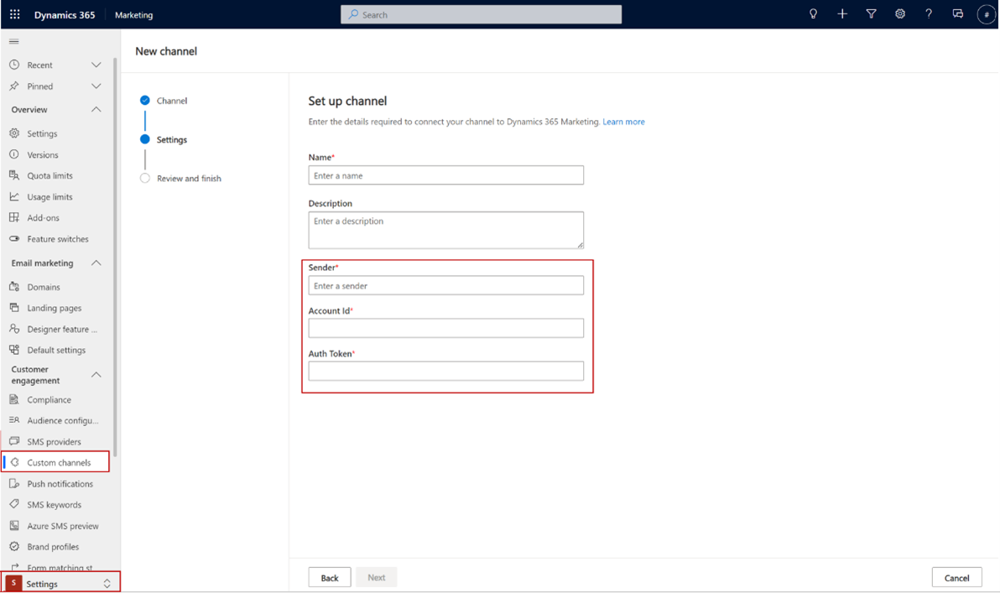

# Define your extended configuration entity for the channel instance

## Applicable channels: SMS, Custom

### Why you need it:

A **Channel Instance** is the representation of a channel in Marketing after an admin uses an installed custom channel package to create and set up a new custom channel.

When creating a new custom channel, you need to set up a sender, for example, the sender of the WhatsApp message. Each **Channel Instance** for channels of **Custom type** represents a single sender.

> [!IMPORTANT]
> To allow Marketing to access the extended configuration entity during submission, you need to add **Read** privileges for the extended configuration entity to the "Cxp Channel Definitions Services User" role.

### How to define it:

For each custom channel solution, you need to:

1. [Create your own custom entity](/dynamics365/customerengagement/on-premises/customize/create-entities) that will represent the extended configuration of the **Channel Instance** entity (**msdyn_channelinstance**), defined in the base solution. The name of the entity will be assigned to the attribute **msdyn_channeldefinitionexternalentity** at the [channel definition step](real-time-marketing-define-channel-definition.md).

1. [Add a relationship](/dynamics365/customerengagement/on-premises/customize/create-and-edit-1n-relationships) to the base **Channel Instance** entity on **msdyn_extendedentityId** attribute. This attribute is a [polymorphic lookup](/power-apps/developer/data-platform/webapi/multitable-lookup). Example of the relationship in XML:

```
<EntityRelationship Name="msdyn_ChannelInstance_extendedentityid_cr65f_samplechannelinstance">
    <EntityRelationshipType>OneToMany</EntityRelationshipType>
    <IsCustomizable>0</IsCustomizable>
    <IntroducedVersion>1.0.0.0</IntroducedVersion>
    <IsHierarchical>0</IsHierarchical>
    <ReferencingEntityName>msdyn_ChannelInstance</ReferencingEntityName>
    <ReferencedEntityName>cr65f_samplechannelinstance</ReferencedEntityName>
    <CascadeAssign>NoCascade</CascadeAssign>
    <CascadeDelete>RemoveLink</CascadeDelete>
    <CascadeReparent>NoCascade</CascadeReparent>
    <CascadeShare>NoCascade</CascadeShare>
    <CascadeUnshare>NoCascade</CascadeUnshare>
    <CascadeRollupView>NoCascade</CascadeRollupView>
    <IsValidForAdvancedFind>1</IsValidForAdvancedFind>
    <ReferencingAttributeName>msdyn_extendedentityId</ReferencingAttributeName>
    <RelationshipDescription>
      <Descriptions>
        <Description description="" languagecode="1033" />
      </Descriptions>
    </RelationshipDescription>
    <EntityRelationshipRoles>
      <EntityRelationshipRole>
        <NavPaneDisplayOption>UseCollectionName</NavPaneDisplayOption>
        <NavPaneArea>Details</NavPaneArea>
        <NavPaneOrder>10000</NavPaneOrder>
        <NavigationPropertyName>msdyn_extendedentityid_cr65f_samplechannelinstance</NavigationPropertyName>
        <RelationshipRoleType>1</RelationshipRoleType>
      </EntityRelationshipRole>
      <EntityRelationshipRole>
        <NavigationPropertyName>msdyn_ChannelInstance_extendedentityid_cr65f_samplechannelinstance</NavigationPropertyName>
        <RelationshipRoleType>0</RelationshipRoleType>
      </EntityRelationshipRole>
    </EntityRelationshipRoles>
  </EntityRelationship>
```

3. Create a form to expose the configuration fields. The form will be loaded at the Marketing setup wizard. The form ID will be assigned to attribute **msdyn_channeldefinitionexternalformid** at the [channel definition step](real-time-marketing-define-channel-definition.md).

For example:

1. In **SMS**

    > [!div class="mx-imgBorder"]
    > 

1. In **Custom** (The form doesn’t have to contain attributes like name or description since they come from Marketing Custom controls.)

    > [!div class="mx-imgBorder"]
    > 
