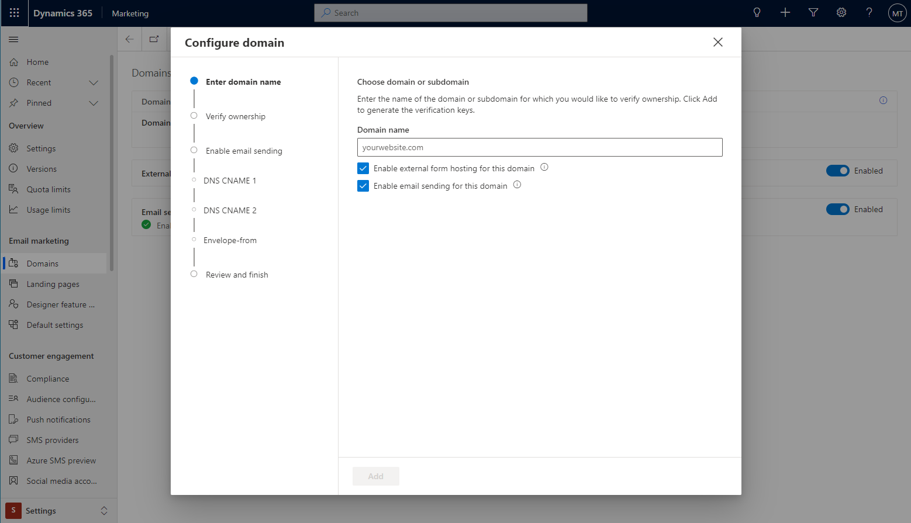
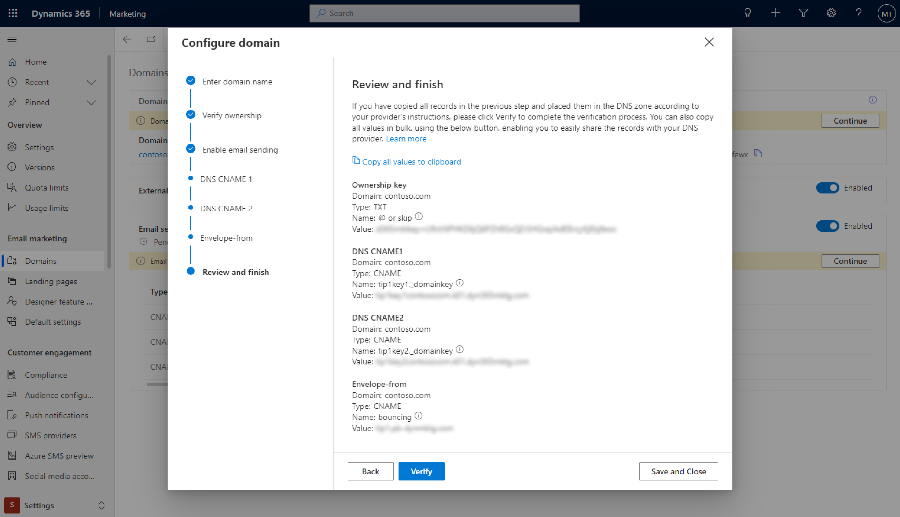

# Real-time marketing domain authentication

As discussed in the [Authenticate your domains](mkt-settings-authenticate-domains.md) article, domain authentication enables recipient email servers to confirm that the from-address shown on each of your email messages belongs to your organization. A method called *DomainKeys Identified Mail* (DKIM) helps make email authentication possible.

Authenticating your domains also enables you to embed outbound marketing forms on externally hosted websites and pre-fill them with data for known contacts.

Dynamics 365 Marketing includes a guided domain authentication wizard, allowing you to authenticate domains for use in real-time marketing and outbound marketing features. This article describes how to use the wizard.

> [!NOTE]
> The wizard described below only appears when [real-time marketing](real-time-marketing-overview.md) features are installed. If real-time marketing is installed, the wizard applies domain authentication settings to real-time and outbound marketing features. If real-time marketing is not installed, you must follow the setup described in the [Authenticate your domains](mkt-settings-authenticate-domains.md) article to authenticate domains for use in outbound marketing features.

## How to use the domain authentication wizard

To authenticate a new domain or a subdomain for email sending and/or form hosting, follow the steps below:

1. Go to **Settings** > **Email marketing** > **Domains**. A list of existing authenticated domains opens.

1. Select **New** on the command bar to add a new domain.

1. A guided wizard opens, prompting you to enter the domain that you want to authenticate, together with the reason for authenticating the domain: external form hosting and/or email sending. The wizard will reconfigure itself based on the selections that you make.

    > [!div class="mx-imgBorder"]
    > 

1. Depending on the selections you made during the previous step, the wizard will provide an ownership key and three sets of records that should be configured on the DNS provider’s portal.

1. An overview of the data will be provided in the last step, along with the ability to bulk copy all of the values.

1. Provide the data to your DNS provider and follow their instructions. Once the DNS registration is complete, you can select **Verify** to complete the setup.

    > [!div class="mx-imgBorder"]
    > 

> [!NOTE]
> DNS registration may require up to 24 hours to take effect. You can leave the wizard at any time and come back to it to try again if the registration is not confirmed right away.

> [!TIP]
> For help with domain authentication errors, see [Troubleshoot domain authentication errors](troubleshoot-domain-authentication.md).