# Create dynamic content for multiple countries and languages

Customers that work in multiple countries require email communications that present the same content but with small variations based on the country or perhaps in different languages. An extension of this scenario occurs when reaching customers in countries where multiple languages are accepted. For example, in the United Kingdom, communications could be transmitted in both English and Welsh. The audience profile is used to determine which content to deliver. 

Having different content sent to customers based on their profile is possible in two ways:
- Create multiple branches leading to the email to send within the customer journey. The email logic is simple with this technique, but the number of emails is higher because each audience requires a different email.
- Build the logic within the Email and/or Content Block. This approach simplifies journey authoring as the audience type complexities can be ignored and there’s a single email to prepare for the journey, which adds to the benefits. However, the email authoring is more complex as it needs to account for the variations.

## Scenario
In this article, we consider a scenario in which a company’s Terms and Conditions must be placed in the footer of every email. Those terms and conditions vary depending on the customer’s place of residency and the preferred language. Since we want to apply the pattern to multiple emails and in multiple journeys, we’re putting the logic in a content block rather than consider putting it in the customer journey or email.

## Solution 
The solution’s goal is to provide a reusable pattern incorporating multi-country, multilingual content in email footers. The focus of the solution is on a common footer with terms and conditions in multiple languages and for multiple countries. However, the pattern can be applied to other scenarios where content variations are needed by country and language.

## Scenario 1 – Conditional content by free text country
The simplest scenario is to construct the solution on existing columns and tables in Dynamics 365 Marketing’s out of the box data model. We have a country's free text field in the Contact table, which allows us to profile the audience depending on their country of residence.  

> [!div class="mx-imgBorder"]
> 

### Create content block with conditional content

Because the terms and conditions are something we want reuse across multiple emails, we create a [content block](content-blocks.md), which is called “All Country Footer”.

In this content block, we add a section and column where the text of the terms and conditions is placed. Next, different [conditions](conditional-content.md) are added for the various countries that are supported in the footer. In the example below we’re supporting three countries: UK, Spain, and Mexico. 

> [!div class="mx-imgBorder"]
> 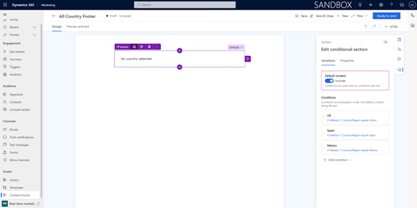

In each of the variations, we have a condition that compares the country field with the corresponding value of the country.

> [!div class="mx-imgBorder"]
> 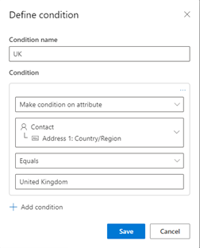

Within each of the variations, we add the text appropriate for the country in the language corresponding to that country. Below is the example for the United Kingdom, which is in English.

> [!div class="mx-imgBorder"]
> 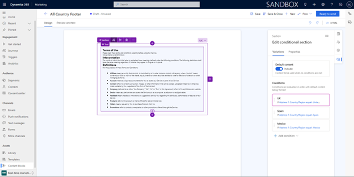

And below is the equivalent content for Spain, which is in Spanish.

> [!div class="mx-imgBorder"]
> 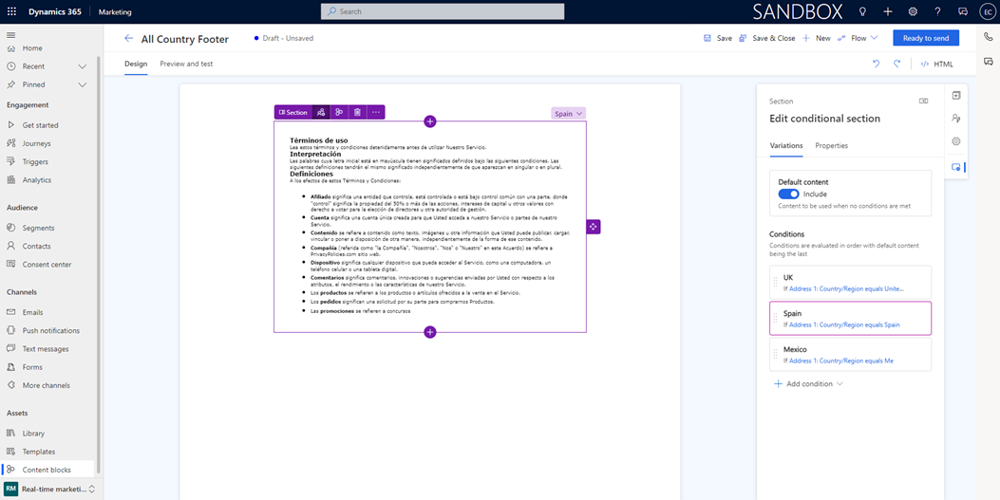

Once all conditional blocks are complete, the content block can be marked “Ready to Send” which allows its use in emails.

## Scenario 2 – Conditional content by lookup country

The above scenario is dependent on the users entering the country in a free text field and having that text match exactly the variations available in the content block. To build a more robust solution, we can extend the Marketing data model and use a lookup table of countries rather than relying on a free-text field. 

### Customize Dynamics 365 for Marketing

The first step to implement the solution is to create a table to allows us to profile contacts based on their country. Using the [Maker Portal](https://make.powerapps.com/), create a [new table](/power-apps/maker/data-platform/create-edit-entities-portal) for Country and populate with the countries that are supported by the solution. 

> [!div class="mx-imgBorder"]
> 

Then we update the Contact table by adding a [table relationship](/power-apps/maker/data-platform/data-platform-entity-lookup) between the Country table and the Contact table. With the relationship in place, the Form for the [Contact table](/power-apps/maker/model-driven-apps/create-design-forms) is updated to allow users to specify the Country and Language of the Contact.

#### Use related table in conditional content

With that data model extension in place, we update the content block to be based on the custom column created. We continue to work with the same three countries but now each one of the conditions is looking at the Contact’s custom country column and refer to the country table.

> [!div class="mx-imgBorder"]
> 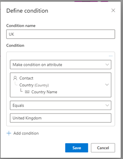

As with the previous scenario, we can specify the text desired for the terms and conditions for the language appropriate for the country.

> [!div class="mx-imgBorder"]
> 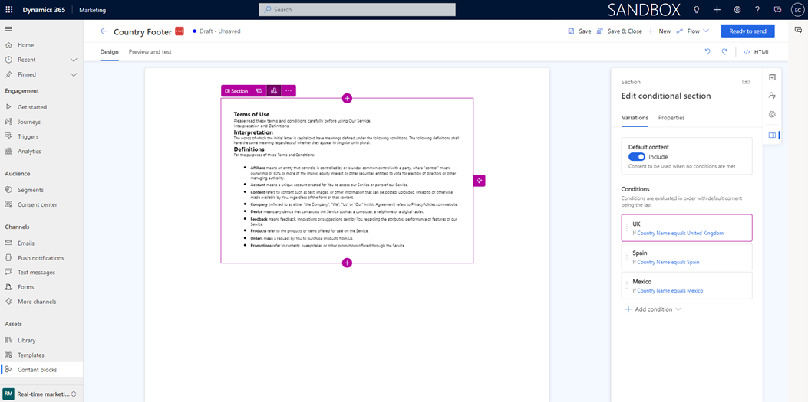

## Scenario 3 – Multiple languages in same country

This scenario builds on the work done in Scenario 2.
On some countries, there are multiple official languages or languages that are so common that it makes sense for communications to be done in the specific language of the audience. This second layer of personalization can also be implemented in Dynamics Marketing.

### Customize Dynamics 365 for Marketing

To support the extra profiling needed, we create a new table for language, following the process done for countries. Then, we populate with the list of languages for which we want to create content.

> [!div class="mx-imgBorder"]
> 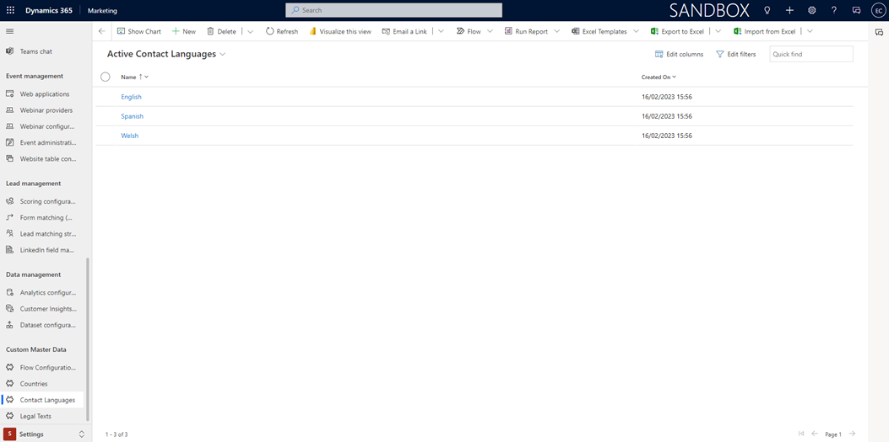

Then, we create an additional Many to One relationship between the Contact table and the Language table and expose the new field on the Contact form. 

#### Multiple conditions in content block variations

Now that we have two different angles (country and language) on which to personalize the content, we update the conditions within the variations of the content block to account for comparing two different fields to the attributes of the audience. We add a different variation for each country-language pair for which content is needed. The conditions look like as follows:

> [!div class="mx-imgBorder"]
> 

Once all the variations have been configured, the content block looks like as follows:

> [!div class="mx-imgBorder"]
> 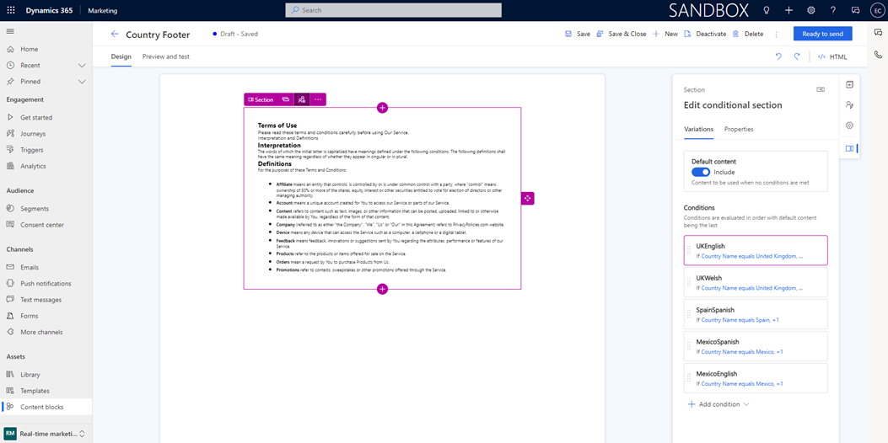

## Scenario 4 – Easing the administration of standard content

This scenario builds on the scenarios previously described. 

If we consider that terms and conditions remain standard but when they change, we want them impacting all communications, having to update multiple conditions across multiple content blocks and emails could be a time-consuming process and some emails could be missed. To facilitate the administration of these changes, we can introduce a level of abstraction so that changing content in a single location would reflect on all communications, countries, and languages.

In addition, having a single variation in the content block where all languages are represented allows for country managers to confirm that the relevant languages for their country are represented in a reusable content. It also allows for the separation of in management, allowing the company’s legal team to manage the texts independent from the journey and email processes. 

### Customize Dynamics 365 for Marketing

To support this scenario, we make one additional extension to Marketing. We create a table that holds the text that email communications use for the various country and language combinations. In this example, we are calling the table that holds the terms and conditions Legal Text. In this table, we also add a Rich-Text Field (called Formatted Text in the screenshot below) that will allow the better formatting of the content to be added to the email. 

> [!div class="mx-imgBorder"]
> 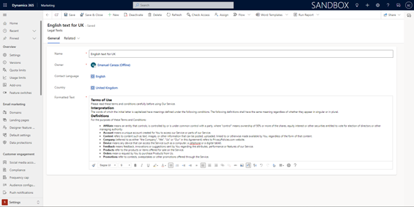

In this table we can create all the necessary combinations that will be later used in the Content Block.

> [!div class="mx-imgBorder"]
> 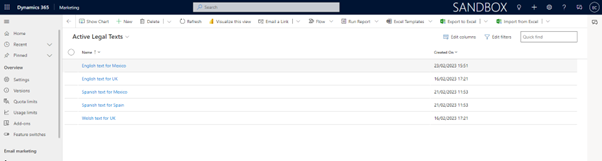

#### Adding inline conditions and predefined dynamic text to content block

In the previous scenarios we have been working with conditions added to content variations in the content block. However, to reduce the number of variations and facilitate the administration, we'll now add [inline conditions](real-time-marketing-personalize-inline-conditions.md) in country variations that will be checking a contact’s language against each of the language options. The following example shows the check for the English language. 

> [!div class="mx-imgBorder"]
> 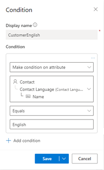

This will be complemented with an additional level of personalization will be require being able to dynamically read the formatted text of the terms and conditions from the [Legal Texts](real-time-marketing-predefined-dynamic-text.md#using-data-from-additional-tables-in-dynamic-text) table using data from additional tables feature.

> [!div class="mx-imgBorder"]
> 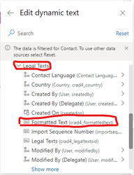

After selecting the attribute with the text to select, it's necessary to pick the record with data to dynamically substitute in the email. Below it's shown how the “English text for the UK” is picked and the name “UKEnglishText” is given to the token for the personalization. 

> [!div class="mx-imgBorder"]
> 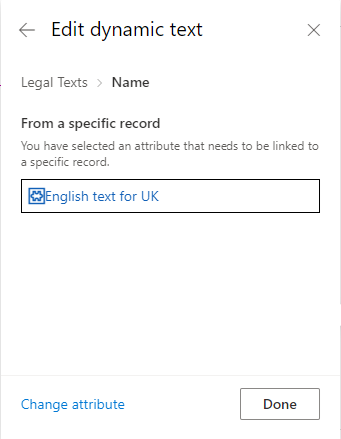

> [!div class="mx-imgBorder"]
> 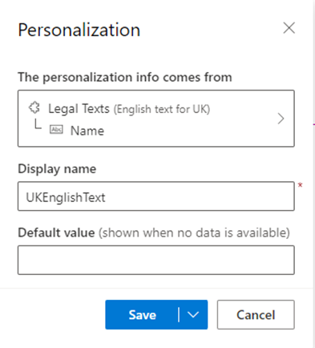

This process needs to be repeated for the various possible combinations of country and language that are possible. 
With the tokens ready, we build the logic for each country’s conditional block. To do this, each desired combination will be placed within an {{#if}} condition as shown below.  

> [!div class="mx-imgBorder"]
> 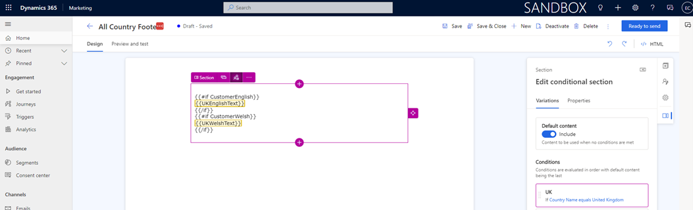

The benefit of structuring the conditional content in this manner is that we end up with one variation per country that easily shows all the language options for that country. In the above example, we can see the UK variation showing language options for English and Welsh. 

### Create the email

Regardless of the scenario built, with the content block ready we can now use in an email, knowing that the terms and conditions will be sent according to the contact’s country and, if configured, the contact’s language. 

> [!div class="mx-imgBorder"]
> 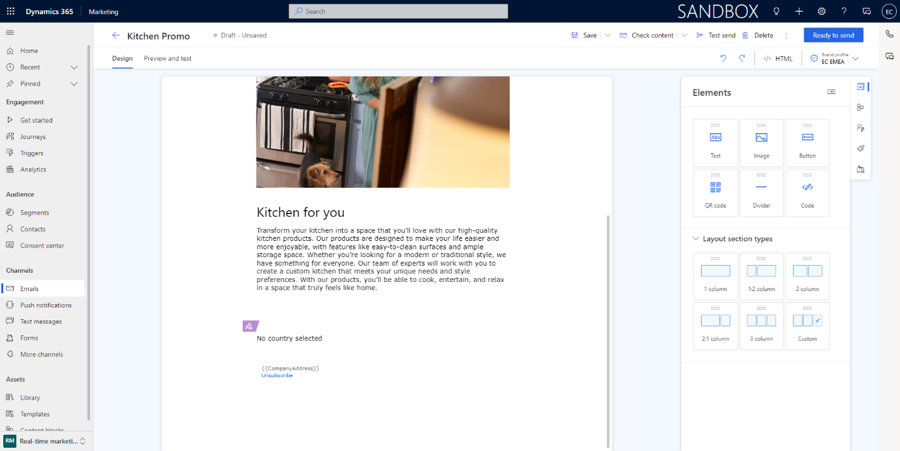

This is an example will render for customers in United Kingdom and Spain with different text.

> [!div class="mx-imgBorder"]
> 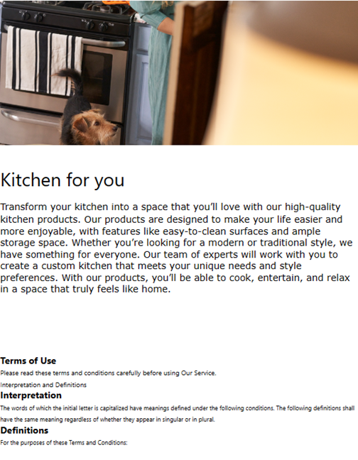

> [!div class="mx-imgBorder"]
> 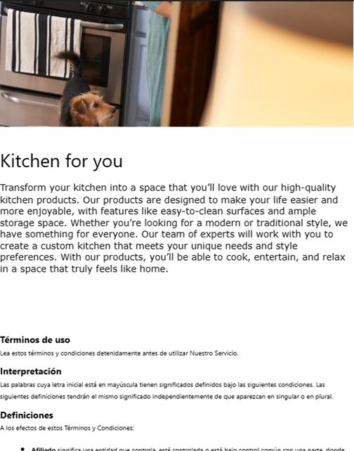

### Next steps

- [Quickly design and deliver a marketing email with send now](email-send-now.md)
- [Send a targeted email blast in real-time marketing](real-time-marketing-email-get-started.md)
