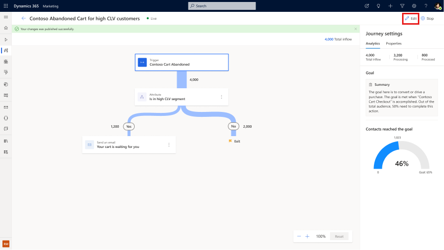
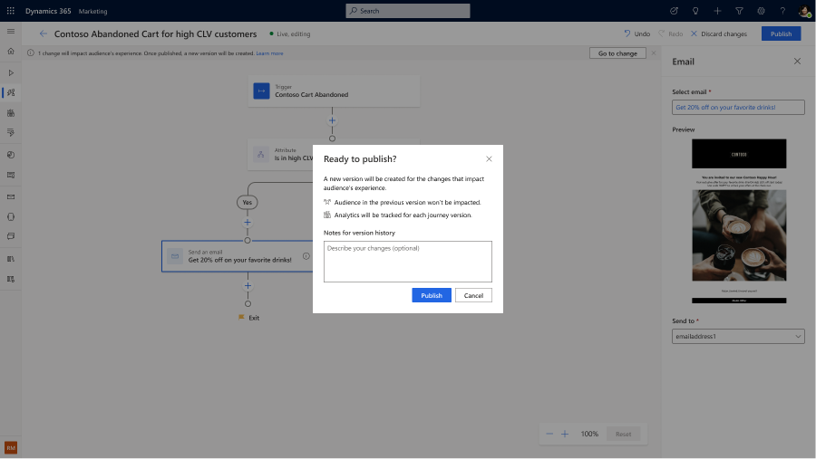
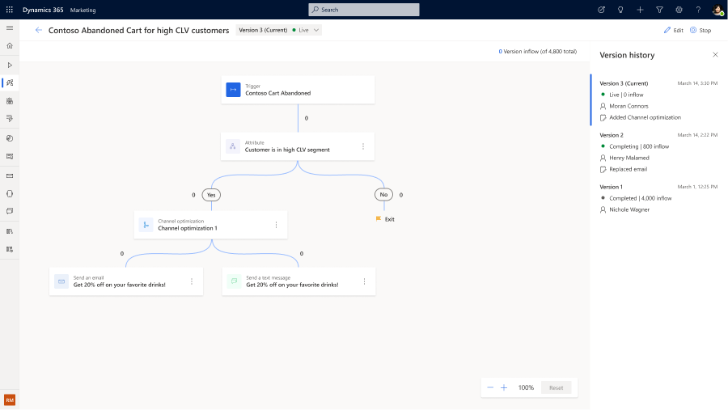

# Edit a live journey in real-time marketing

You can make lightweight edits to journeys, such as renaming elements or adjusting goal percentages, without stopping them. You can also make major changes with real-time marketing's built-in journey version control feature. These features give you the flexibility to make edits on the fly, without concern about breaking or being unable to revert a journey.

## How to make lightweight edits to live journeys

In your journey, select the **Edit** button in the top right of the screen. Make changes such as renaming your journey or changing your goal percentage. When you're done, select the **Publish** button in the upper right. You'll see a confirmation that your changes published successfully.

> [!div class="mx-imgBorder"]
> 

## How to make changes that impact your customer experience

In your journey, select the **Edit** button and make your changes. If the change impacts your customer experience, for example, deleting an email in an existing journey, it will result in a new version of the journey. Your existing customers will complete the current version of their journey while new customers will enter the new version.

The following are examples of changes that will result in a new version:

1. Switching an email.
1. Adding or deleting a channel.
1. Adding or updating conditions in branches.

> [!div class="mx-imgBorder"]
> 

The change tracking and auditing capabilities allow you to efficiently collaborate with your marketing team.

> [!div class="mx-imgBorder"]
> 

Analytics results are kept for each version, enabling you to compare and optimize journey flow and goal attainment across all iterations.

> [!div class="mx-imgBorder"]
> 

[!INCLUDE[footer-include](../includes/footer-banner.md)]