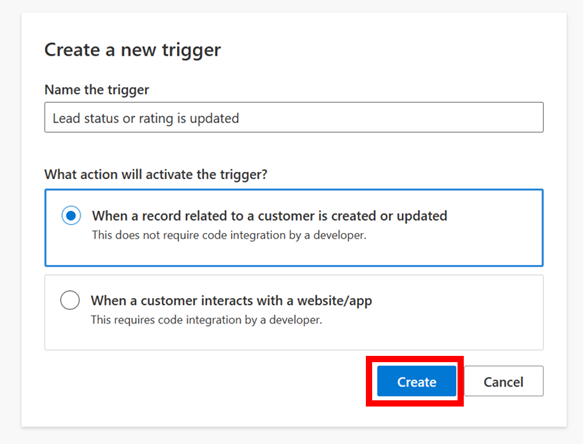
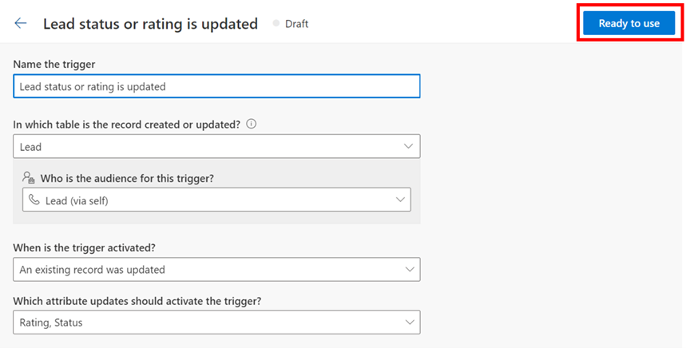
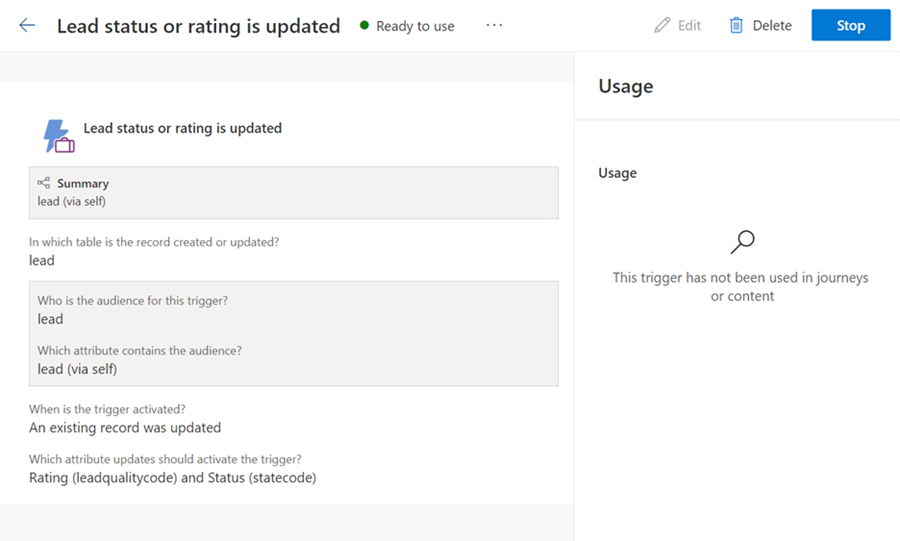
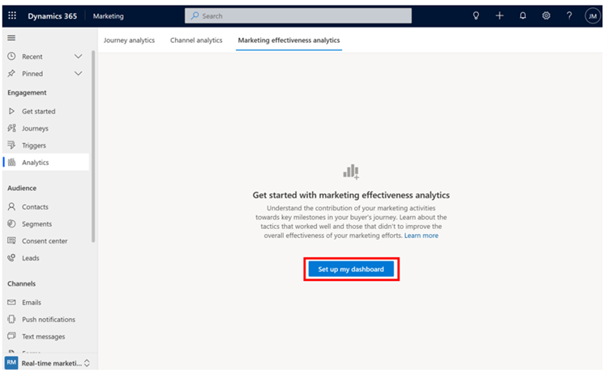
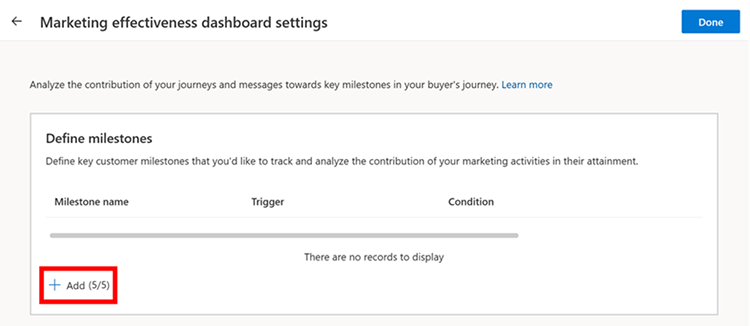
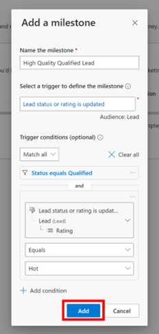
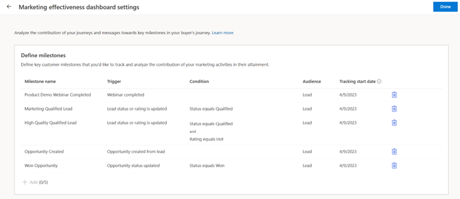
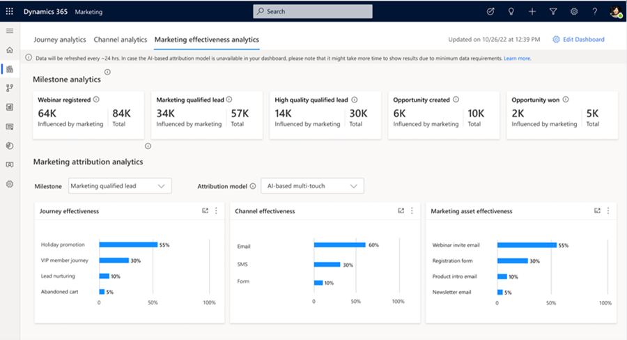

# Preview: Marketing effectiveness analytics

> [!IMPORTANT]
> A preview feature is a feature that is not complete, but is made available before it’s officially in a release so customers can get early access and provide feedback. Preview features aren’t meant for production use and may have limited or restricted functionality.
> 
> Microsoft doesn't provide support for this preview feature. Microsoft Dynamics 365 Technical Support won’t be able to help you with issues or questions. Preview features aren’t meant for production use, especially to process personal data or other data that are subject to legal or regulatory compliance requirements.

Dynamics 365 Marketing enables you to create highly personalized experiences to nudge customers toward important milestones in the buyer's journey. With the marketing effectiveness analytics dashboard, you can define key customer milestones, measure them over time, and assess the contribution and effectiveness of your journeys, channels, and marketing assets in driving customers to the milestones. The dashboard uses AI-powered multi-touch and single-touch attribution models. This provides you with a feedback loop to gain a comprehensive view of the effectiveness of your real-time marketing tactics in driving key business outcomes, empowering you to optimize your marketing mix by learning from tactics that worked well and improving or dropping tactics that didn’t.  

## How to use the dashboard

### Enable the dashboard
To use the marketing effectiveness analytics dashboard, an administrator needs to enable the feature switch in settings. To enable the feature switch:
1. Go to **Settings > Overview > Feature switches**.
1. Enable the **Marketing effectiveness analytics (preview)** feature switch under the **Analytics** section and select **Save** in the upper right corner.

### Creating milestones

Milestones are journey-agnostic key customer actions, touchpoints, or states in the buyer’s journey that you want your customers complete. Typically, milestones are closely related to the business outcomes that your marketing organization is responsible for. You might use various capabilities in real-time marketing (for example, creating numerous customer journeys and forms) to drive your customers to the milestones.

Depending on your buyer’s journey and what’s important for your business to track, each business might have different milestones and corresponding definitions. You can customize milestones to your specific business needs. The following are examples of milestones:
- B2C businesses: Customer enrolling in the loyalty program, making an e-commerce purchase, newsletter or service subscription, etc.
- B2B businesses: Lead attending an important product demo webinar or event, qualifying a lead by marketing or sales, creating or winning an opportunity, etc.

In the marketing effectiveness analytics dashboard, you can create up to five milestones that are important for your marketing organization. You can define milestones by leveraging business or custom [triggers](real-time-marketing-triggers.md) in real-time marketing. There are three components to defining a milestone:
1. Name the milestone.
1. Select a business or custom trigger that gets raised when a customer completes the milestone.
1. Optionally, add any conditions (using attributes associated with the trigger) that need to be satisfied for a customer to complete the milestone.

*For each milestone, a customer completes the milestone when the trigger specified in the milestone definition is raised and all the associated trigger conditions are satisfied.* 
 
The following is an example of how a milestone can be created. Let’s say for a B2B business you want to create a milestone called **“High-quality qualified lead”** to track the number of such leads contributed by marketing and analyze the contribution of your marketing activities in helping you do so. A lead reaches this milestone when the lead status is updated to “Qualified,” and the lead rating is “Hot.” This milestone is created by first creating a business trigger for the scenario and then using the trigger and adding the necessary trigger conditions to define the milestone.

For the example scenario, you need to create a trigger that gets raised when the lead “status” or “rating” attribute is updated in any lead record. You can create a business trigger for this purpose as shown in the steps below. The trigger is named **“Lead status or rating is updated.”**

> [!div class="mx-imgBorder"]
> 

> [!div class="mx-imgBorder"]
> 

> [!div class="mx-imgBorder"]
> 

As shown above, a business trigger has been created that gets raised every time a lead’s status or rating attributes are updated in the system. The business trigger is now ready to use to create the milestone. 

> [!NOTE]
> Ensure that you create the custom or business trigger using the correct audience type (Contact, Lead, or Customer Insights profile) since the milestone will directly leverage the trigger’s audience type.

Next, to start creating a milestone, go to the **Marketing effectiveness analytics dashboard** from the **Analytics** site navigation. You can create and delete milestones from the dashboard settings page. To access dashboard settings, select **“Set up my dashboard”** if you’re using the dashboard for the first time, or the **“Edit dashboard”** button on the upper right corner of the dashboard if you have already set up the dashboard.

> [!div class="mx-imgBorder"]
> 

Next, to start creating a milestone, select **“+ Add”** in the “Define milestones” table.

> [!div class="mx-imgBorder"]
> 

To define the milestone, add the following details:  
- Name: **High-quality qualified lead**
- Trigger: For the High-quality qualified lead milestone, select the **“Lead status or rating is updated”** business trigger that you previously created. 
- Trigger conditions: The trigger is raised every time a lead’s status or rating attributes are updated. However, for this milestone, customers should complete it only when the lead status is updated to “Qualified” and its rating is “Hot.” You need to therefore specify these as additional conditions in the milestone definition to ensure that only leads that are qualified and have a “hot” rating complete the milestone and not any other leads.

> [!div class="mx-imgBorder"]
> 

Next, select **“Add”** to complete the milestone creation. You’ll now see the milestone show up in the milestones table with details of the milestone definition along with its tracking start date (this is the date when you created the milestone and from this date onwards, the system starts tracking customers that reach this milestone and show corresponding analytics in the dashboard).

> [!div class="mx-imgBorder"]
> 

In this way, you can create up to five milestones by leveraging business or custom triggers. Select **“Done”** once you’ve created the milestones to exit the dashboard settings page. You can access the dashboard settings page to create new milestones or delete existing ones at any point by selecting **“Edit dashboard”** in the upper right corner of the dashboard.

> [!NOTE]
> Ensure that none of the triggers that you use to define your milestones are deleted. If a trigger used to define a milestone is deleted, the system can no longer track when new customers complete the milestone, impacting the analytics for the milestone in the dashboard. 

### Deleting milestones
You can choose to delete and re-create a milestone if needed. When a milestone is deleted, the system stops tracking it and the data pertaining to the marketing effectiveness analytics (for that milestone) in the dashboard is reset. If the same milestone is added back later, it's treated as a new milestone.  

### Interpreting analytics in the dashboard
Once you’ve defined your milestones, after the next dashboard data refresh (about 24 hours), analytics will start to populate the dashboard. For each milestone, the dashboard provides insights through milestone analytics and marketing attribution analysis. 

#### *Milestone analytics*
This section of the dashboard helps you understand how many customers have completed the defined milestones and the number of customers that were impacted by your real-time marketing activities before they completed the milestone. It provides you with the following metrics for each milestone:
- **Total**: The total number of unique customers that reached that milestone.
- **Influenced by marketing**: The total number of unique customers with at least one interaction due to real-time marketing-initiated activities that reached that milestone.

#### *Marketing attribution analysis*
This section provides you with insights into the effectiveness and contribution of your journeys, channels, and marketing assets in driving your customers to various milestones. For each milestone, you can leverage the following three attribution models to gain insights into the effectiveness and contribution of your real-time marketing activities:
1. **AI-powered multi-touch model**: This model allocates credit to each customer interaction by employing an AI algorithm that analyzes not just the frequency of different customer interactions but also their sequence to assess each interaction’s actual contribution towards milestone completion. This model can be used to understand the most effective journeys, channels, and marketing assets that drove customers to a specific milestone.
1. **Linear multi-touch model**: This model allocates equal credit for milestone attainment to each customer interaction before the milestone is completed. It can be used to understand the most common journeys, channels, and assets that customers interacted with before completing a milestone.
1. **Last touch model**: This is a single-touch model and allocates all credit for milestone attainment to the last customer interaction before the milestone is completed. It can be used to understand the most common last journey, channel, or marketing asset that customers interacted with before completing a milestone.

Select a milestone and an attribution model from the dropdown to see the corresponding effectiveness analysis. Based on the selection, a percentage score is allocated to each journey, channel, and marketing asset and displayed in the corresponding effectiveness charts.  

> [!div class="mx-imgBorder"]
> 

Only actual customer interactions due to real-time marketing-initiated activities are considered for the attribution analysis. The following are the types of customer interactions for each marketing asset that are considered for attribution analysis:
- **Email**: Email opens and clicks.
- **Text messages**: Text message clicks and replies received.
- **Push notifications**: Push notification opens and clicks.
- **Forms**: Form visits and submissions.

There are certain minimum data requirements for each attribution model to show results. For any selected milestone:
- The AI-powered multi-touch attribution model requires at least 10 unique customers that are “influenced by marketing” to have completed the milestone to show results.
- The linear multi-touch and last-touch attribution models require at least 1 unique customer that is “influenced by marketing” to have completed the milestone and a total of at least 10 customer interactions among customers that have completed the milestone to show results (the 10 customer interactions can belong to a single customer too).

## Limitations

- **Business unit support**: The dashboard currently doesn’t support data segregation based on business units. Users across all business units have access to the dashboard and the analytics shown in the dashboard are based on real-time marketing activities (journeys, forms, etc.) across all business units. 
- **Custom channel interactions**: Customer interactions with messages sent through custom channels aren't yet incorporated into the attribution analysis results. 

## Frequently asked questions

### Historically, which customer interactions are considered as inputs for attribution analysis?
Only the customer interactions generated due to activities in real-time marketing are considered for attribution analysis. The models consider all customer interactions from the last two years for attribution analysis for each milestone. 
###	Are form interactions considered in journey effectiveness?
Form interactions can result from organic form visits (for example, a customer directly visits your website and submits a form) or customers visiting a form by clicking on a link in a message that was sent through a journey in real-time marketing. The form interactions that result from the latter are incorporated in assessing the overall effectiveness of the customer journey (since the form interactions were due to customers interacting with messages in the customer journey). However, form interactions due to organic visits aren't considered in the journey effectiveness analysis since the journey didn't contribute to those. The impact of organic visit interactions is incorporated into the marketing asset and channel effectiveness charts. 
