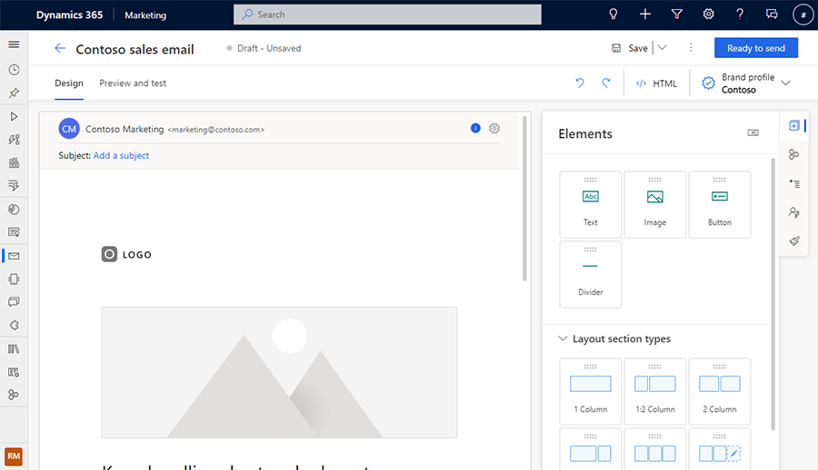
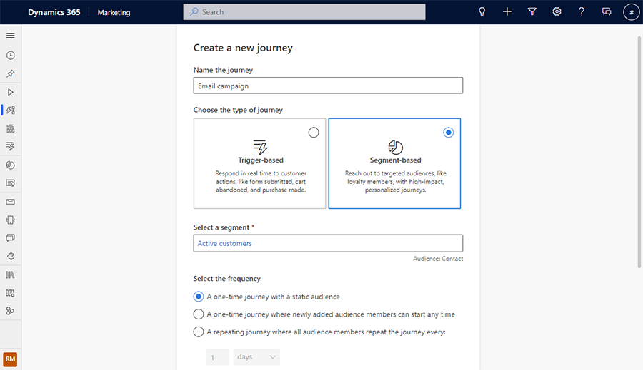
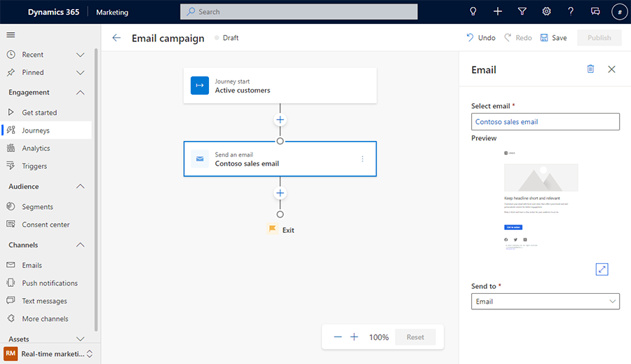

# Send a targeted email blast in real-time marketing

A targeted email blast allows you to quickly reach a specific set of contacts that meet the criteria of your choosing. You may want to target parents in the fall for a back-to-school sale. Or, you may want to reach a subset of customers to tell them about a conference they may be interested in. Real-time marketing offers many ways to reach specific contacts, including email, text, and push messages. This article discusses how to reach contacts through a targeted email campaign.

You’ll need three things to send an email blast:

1. A segment that includes the contacts you want to send the email to.
1. An email you want to send.
1. A journey to send the email to the segment.

## Create a segment

A segment is a subset of your contacts that meet defined criteria. For example, you could have a segment that contains customers over the age of 60 who live in North America, a segment for customers who earn more than $100,000 per year, or a blanket segment with all your active contacts.

For this example, we’ll use a segment with all active contacts. We can define the segment by choosing the “Status” attribute of a contact and creating a segment where the “Status” is “Active” as shown below. Once you've created the segment, remember to mark it as “Ready to use.”

Learn more: [Build segments in real-time marketing](real-time-marketing-build-segments.md).

> [!div class="mx-imgBorder"]
> 

> [!NOTE]
> This example assumes that you are using sample contacts or have already added your own. To learn more about adding contacts, see the [Create a segment with new contacts in outbound marketing](create-segment.md) article.

## Create an email

An email is one of three options, alongside push notifications and text messages, that you can use to reach your customers with real-time marketing.

To create an email, go to **Channels** > **Emails** and start by selecting a template, and then filling in the content to match your message. You’ll also need to select the email header to set a subject and reply email, along with your company’s address. Once you’ve filled in everything, you can optionally choose “Test send” to try out your email by sending it to yourself. After you’re happy with your email, mark it as “Ready to send.”

Learn more: [Create an email in real-time marketing](real-time-marketing-email.md).

> [!div class="mx-imgBorder"]
> 

## Create a journey

Once you have a segment and an email that are both ready to go, the next step is to create a journey to pull them together. When creating the journey, go to **Engagement** > **Journeys**,  choose a segment-based journey, and choose the segment that you made earlier. Then choose a start time and select “Create.”

> [!div class="mx-imgBorder"]
> 

Below the start of the journey, add the email that you created by selecting the “+” button, choosing “Send an email”, and selecting your email.

> [!div class="mx-imgBorder"]
> 

Finally, review and save your journey. You can optionally add additional steps or a goal to your journey. Once you’re happy with your journey, select **Publish** to go live.

Congratulations – you've now sent your first email blast using the real-time marketing area of Dynamics 365 Marketing!

Learn more: [Create a segment-based journey](real-time-marketing-segment-based-journey.md).

## Next steps

After your journey has been running for a while, you’ll start to receive analytics reports that you can use to measure the effectiveness of your journey. Learn more: [Access and interpret analytics](real-time-marketing-analytics.md).

Once you’re ready to take your customer interactions to the next level, you can learn how to use triggers to reach customers in the moments that matter. Learn more: [Create a trigger-based journey](real-time-marketing-trigger-based-journey.md).
