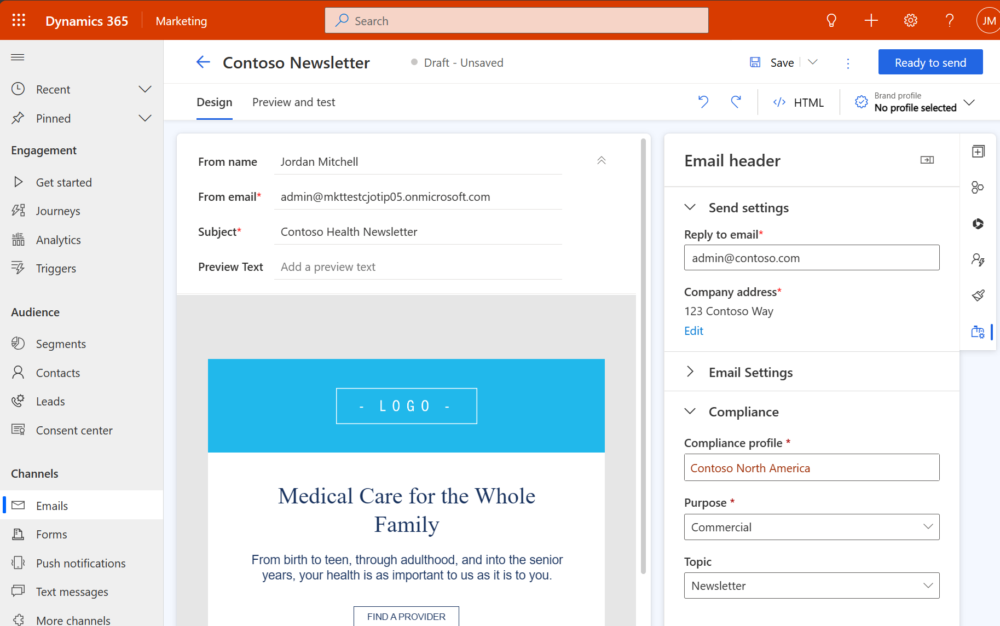

# Manage consent for email and text messages in real-time marketing

> [!NOTE]
> Real-time marketing consent is contact-point based and works for messages sent to contacts, leads, and Customer Insights profiles. Customer consent is stored per email address or phone number, as opposed to being stored per contact record. Outbound marketing consent processes that you have already defined are not influenced by the real-time marketing settings.

> [!IMPORTANT]
> As of December 2022, consent enforcement for real-time customer journeys for **contacts** was changed to require opt-in for emails sent using the **restrictive** consent enforcement model. If you would like to revert to the previous behavior, you can change your consent enforcement model to **non-restrictive**. Alternatively, if you have previously captured consent on **contact** records in outbound marketing, you can **load consent** to populate the contact point consent records used to enforce consent in real-time marketing. Learn more: [Migrate consent records to real-time marketing](real-time-marketing-migrate-consent.md)

> [!TIP]
> Real-time marketing will check the **Allow email** and **Allow bulk email** fields of **contact** records to determine if email is allowed to be sent to the contact's email address. Both fields must be set to allow for an email with a commercial purpose type to be sent to a contact. Only the **Allow email** field must be set to allow emails to be sent with a transactional purpose type selected. These checks are done in addition to the real-time marketing contact point consent opt-in/opt-out checks for emails sent by real-time journeys. These checks are not performed for other entity types (for example, leads or Customer Insights profiles).

Whether consent is checked before sending emails and text messages depends on the consent model that you select for the **Purpose** in a specific **Compliance Profile**. Learn more:[Manage user compliance settings in real-time marketing](real-time-marketing-compliance-settings.md)

## How consent is respected for emails

When creating a new email message, you choose a **Compliance Profile**, a **Purpose**, and, optionally, a **Topic** from that profile in the **Compliance** section of the **Email header** settings. To set up message designation, select the gear icon  in the email header. This opens the **Email header** settings pane on the right side of the page. Navigate to the **Email settings** section.

> [!div class="mx-imgBorder"]
> 

As required for commercial email, a **Company Address** placeholder and an **Unsubscribe** link are added to the email footer automatically. The company address reflects the value set on the **Compliance profile** page and can be edited directly from the email editor, if needed. The unsubscribe link leads to the preference center, where customers can review and change communication preferences.

The presence of a company address and unsubscribe link is checked when you select **Ready to send**. The app notifies you if one of these parameters is missing.

> [!NOTE]
> The app will display warnings if, for example, you accidentally delete either the default company address or link to the default preference page. However, it does not block you from sending such an email. Thus, you are able to replace the given company address field with another one of your choice or add a link to a custom preference center if you like.

If you want to send commercial email, the app checks whether the email addresses of the target audience have granted consent when the email is sent. In the restrictive model, messages only send to customers whose email addresses were opted in. By default, the transactional message purpose has a **Disabled** enforcement model, meaning that consent checks won't run against contact points. The enforcement model can be changed in the compliance profile itself.

## How consent is respected for text messages

The real-time marketing rules for sending text messages are slightly different than the rules for sending emails. A user must always opt in to consent to receive commercial text messages, irrespective of the consent enforcement model. Transactional text messages are always sent and don't have consent checked or enforced.

## Consent to track user behavior

Each compliance profile has its own purpose specifically for tracking user interactions, such as message opens and link clicks. Like the commercial and transactional purposes, the enforcement model for tracking consent can be restrictive, non-restrictive, or disabled. If the tracking purpose is set to a disabled enforcement model, no tracking consent checks are made for messages sent as part of that compliance profile, meaning all interactions are tracked.

If you would like to collect tracking consent, you can add the tracking purpose to forms and preference centers.  

## Consent enforcement diagram

The following diagram provides a visual representation of how consent is enforced in real-time marketing.

<table>
  <tr>
    <th>Restrictive enforcement model</th>
  </tr>
  <tr>
  	<td></td>
    <td><b>Opted out</b></td>
    <td><b>None/Not-set</b></td>
    <td><b>Opted in</b></td>
  </tr>
  <tr>
  	<td><b>Email channel</b></td>
    <td>Blocked</td>
    <td>Blocked</td>
    <td>Sent</td>
  </tr>
  <tr>
  	<td><b>SMS/Custom channel</b></td>
    <td>Blocked</td>
    <td>Blocked</td>
    <td>Sent</td>
  </tr>
  <tr>
  	<td><b>Tracking purpose<b></td>
    <td>Not tracked</td>
    <td>Not tracked</td>
    <td>Tracked</td>
  </tr>
</table>

<table>
  <tr>
    <th>Non-restrictive enforcement model</th>
  </tr>
  <tr>
  	<td></td>
    <td><b>Opted out</b></td>
    <td><b>None/Not-set</b></td>
    <td><b>Opted in</b></td>
  </tr>
  <tr>
  	<td><b>Email channel</b></td>
    <td>Blocked</td>
    <td>Sent</td>
    <td>Sent</td>
  </tr>
  <tr>
  	<td><b>SMS/Custom channel</b></td>
    <td>Blocked</td>
    <td>Blocked</td>
    <td>Sent</td>
  </tr>
  <tr>
  	<td><b>Tracking purpose<b></td>
    <td>Not tracked</td>
    <td>Tracked</td>
    <td>Tracked</td>
  </tr>
</table>

<table>
  <tr>
    <th>Disabled enforcement model</th>
  </tr>
  <tr>
  	<td></td>
    <td><b>Opted out</b></td>
    <td><b>None/Not-set</b></td>
    <td><b>Opted in</b></td>
  </tr>
  <tr>
  	<td><b>Email channel</b></td>
    <td>Sent</td>
    <td>Sent</td>
    <td>Sent</td>
  </tr>
  <tr>
  	<td><b>SMS/Custom channel</b></td>
    <td>Sent</td>
    <td>Sent</td>
    <td>Sent</td>
  </tr>
  <tr>
  	<td><b>Tracking purpose<b></td>
    <td>Tracked</td>
    <td>Tracked</td>
    <td>Tracked</td>
  </tr>
</table>

> [!IMPORTANT]
> Real-time marketing checks the **Allow email** and **Allow bulk email** fields of **contact** records to determine if email is allowed to be sent to the contact's email address. Both fields must be set to allow for an email with a commercial purpose type to be sent to a contact. Only the **Allow email** field must be set to allow emails to be sent with a transactional purpose type selected. These checks are done in addition to the real-time marketing contact point consent opt-in/opt-out checks for emails sent by real-time journeys. These checks are not performed for other entity types (for example, leads or Customer Insights profiles).

## View consent records

In the consent center, you can view a list of all contact-point consents and their related attributes (type, status, source of consent data, and date modified).

To see a compact view for a single consent record or make changes to it, select the contact point name from the list of records.

## Audit consent records

You can keep track of all consent-related changes on a per contact record basis (who made the changes and when). The **Audit history** is available under a consent record's **Related** tab.

### See also

[Grow your business with multi-brand, custom preference centers](real-time-marketing-compliance-settings.md)
[Real-time marketing preference centers](real-time-marketing-preference-centers.md)
[Outbound marketing compliance settings](privacy-use-features.md)

[!INCLUDE[footer-include](../includes/footer-banner.md)]