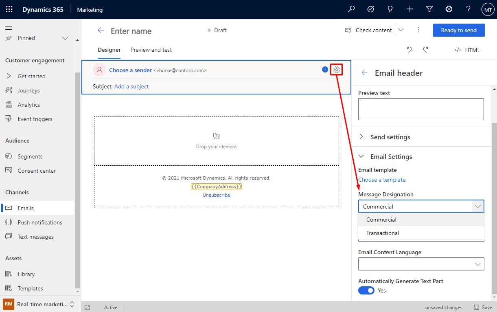
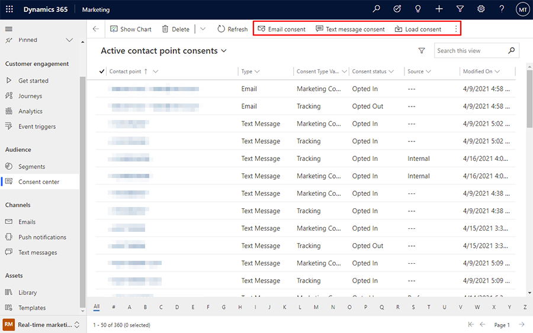
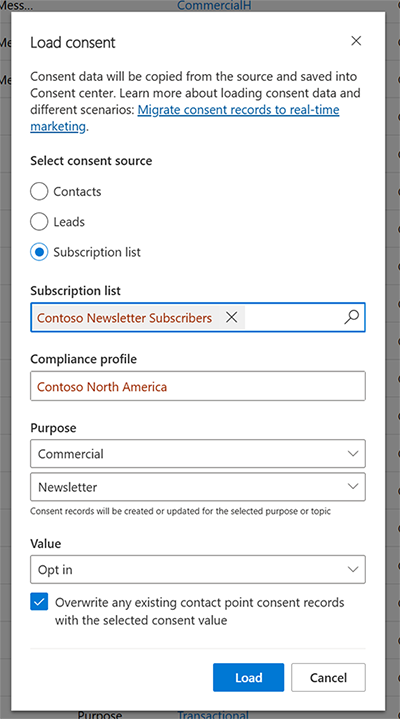

# Manage consent for email and text messages in real-time marketing

> [!IMPORTANT]
> A preview feature is a feature that is not complete, but is made available before it’s officially in a release so customers can get early access and provide feedback. Preview features aren’t meant for production use and may have limited or restricted functionality.
> 
> Microsoft doesn't provide support for this preview feature. Microsoft Dynamics 365 Technical Support won’t be able to help you with issues or questions. Preview features aren’t meant for production use, especially to process personal data or other data that are subject to legal or regulatory compliance requirements.

The real-time marketing Consent center allows you to track consent information given by your customers.

> [!NOTE]
> Real-time marketing consent is contact-point based. Customer consent is stored per email address or phone number, as opposed to being stored per Contact record. Outbound marketing consent processes that you have already defined are not influenced by the real-time marketing settings.

Whether consent is checked before sending emails and text messages depends on the consent model that you select on **Compliance** page. [Learn more about compliance settings](real-time-marketing-compliance-settings)

## How consent is respected for emails

When creating a new email message, one of the parameters you need to set up is **Message designation**. To set up message designation, select the gear icon  in the email header. This will open the **Email header** settings pane on the right side of the page. Navigate to the **Email settings** section.

The message designation is a drop down field in which you can choose **Commercial** or **Transactional**. By default, new email messages are designated as commercial.

> [!div class="mx-imgBorder"]
> 

As required for commercial email, a **Company Address** placeholder and an **Unsubscribe** link are added to the email footer automatically. The company address reflects the value set on **Compliance** page. The unsubscribe link leads to the Preference page, where customers can review and change communication preferences.

The presence of a company address and unsubscribe link is checked when you select **Ready to send**. The app will notify you if one of these parameters is missing.

If you want to send commercial email, the app will check whether the email addresses of the target audience have granted consent when a customer journey is started. Messages will only be sent to customers whose email addresses were opted-in.  
 
## How consent is respected for text messages
 
 In the real time marketing Public Preview, only transactional text messages can be sent. Sending transactional text messages requires a mobile number has opted in before it can receive the message.

## Adding consent data

When you initially install real-time marketing, the real-time marketing consent center (**Real-time marketing** > **Audience** > **Consent center**) will contain no records, even if you already gathered consent in outbound marketing. You can add consent information using one of three methods:

1. Add new consent records for email and text messages manually by selecting the corresponding option from the top ribbon.
1. Import consent settings from an Excel file.
    > [!TIP]
    > If you don't see the **Import from Excel** option in the top ribbon, you may have to select the three dots on the right side of the ribbon to see more items.
1. Load consent information that was already captured for contacts from previous Dynamics 365 Marketing settings.

> [!div class="mx-imgBorder"]
> 

## Loading consent from contacts

To load consent from contacts, an administrator must select **Load consent** from the top ribbon on the **Consent center** page.

The following message will appear:

> [!div class="mx-imgBorder"]
> 

To load consent from contacts, the following prerequisites must be met:

1. Only one email address from a contact record will be loaded. This field is defined in the [Audience configuration](real-time-marketing-audience-data.md)and can be changed by administrator.
1. Consent information is loaded from the *Allow bulk email* field of a contact record.
1. If two or more contacts share the same email address, consent for the email will be set to *Allow* **only** when all contacts contain the value *Bulk email=Allow*. In all other cases, consent for the email address will be set to *Do not allow*.
1. If consent for the email already exists in real-time marketing (for example, you decide to load consent from contacts after some email consent items were already manually added), the above-listed rule applies. The email address is only opted in if **both** email consent values are set to *Allow* **and** all consent records from contacts that share the same email address are set to *Allow*.

Consent loaded from contacts relates to emails only and includes the following fields: *Allow email*, *Allow bulk email*, and *Allow tracking*.

## View consent records

In the Consent center, you can view a list of all contact-point consents and their related attributes (type, status, source of consent data, and date modified).

To see a compact view for a single consent record or make changes to it, select the contact point name from the list of records.

## Audit consent records

You can keep a record of all consent-related changes per contact record (who made the changes and when). The auditing system is usually disabled by default, so you'll need to set it up if you want to use it to log consent changes.

To access auditing features:

1. Open the **Settings** menu  at the top of the page and select **Advanced settings**.
2. The advanced-settings area opens in a new browser tab. Note that this area uses a horizontal navigator at the top of the page instead of a side navigator. Navigate to **Settings** > **System** > **Auditing**.
3. Select **Global audit settings**, then select the **Start auditing** checkbox. Begin the audit by selecting **OK**.
4. Select **Entity and Field Audit Settings**.  In the left column, in the list of fields, select **Contact Point Consent**. Ensure that auditing for this field is switched on.
5. You can access all information about field changes in the **Audit summary View** area of the **Auditing** page in **Advanced settings**.
