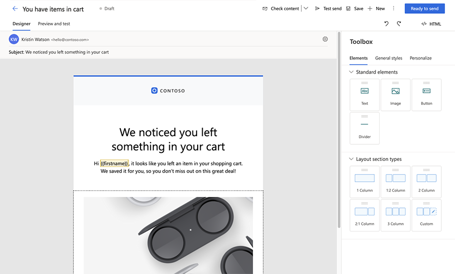
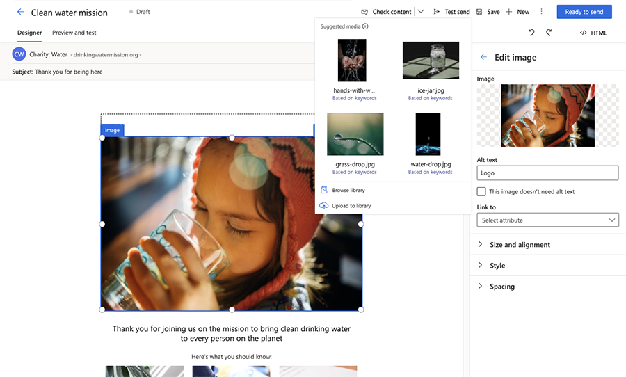
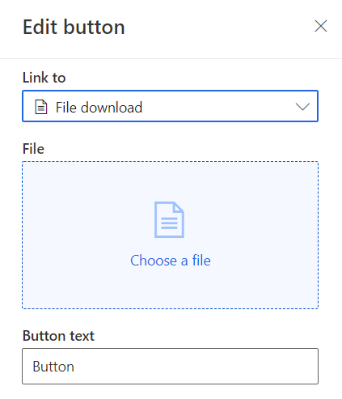
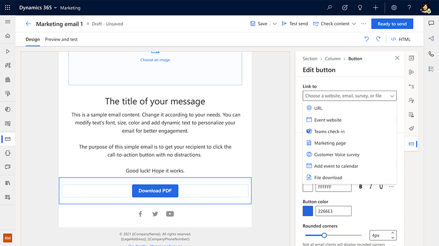

# Create real-time marketing emails

The real-time marketing email editor shares much of its look and feel with the [outbound marketing email editor](prepare-marketing-emails.md). As with the outbound marketing email editor, the real-time marketing editor allows you to quickly create personalized emails to capture your customers' attention.

Learn more about creating email in Dynamics 365 Marketing: [Create a new email and design its content](email-design.md)

## Features unique to the real-time marketing email editor

In addition to the standard email editor features, the real-time marketing email editor includes unique personalization capabilities and AI-driven image suggestions.

### Powerful email personalization

The real-time marketing email editor has a new assist edit control to bind personalized data. Use personalized data to dynamically populate information that is unique to each email recipient.

#### Add personalized data to a real-time marketing email

1. Create a placeholder by adding a text field and then selecting the **Personalization** button  in the toolbar.
1. Select **Select a data field** to choose a data source. Your data source can be based on an **Audience**, a **Trigger**, or **Compliance**.
1. After choosing the data source, you can search for the specific attribute or trigger you're looking for.
1. Add a **Label** to quickly identify your dynamic text in the message content.
1. Personalized dynamic text is highlighted in the content designer.
1. You can see and edit all your dynamic text in the **Personalize** tab in the **Toolbox**.

> [!div class="mx-imgBorder"]
> 
<!-- 
### AI-driven image suggestions

The new editor analyzes the text content of your email and, using AI, suggests the most relevant images from the new asset library. The images are tagged automatically, saving you time.

Learn more about the [Asset library](real-time-marketing-asset-library.md)

> [!div class="mx-imgBorder"]
> 
-->
### Link to documents and videos stored in the asset library

Add feature-rich links to emails by directly linking to documents stored in the asset library. To link to a document or video:

1. Add some text, a button, or an image to a real-time marketing email.
1. In the button or image editing pane (or in the text link dialog), select the **Link to** dropdown then select **File download**.
1. To link to a document in the image library, select **Choose a file** then select **Browse library** and choose your file.
1. Alternatively, you can upload a new file to link to by selecting **Upload to library**.

> [!div class="mx-imgBorder"]
> 

### Link to surveys, events, marketing pages, Microsoft Teams events, or calendar items

Using text, images, or buttons in the real-time marketing email editor, you can link to surveys, events, or marketing pages. You can also create text, button, or image links that allow recipients to join a Microsoft Teams event or that create a new calendar item.

  > [!div class="mx-imgBorder"]
  > 

The **Link to** dropdown allows the following options for Teams check-ins and calendar items:

- **Teams check-in**: Select a specific Teams event or session that your button or image should link to.
- **Add to Calendar**: Link to an iCalendar file. Choose the information you want to include in the iCalendar file using the **What should be added to calendar** dropdown. The options include:
    - **Only the event**: The iCalendar file will contain only the event the contact has registered for.
    - **Event and sessions registered**: The file will contain information for the event and the sessions the contact has registered for.
    - **Only sessions registered**: The file will contain only the event sessions the contact has registered for.
