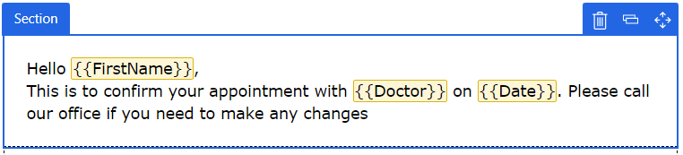

# Create real-time marketing emails

> [!IMPORTANT]
> A preview feature is a feature that is not complete, but is made available before it’s officially in a release so customers can get early access and provide feedback. Preview features aren’t meant for production use and may have limited or restricted functionality.
> 
> Microsoft doesn't provide support for this preview feature. Microsoft Dynamics 365 Technical Support won’t be able to help you with issues or questions. Preview features aren’t meant for production use, especially to process personal data or other data that are subject to legal or regulatory compliance requirements.

The real-time marketing email editor shares much of its look and feel with the [outbound marketing email editor](prepare-marketing-emails.md). As with the outbound marketing email editor, the real-time marketing editor allows you to quickly create dynamic emails to capture your customers' attention. 

Learn more about creating email in Dynamics 365 Marketing: [Create a new email and design its content](email-design.md)

In addition to the standard email editor features, the real-time marketing email editor includes unique personalization capabilities and AI-driven image suggestions.

## Features unique to the real-time marketing email editor

### Powerful email personalization

The real-time marketing email editor has a new assist edit control to bind personalized data. Use personalized data to dynamically populate information that is unique to each email recipient.

To add personalized data to a real-time marketing email:

- Create a placeholder by adding a text field, then selecting the **Personalization** button  in the toolbar.
- Choose a **Data source**. Your data source can be based on **Compliance**, **Events**, or a **Customer Insights** profile.
- After choosing the data source, you can search for the specific attribute you are looking for.
- Add a **Label** to quickly identify your token in the content.
- Personalized tokens are highlighted in the content designer.

    > [!div class="mx-imgBorder"]
    > 

- You can see and edit all your tokens in the **Dynamic data** tab.

### AI-driven image suggestions

The new editor analyzes the text content of your email and, using AI, suggests the most relevant images from the new asset library. The images are tagged automatically, saving you time.

Learn more about the [Asset library](real-time-marketing-asset-library.md)