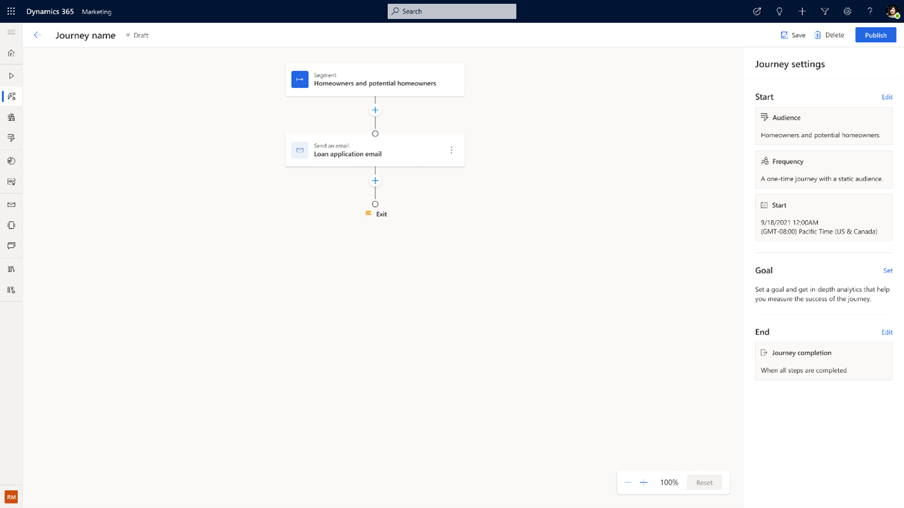
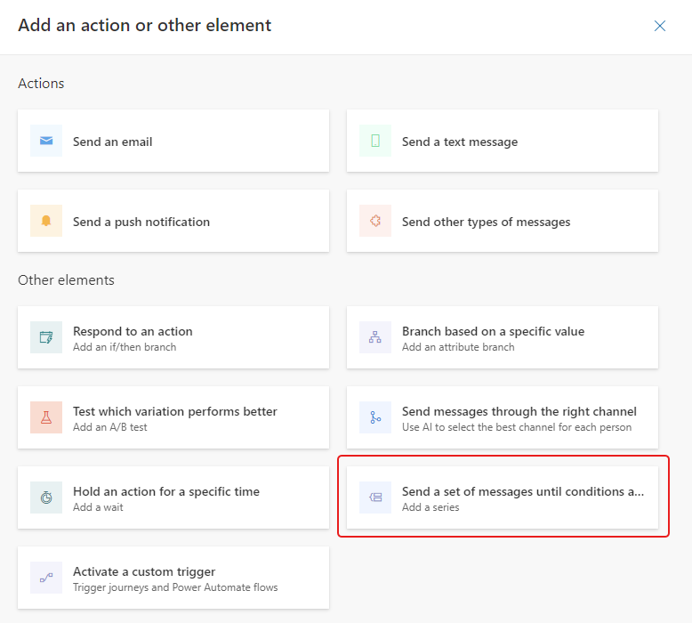
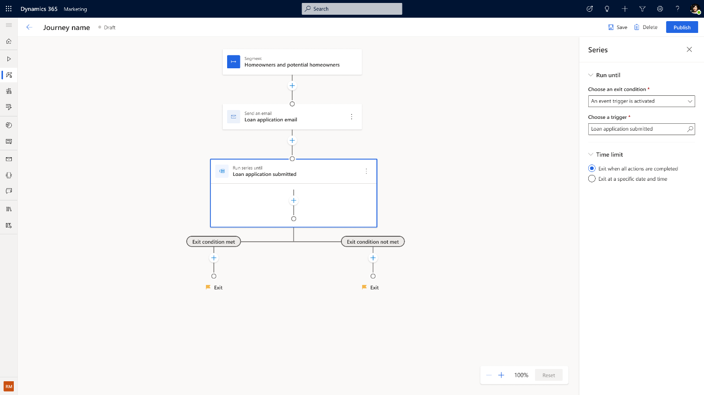
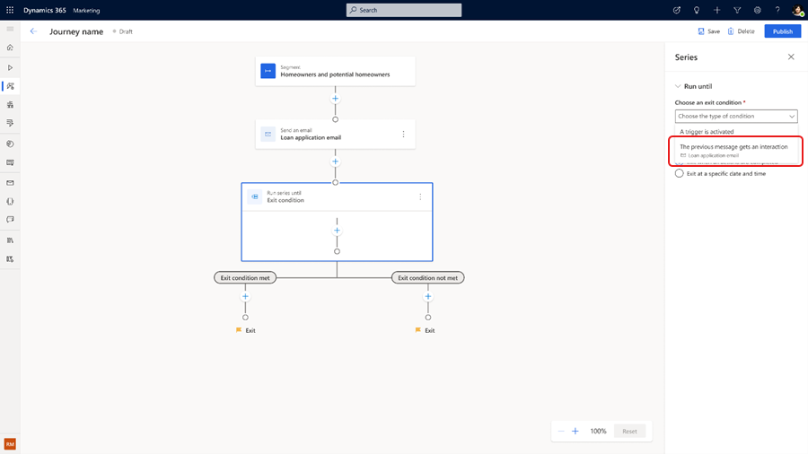
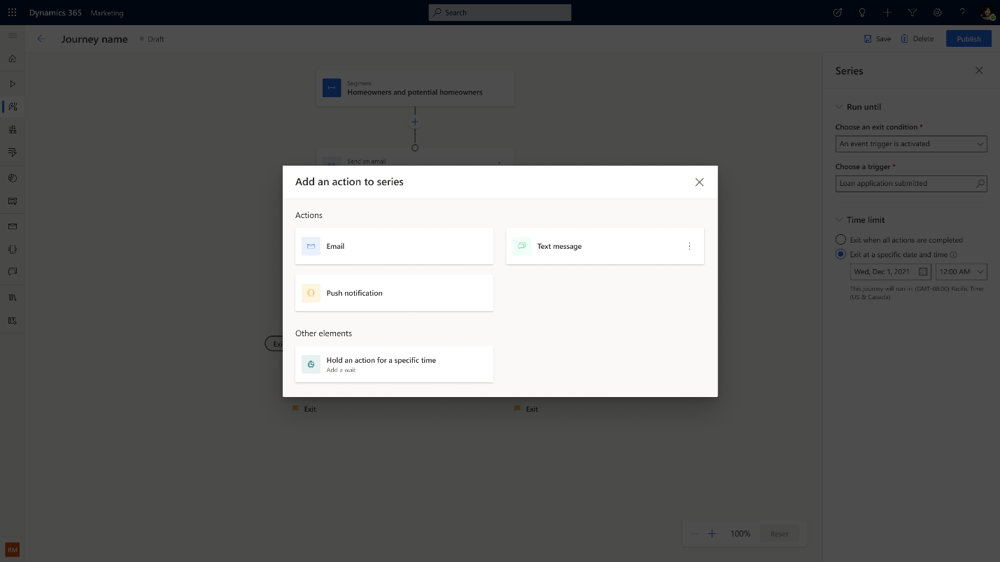
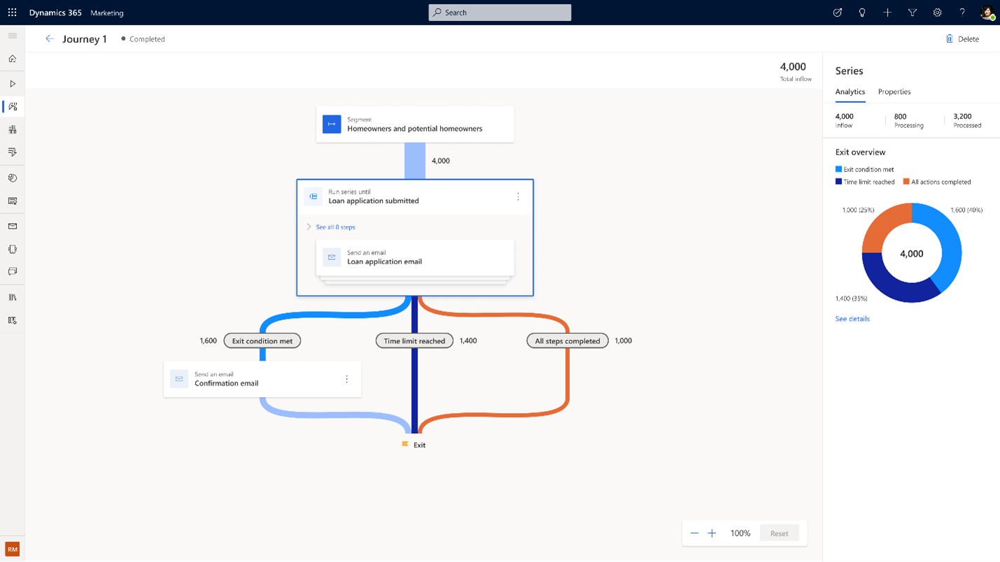

# Enhanced journey reminders

[!INCLUDE[consolidated-sku-rtm-only](../includes/consolidated-sku-rtm-only.md)]

Create action-oriented journeys that remind customers to complete a call to action until a certain date or time. Built-in reminder orchestration eliminates the need to create cascading branches that check for the qualifying action after each step or specify conditions with more than two possibilities. This simplifies not only the journey logic required to capture the whole scenario in a single journey, but also preserves all analytics for the journey actions in a single place when journeys are live.

## Create reminders using the Series tile

The best way to show how journey reminders work is to walk through a real-life scenario. Let's say you're working for a loan company. You want to create a customer journey to remind current and future homeowners to fill out their loan applications. First, you'll need to create a [segment-based journey](real-time-marketing-build-segments.md) that sends out an initial loan application email.

> [!div class="mx-imgBorder"]
> 

1. To create the reminders, select the plus (**+**) symbol below the email tile then select the **Send a set of messages until conditions are met** tile in the action pane. This is also known as the **Series** tile.

    > [!div class="mx-imgBorder"]
    > 

1. The Series tile has two exits by default. If a customer completes the defined exit condition, they exit the left branch. Otherwise, the customer exits the right branch. In this example, the exit condition is a custom trigger called "Loan application submitted".

    > [!div class="mx-imgBorder"]
    > 

1. You can also define your exit condition by how your customers interact with your previous messages. For example, the exit condition can be met if the customer opened the loan application email or clicked on a link within the email.

    > [!div class="mx-imgBorder"]
    > 

1. To make sure your reminders fit within a defined time frame, you can set an end date for your application under **Time limit** in the Series properties pane on the right. Selecting an end date automatically adds an additional exit branch for the Series tile. If a customer doesn't complete the application within the defined time window, they'll exit through the new branch.

1. To complete the journey, select the plus (**+**) button inside the Series tile and add messages from different channels that you want to send out as part of the reminder journey. Add wait time between the messages to avoid spamming your customers.

    > [!div class="mx-imgBorder"]
    > 

## View analytics of the Series tile and your reminder journey

After the journey has been live for a while, select the **Analytics** tab in the Series tile properties to see how many customers are flowing through each exit branch and analytics on the delivery and interactions details of each message inside the Series tile.

> [!div class="mx-imgBorder"]
> 

[!INCLUDE[footer-include](../includes/footer-banner.md)]
