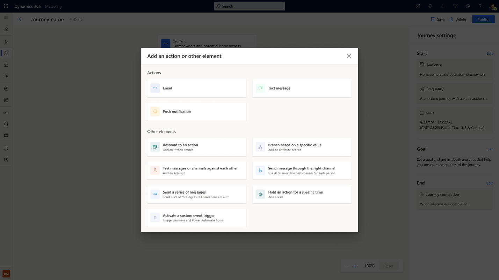
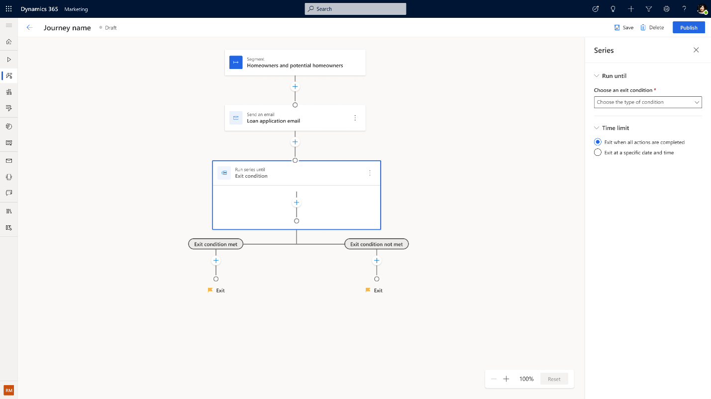

# Boost your productivity with enhanced journey reminders

To support marketers and boost their productivity, we’ve enhanced recurring message orchestration capabilities. You can now create action-oriented journeys, reminding customers until they complete a call to action or until a certain date or time. Built-in reminder orchestration eliminates the need to create cascading branches that check for the qualifying action after each step or specify conditions with more than two possibilities. This simplifies not only the journey logic required to capture the whole scenario in a single journey but also preserves all analytics for the journey actions in a single place when journeys are alive.

## How to create reminders using Journey Series in real-time marketing

For example, a loan company wants to create a customer journey to remind their homeowners and future homeowners to fill out their loan applications. They can create a segment-based journey to send out an initial loan application email.

> [!div class="mx-imgBorder"]
> 

1. To create reminders, select the new ‘**Series**’ tile in the action pane. 

> [!div class="mx-imgBorder"]
> 

2. The Series tile has two exits by defaults, if the customers have completed the exit condition defined, they'll exit the left branch; otherwise, they'll exit the right branch. In the example, the exit condition can be a custom trigger called ‘loan application submitted’. 

> [!div class="mx-imgBorder"]
> 

> [!div class="mx-imgBorder"]
> 

3. You may also define your exit condition as how your customers interact with your previous messages. For example, if they clicked on the loan application email or clicked on a link within it. 

> [!div class="mx-imgBorder"]
> 

4. To make sure your reminders are in effective time window of communications, you can set an end date for your application. This automatically adds an additional exiting branch for the Series tile. If the customers didn't complete the application within the defined time window, they'll exit through this new branch. 

5. Then, add messages from different channels that you may want to send out as part of the reminder journey. Add wait time in between to avoid spamming your customers. 

> [!div class="mx-imgBorder"]
> 

> [!div class="mx-imgBorder"]
> 

## View analytics of the Series tile and your reminder journey 

After the journey has been live for a while, you can easily see how many customers flow through each exiting branches, along with analytics on the delivery and interactions details of each message inside the Series tile.

> [!div class="mx-imgBorder"]
> 