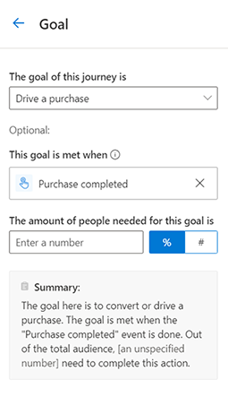
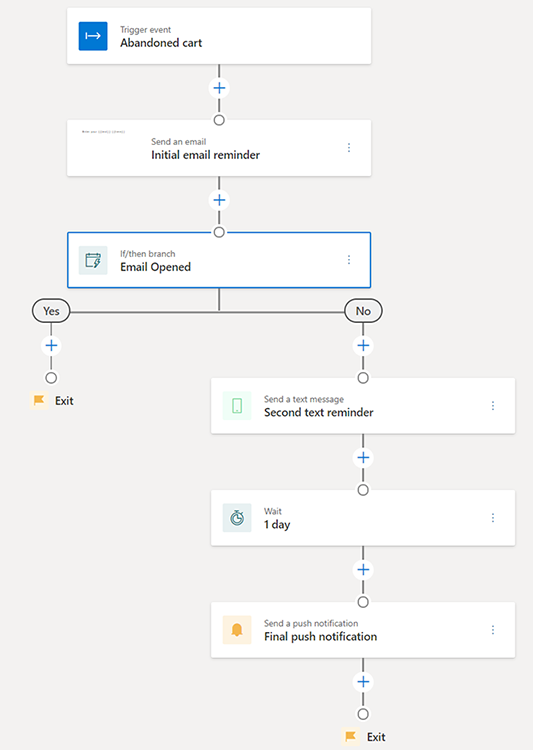

# Create an event-based journey

> [!IMPORTANT]
> A preview feature is a feature that is not complete, but is made available before it’s officially in a release so customers can get early access and provide feedback. Preview features aren’t meant for production use and may have limited or restricted functionality.
> 
> Microsoft doesn't provide support for this preview feature. Microsoft Dynamics 365 Technical Support won’t be able to help you with issues or questions. Preview features aren’t meant for production use, especially to process personal data or other data that are subject to legal or regulatory compliance requirements.

Event-based customer journeys enable you to react to customers’ actions in real time. Journeys can be triggered based on real-world interactions like walking into a store and connecting to Wi-Fi. Journeys can also be triggered by virtual interactions such as visiting a shopping site. The real-time nature of the journey ensures that you can respond to customers immediately and convert their expression of interest into a sale.

## Creating an event-based journey for abandoned cart reminders

To illustrate the capabilities of an event-based journey, we will create a personalized, multi-channel, event-based journey that can be used to bring prospective buyers with abandoned carts back to your website to complete their purchase.  

## Pre-requisites

### Create custom event triggers

- Work with your website team to capture the customer's *Abandoned cart* and *Purchase completed* actions as custom event triggers. For more information on creating custom events, see [Real-time marketing event triggers](real-time-marketing-event-triggers.md).
- The *Abandoned cart* event trigger should be raised whenever a customer adds products to the cart but does not complete the purchase.  
- The *Purchase completed* event should be raised whenever a customer completes their purchase.

### Create email, text, and push notifications

We will use three touchpoints across various channels to remind customers to complete their purchase.

- **Initial email reminder**: When a customer abandons a cart, they will get an email to remind them to complete their purchase.  
- **Second text reminder**: If the customer has not opened their email one day after the initial reminder, we will try to reach them with a text message.
- **Final push notification**: If the customer has not completed their purchase one day after the second reminder, we will send a final push notification.

You can build the journey while the content is in the **Draft** state. To publish and go live with the journey, the content must be in the **Ready to send** state.

## Set the journey start

When creating an event-based journey, you can specify the following properties to configure how customers start the journey:

- **Choose an event trigger**: This is the event trigger that customers must perform to start the journey. We want customers to start the journey when they abandon their cart, so select the *Abandoned cart* event as the event trigger.
- **Repeating this journey**: Specify whether a customer can repeat the journey and how soon can they repeat it if they perform the event trigger again. For an abandoned cart reminder journey, this can be *immediately*, as the *Abandoned cart* event is only triggered once for every abandoned cart. For other types of journeys, especially those involving event triggers that are more frequent (like visiting a website), you may want to consider adding some delay before letting people repeat the journey.  
- **Start date and time**: Customers can start the journey only if they perform the event trigger after this start date and time. Select today's date if you want the journey to start listening to the abandoned cart event trigger immediately after it has been published.  

> [!div class="mx-imgBorder"]
> 

Additional configuration for starting the journey can be found in the journey task pane. See [Real-time marketing journey tile reference](real-time-marketing-tile-reference.md). 

## Set the journey goal

The goal for this journey is to *drive a purchase*. You can use the *Purchase completed* event trigger to track and capture when users meet this goal. The **Amount of people needed for this goal** can be set to 50% to indicate that you want at least 50% of customers who abandon carts and are targeted by this journey to go on to complete the purchase.

> [!div class="mx-imgBorder"]
> 

## Set the journey exit

By default, customers leave the journey when they have completed all the steps. However, you can set additional journey exits by using event triggers. For this journey, you want to make sure you only send the reminder messages if customers have not yet completed their purchase. By setting the journey exit to the *Purchase completed* event, you can ensure that the moment any customer completes the purchase, they will exit the journey and no longer receive the reminder messages. Setting the journey exit to an event trigger provides an easy way to remove customers who perform the event trigger from the journey, ensuring that customers do not receive irrelevant messages from your customer journey.

> [!div class="mx-imgBorder"]
> 

## Add the abandoned cart reminders

Use the plus sign on the journey canvas to add the abandoned cart reminders to your journey.

1. **Send an email**: Select the *Initial email reminder* email that you want to send. For the **Send to** field, select the attribute that contains the email address you want to send the email to.
1. **Add an if/then branch**: In the **Branch off this** field, select the previous email *Initial email reminder*. You want to **Wait for** the *Email opened* event trigger. Set the time limit to *1 day*. This if/then branch will check to see if the customer opens the *Initial email reminder* email within one day after it was sent. If the customer opens the email within one day, they will immediately go down the yes branch. If the customer has not opened the email one day after it was sent, they will go down the no branch.
1. **Send a text message**: Under the no branch, you can send the *Second text reminder*. For the **Send to** field, select the attribute that contains the phone number you want to send the text message to. This text message will only be sent if the customer did not open the first email message within a day. Because the if/then branch already has a time limit of one day, the text message will be sent one day after the email was sent.
1. **Add a wait**: Add a wait and select *A set amount of time*. Set the duration to *1 day*. This will ensure that customers wait for one day after the text message before moving forward to the next step.
1. **Send a push notification**: As the final step, send the *Final push notification* reminder.

> [!div class="mx-imgBorder"]
> 

## Publish the journey

After adding all the steps to the journey canvas, the journey is ready to go live and message real customers. Before publishing the journey, make sure all related content (email, text messages, and push notifications) is in the **Ready to send** state. Any event triggers must also be published and their code integrated. The journey cannot be modified after it is published, so it's a good idea to verify that all the steps in the journey are exactly how you want them before publishing.

Once the journey is published and live, you can look at the journey [analytics page](real-time-marketing-analytics.md) to understand how it is performing.