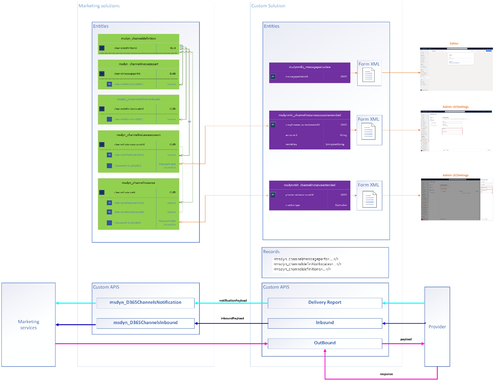

# Preview: Manually add a custom channel

> [!IMPORTANT]
> A preview feature is a feature that is not complete, but is made available before it’s officially in a release so customers can get early access and provide feedback. Preview features aren’t meant for production use and may have limited or restricted functionality.
> 
> Microsoft doesn't provide support for this preview feature. Microsoft Dynamics 365 Technical Support won’t be able to help you with issues or questions. Preview features aren’t meant for production use, especially to process personal data or other data that are subject to legal or regulatory compliance requirements.

Marketing currently offers three types of native channels: **Email**, **Push** and **SMS**. To create a different type or channel or use an SMS provider that isn't supported natively, you need to develop and install a custom channel solution. 

## Custom channel structure

Custom channels can be implemented as part of a Dataverse solution. The steps and actions required to create a custom channel are listed below:

1.	Define your extended configuration entity for Channel Instance 
2.	Define your extended configuration entity for the Channel Instance account   - SMS only
3.	Define your Message parts ([solution aware component](https://dynamicscrm.visualstudio.com/OneCRM/_wiki/wikis/OneCRM.wiki/30527/Solution-Aware-Entities))
4.	Define your localization for the Admin UI - Optional
5.	Define the Message editor UI - Optional
6.	Define your Custom APIs
7.	Define your Channel Definition ([solution aware component](https://dynamicscrm.visualstudio.com/OneCRM/_wiki/wikis/OneCRM.wiki/30527/Solution-Aware-Entities))

Marketing already provides base components for the custom channel creation: the **required entities** like msdyn_chaneldefinition, msdyn_channelmessagepart, msdyn_channelocale, msdyn_channelinstanceaccout and msdyn_channelinstance. Along with the entity metadata, it provides **Custom APIs** that should be called from your custom solution’s plugins in order to proxy the data to Dataverse.

The overview diagram below shows main components of Marketing and custom channel solution, so as how they interact with each other:

> [!div class="mx-imgBorder"]
> 

The implementation requirements for channels of SMS and Custom type differ as follows:

| **Component**                                                    | **SMS**                                                                          | **Custom**                                                |   |   |   |   |
|--------------------------------------------------------------------------|--------------------------------------------------------------------------------------------|---------------------------------------------------------------------|---|---|---|---|
|     Extended configuration entity for the Channel Instance            |     Required                                                                            |     Required                                                     |   |   |   |   |
|     Extended configuration entity for the Channel Instance account    |     Required                                                                            |     Not supported currently                                      |   |   |   |   |
|     Message parts                                                     |     Required, should contain only a single message part with   “msdyn_name” = “text”    |     Required                                                     |   |   |   |   |
|     Localization for Admin UI                                         |     Optional                                                                            |     Optional                                                     |   |   |   |   |
|     Message editor UI                                                 |     Not allowed, native Marketing SMS editor is used                                    |     Optional, generic Marketing editor is used if not defined    |   |   |   |   |
|     Custom APIs                                                       |     Required                                                                            |     Required                                                     |   |   |   |   |
|     Channel Definition                                                |     Required                                                                            |     Required                                                     |   |   |   |   |

#### Sample solutions  
The samples below include unpacked solutions for Dataverse and plugins projects.
To pack and import these solutions, first build the plugin project. The project will then copy the assembly to the solution project. Then, pack the solution using the [Solution Packager tool](https://learn.microsoft.com/en-us/power-platform/alm/solution-packager-tool)

SampleSmsChannel.zip

SampleCustomChannel.zip