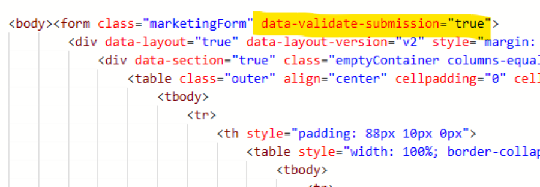
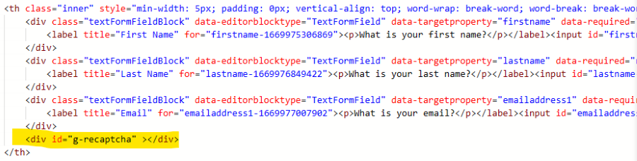
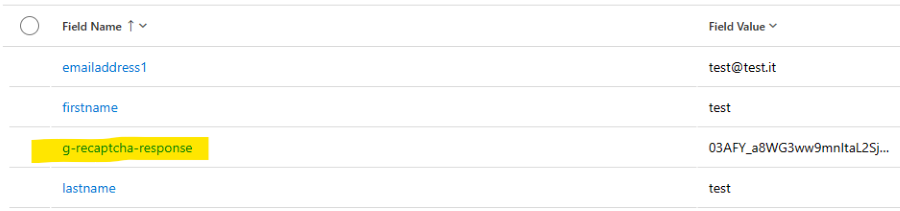
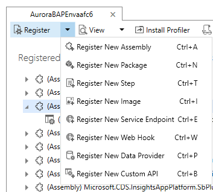
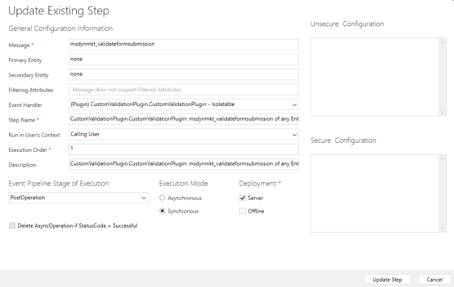
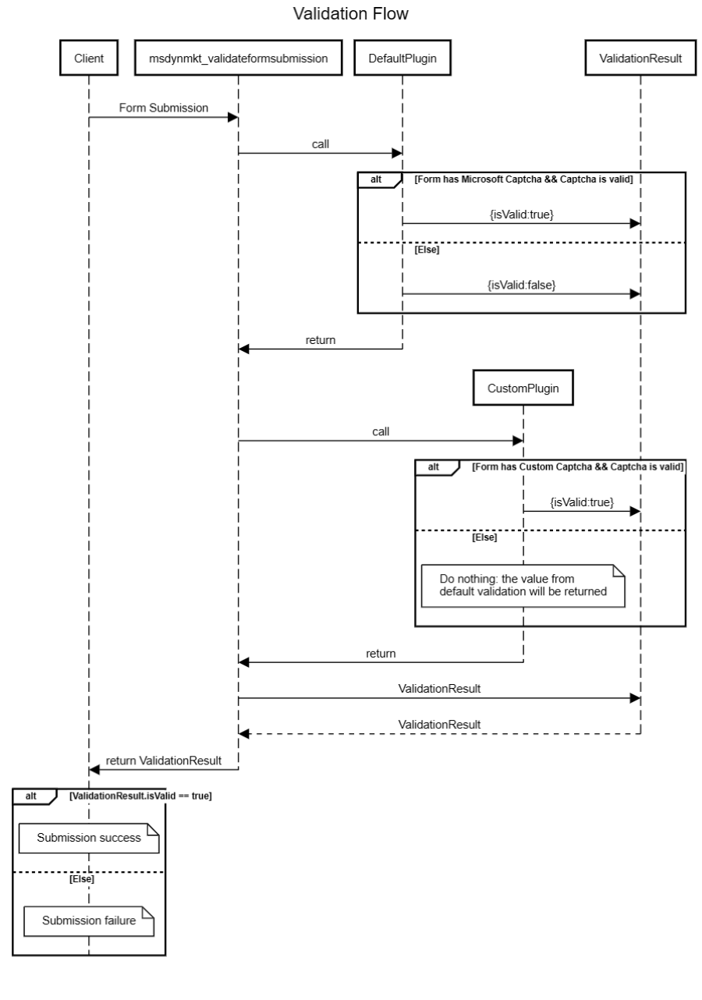

# Integrate custom captcha service with real-time marketing forms

The real-time marketing forms allow you to use your own custom captcha bot protection to validate form submissions. This article describes an example how to integrate  Google reCAPTCHA. The flow is also very similar for other captcha services.

The whole process consists of these steps:

1. **Add reCAPTCHA to the form.**
1. **Add the captcha text value** to the form submission once the form is submitted.
1. **Create a plugin** in the CRM that will validate the captcha.

## Step-by-step example: Integrate Google reCAPTCHA

### 1. Add reCAPTCHA to the form

1. Create a form in real-time marketing form editor.
1. Add `data-validate-submission="true"` attribute to the `<form>` element. That wil enable custom validation on the form submission:
    > [!div class="mx-imgBorder"]
    > 
1. Add a `<div id="g-recaptcha">` in the form as placeholder for reCAPTCHA. This div id will be used as a reference later. It is recommended to put the placeholder between the last field and submit button.
    > [!div class="mx-imgBorder"]
    > 
1. Publish the form and embed the form into your website.
1. Edit the page where the form was embedded. Add the script provided by Google into the page header. This script will load the reCAPTCHA, with the onLoad callback parameter. This callback will be called as soon as the captcha is loaded.

    ```javascript
    <script src="https://www.google.com/recaptcha/api.js?onload=onloadCallback" async defer></script>
    ```

1. Add the onLoadCallback function:

    ```javascript
    function onloadCallback() {
        grecaptcha.render('g-recaptcha',
        { 
          sitekey: '{sitekey}',
        });
    }
    ```

    Replace the `{sitekey}` placehodler with the one provided by Google. This callback function will render the reCAPTCHA inside the placeholder `<div id="g-recaptcha">` we created earlier.

### 2. Add the captcha text value to the form submission

Once the form is submitted, the `g-recaptcha-response` parameter will be added automatically to the form submission. In the next steps we will build a plugin that will hide this value and it will add it to the `ValidationOnlyFields` list in the response object returned by plugin code.

> [!div class="mx-imgBorder"]
> 

### 3. Create a plugin

#### 3.1 Create Visual Studio Project for the plugin

1. Open Visual studio and create a new Class Library project using .NET Framework 4.6.2
1. In Solution Explorer click Manage Nuget Pacakges and install `Microsoft.CrmSdk.CoreAssemblies`

#### 3.2 Create the plugin class

1. Rename `Class1.cs` to `CustomValidationPlugin.cs`
1. Make CustomValidationPlugin class inherit from IPlugin interface and add Execute method.

    ```cs
    public class CustomValidationPlugin : IPlugin
    {
       public void Execute(IServiceProvider serviceProvider)
       {

       }
    }
    ```

1. Add the following code into the execute method to retrieve context and tracing service:

    ```cs
    public void Execute(IServiceProvider serviceProvider)
    {
       // get tracing service
       ITracingService tracingService =
       (ITracingService)serviceProvider.GetService(typeof(ITracingService));

       // get plugin execution context
       IPluginExecutionContext context = (IPluginExecutionContext)
       serviceProvider.GetService(typeof(IPluginExecutionContext));
    }
    ```

1. Add this code to the retrieve form submission parameter string. It will be a json encoded string representing the fields that the user submitted in the form. We retrieve this string and deserialize it using a Deserialize helper method and FormSubmissionRequest class that we will define later. We check that the Fields array contains a key for g-recaptcha-response. If the reCAPTCHA key is not found we return skipping validation as this mean the form we are processing did not contain a Google recaptcha element.

    ```cs
    var requestString = (string)context.InputParameters["msdynmkt_formsubmissionrequest"];
    var requestObject = Deserialize<FormSubmissionRequest>(requestString);
    if (!requestObject.Fields.TryGetValue("g-recaptcha-response", out string recaptchaToken))
    {
       tracingService.Trace("g-recaptcha-response was not present in form submission");
       return;
    }
    ```

1. Add the following code to return if `g-recaptcha-token` value is null or empty.

    ```cs
    if (String.IsNullOrEmpty(recaptchaToken))
    {
       tracingService.Trace($"g-recaptcha-response value not found");
       return;
    }
    ```

1. Add the following code to validate the google captcha token against Google APIs.

    ```cs
    string url = "https://www.google.com/recaptcha/api/siteverify";
    using (HttpClient client = new HttpClient())
    {
       var content = new FormUrlEncodedContent(new Dictionary<string, string>
       {
          {"secret", "your_secret_key"},
          {"response", recaptchaToken}
       });

       try
       {
          var response = client.PostAsync(url, content).Result;
          if (!response.IsSuccessStatusCode)
          {
             tracingService.Trace($"Request Failed: ({response.StatusCode}){response.Content}");
             return;
          }

          var responseString = response.Content.ReadAsStringAsync().Result;

          gRecaptchaResponse = Deserialize<GRecaptchaResponse>(responseString);

          var resp = new ValidateFormSubmissionResponse()
          {
             IsValid = isValid,
             ValidationOnlyFields = new List<string>() { "g-recaptcha-response" }
          };
          context.OutputParameters["msdynmkt_validationresponse"] = Serialize(resp);
        }
        catch (Exception e)
        {
           tracingService.Trace($"{e.Message}");
        }
    }
    ```

    First, we define the URL, then we create an instance of `HttpClient`. We create a `FormUrlEncodedContent` object containing the `recaptchaToken` retrieved in previous steps and the secret key that is provided by Google. Then a `POST` request is sent and the status code is checked, if not successful we return. If successful we deserialize the response using Deserialize helper method and `GRecaptchaResponse` we will define later. We then create a new `ValidateFormSubmissionResponse` object, serialize it and set it as the value of the output parameter `msdynmkt_validationresponse` which is the one Microsoft service will use to accept or reject the submission. Adding the `g-recaptcha-response` string to the `ValidationOnlyFields` list will allow to hide this field from the form submission in the UI.

1. Add the following code to define Serialize and Deserialize helper methods.

    ```cs
    private T Deserialize<T>(string jsonString)
    {
       serializer = new DataContractJsonSerializer(typeof(T));
       T result;
       using (MemoryStream stream = new MemoryStream(Encoding.UTF8.GetBytes(jsonString)))
       {
          result = (T)serializer.ReadObject(stream);
       }
       return result;
    }
    
    private string Serialize<T>(T obj)
    {
        string result;
        serializer = new DataContractJsonSerializer(typeof(T));
        using (MemoryStream memoryStream = new MemoryStream())
        {
           serializer.WriteObject(memoryStream, obj);
           result = Encoding.Default.GetString(memoryStream.ToArray());
        }
        return result;
    }
    ```

1. Add the following code to define the classes needed to Serialize/Deserialize json strings objects.

    ```cs
    public class FormSubmissionRequest
     {
         public Dictionary<string, string> Fields { get; set; }
     }
    
     public class GRecaptchaResponse
     {
         public bool success { get; set; }
     }
    
     public class ValidateFormSubmissionResponse
     {
         public bool IsValid { get; set; }
         public List<string> ValidationOnlyFields { get; set; }
     }
    ```

#### 3.3 Sign and build plugin

1. Right click on the project and select **Properties** in the **Solution Explorer**.
1. Select **Signing** tab and check the **Sign the assembly** checkbox.
1. Select `<New...>`.
1. Enter a key file name and deselect **Protect my key file with a password**.
1. Build the project.
1. You will now find the plugin assembly `CustomValidationPlugin.dll` in `\bin\Debug`

#### 3.4 Register plugin

1. Open `PluginRegistration.exe`.
1. Select **Create new connection**.
1. Choose **Office 365**.
1. Select **Login**.
1. Select **Register** and then **Register new assembly**.
    > [!div class="mx-imgBorder"]
    > 
1. Select **(...)** button in step one and select the dll built in previous steps.
1. Select **Register selected plugin**.

#### 3.4 Register Step

1. Select **CustomValidationPlugin** from the list of the registered assemblies.
1. Select **Register New Step**.
1. Enter `msdynmkt_validateformsubmission` into Message text field.
1. Make sure **Execution Mode** is set as **Synchonous**.
    > [!div class="mx-imgBorder"]
    > 
1. Make sure **Event Pipeline Stage Of Execution** is set as **Post Operation**.
1. Select **Register New Step**.

### Conclusion

When a form with `data-validate-submission` attribute is submitted, your custom plugin will run and validate the reCAPTCHA response with Google services. Note that the custom plugin will be running after default Microsoft validation plugin. If there are no Microsoft captcha fields in the form, Microsoft plugin will set `IsValid:false` and therefore the submission will fail unless you overwrite it with `IsValid:true`.

> [!div class="mx-imgBorder"]
> 
