# Create and manage forms in real-time marketing

> [!VIDEO https://www.microsoft.com/videoplayer/embed/RE5dqbE]

A marketing form is an inbound communication channel that allows your customers to register for newsletters, ask for quotations, etc. The form is defined by a set of input fields arranged into a form layout.

Each marketing form is made from a collection of fields, buttons, graphical elements, and a few configuration settings. Each field included in your form is linked to an attribute of an entity in Dynamics 365 Marketing.

The real-time marketing form editor allows you to easily and quickly create and publish forms. You can choose a template or start from scratch. You can also design form content using drag-and-drop elements and preview options. Once your form is ready, you can publish the form in one quick step.

## Create a new form

To create a new form, go to **Real-time marketing** > **Channels** > **Forms** and select **New** on the command bar.

1. **Select a target audience** that is updated by the form submission. With real-time marketing forms, you can select which audience you want to update (Contact or Lead). Each target audience has a default strategy for duplicate records handling:

    - **Lead**: Each form submission creates a new record, even if the same email address is used.
    - **Contact**: If a record with the same email address already exists, it's updated. No duplicate contact is created if the same email address is used.

    You can change the duplicate record handling in the [form settings](#form-settings).

    In this example, enter a name for your new form and select **Contact** as the target audience.

    > [!div class="mx-imgBorder"]
    > 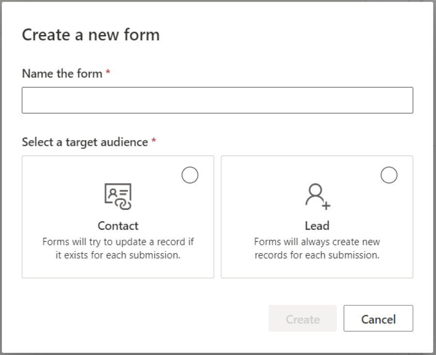

1. **Choose a template.** The list of templates is filtered according to the target audience selected in the previous step. If you want to start with a blank form, you can skip the template selection. After you select a template or choose to skip, you’ll be in the form editor where you can finish creating your form.

    > [!div class="mx-imgBorder"]
    > 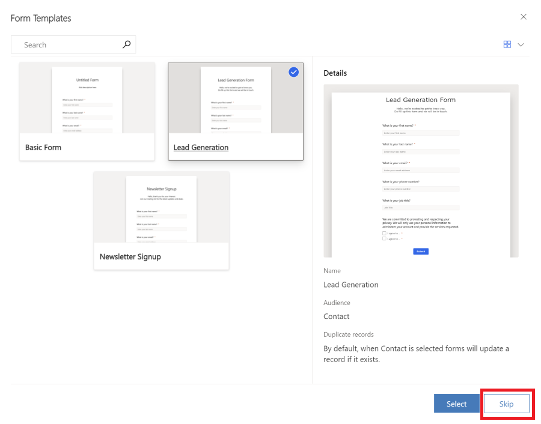

1. Now you can see the list of questions represented by **form fields**. The list of available fields can be found in the right pane and it includes all attributes of the selected target audience (entity). If you create a new custom attribute for the entity, it's visible in this list, and you can immediately use it as a field in your form. Some system fields may be hidden, as they can't be used in the form. You can use the search bar in the list of fields to filter the field you're looking for.

    Enter "name" into the search bar to find the "Last Name" field.

    > [!NOTE]
    > You can switch between Elements and Fields using the small icons on the side of the right pane.

    > [!div class="mx-imgBorder"]
    > 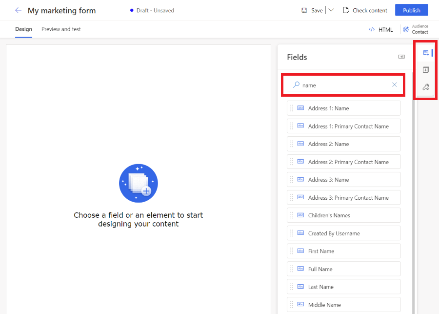

1. **Drag a field from the list and drop it on the form canvas**. Once the field is added, the field's properties are shown in the right pane. The field properties can be used to set if it's a required field, configure validation, and more. Learn more about [form field properties](#form-field-properties). There are multiple types of fields available with different properties, check the list of [field types](#field-types).

    > [!div class="mx-imgBorder"]
    > 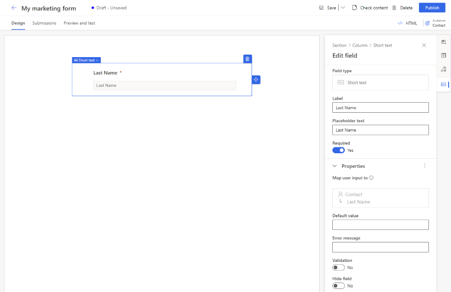

    **Useful tips**
    - You can drag and drop a field on the form canvas to change its position.
    - Fields can be removed from the form by selecting the trash icon.
    - You can hide a field so it isn't visible to your web page visitor by enabling the **Hide field** toggle.
    - You can access the field properties again by selecting the field on the canvas.

1. You can edit the field label by selecting it on the canvas. Use the rich text editor to edit the styling of any text on the canvas. Change the placeholder text and default value in the right pane. To change a field's default value, enter text into the field on the canvas.

    > [!div class="mx-imgBorder"]
    > 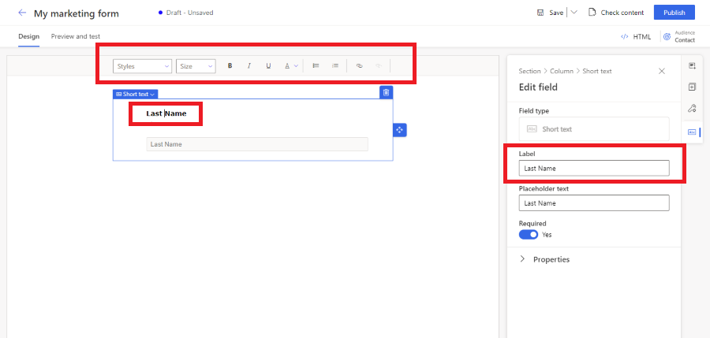

1. If you want to build more complex forms, you can change the layout of your form to multi-column and create multiple layout sections. Select the **Elements** section on the right pane. Now you can drag and drop a column layout on form canvas to create a new section. You can add elements and fields to the newly created sections.

    > [!div class="mx-imgBorder"]
    > 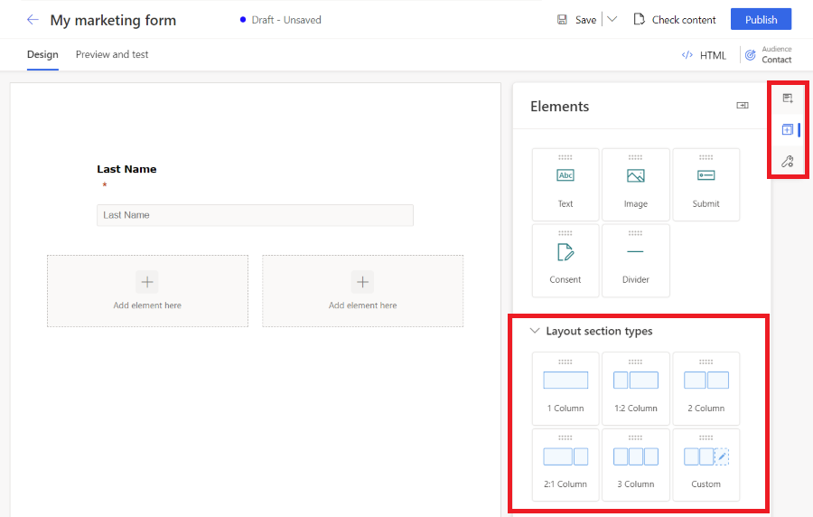

    > [!NOTE]
    > You can access the existing section's styling setting by selecting the top left corner of the field or other element and selecting Section. That section properties will appear in the right pane.
    > [!div class="mx-imgBorder"]
    > 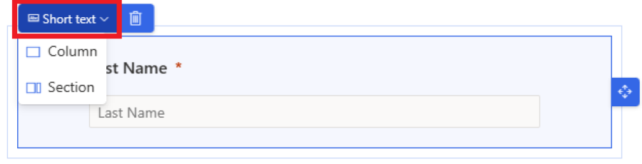

1. To add elements to your form, select the **Elements** section in the right pane. Drag and drop static text, a submit button, captcha, or an [image](upload-images-files.md#use-images-in-your-content) element on the form canvas.

    All forms must contain a **Submit** button. The form editor doesn't allow you to publish a form without a submit button. Select the submit button to change the styling.

    > [!div class="mx-imgBorder"]
    > 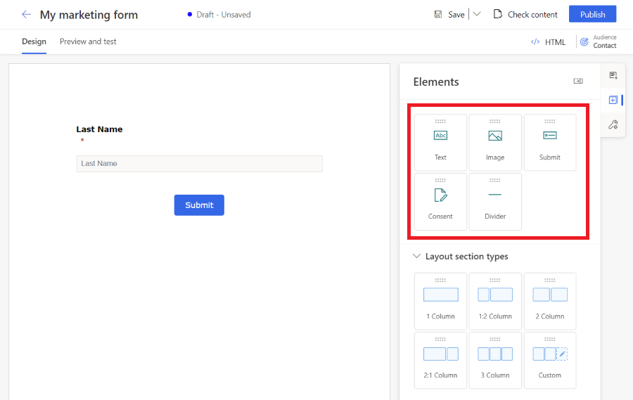

    > [!NOTE]
    > You can **integrate custom captcha** bot protection services like **reCAPTCHA** in your form. [Learn more](real-time-marketing-form-custom-captcha.md)

1. **Add consent control** from the **Elements** section to your form. Once you add the consent control to your form, you can select the correct consent purpose in the properties. Select the consent checkbox caption to change its text. Learn more about how to [manage consent for email and text messages in real-time marketing](real-time-marketing-email-text-consent.md).

    > [!div class="mx-imgBorder"]
    > 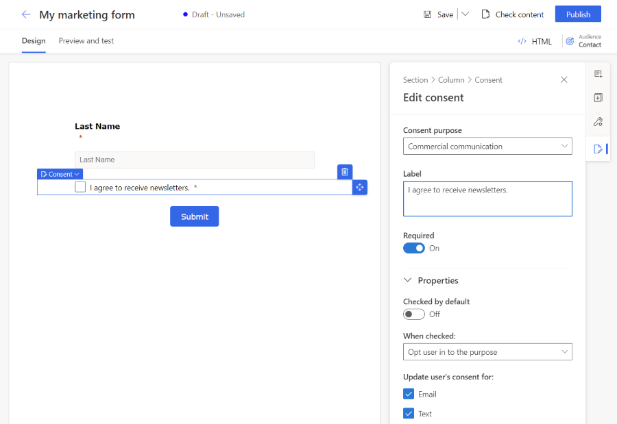

    > [!NOTE]
    > The *commercial communication* consent purpose used by the **Consent element** isn't linked to the *Do not bulk email* attribute of the Contact.

1. Now it's time to preview your for to check the responsiveness. To open the form preview, select the **Preview and test** tab. You can select various platforms to check how the form renders on a mobile device or a tablet.

    > [!div class="mx-imgBorder"]
    > 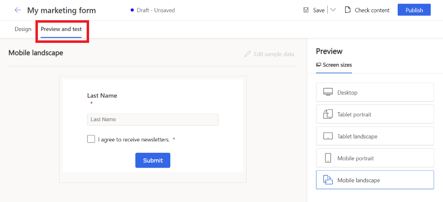

1. To publicly share your form, select the **Publish** button in the top right corner. The form is automatically saved and the [validation process](#form-validation) starts. You may need to add other required fields to your form to pass the validation. By default, the **Email** field is required to check if the same Contact already exists. Once the form is successfully validated, you see the following options on how to publish your form. Learn more on how to [publish the form](#publish-your-form).

    > [!div class="mx-imgBorder"]
    > 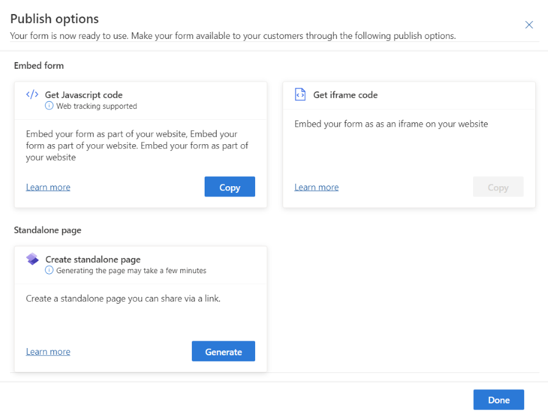

    > [!IMPORTANT]
    > Make sure the domain where you embedded your form is allowed for external form hosting. If the domain isn't allowed for external form hosting, the form won't be rendered on your web page and all form submissions will be rejected. Learn more about [domain authentication](domain-authentication.md).
    > The out-of-box domain for a standalone page is enabled by default. [Learn more](#publish-your-form)

1. Set up a "thank you" email for web page visitors who submitted the form. You can create a new journey using the *Marketing Form Submitted* trigger, which is executed every time your form is submitted. Learn more about creating a [trigger-based journey](real-time-marketing-trigger-based-journey.md).

## Manage forms

### Publish your form

To publish your form, select the **Publish** button in the top right corner. There are three options to publish a form:

- **Embed to an external page using JavaScript**: This is the most common way to integrate the form into your own web page. You can reuse the same code snippet on multiple web pages. The form submission data includes the URL of the page where the form is embedded. There's also a tracking script included to count the statistics of visitors to the page that the form is embedded on.
- **Create a standalone page**: A new page is automatically created and the form is embedded into the page. As a result of this process, you get a public URL, which you can share to allow your visitors to visit and submit the form.

Once the form is published, you can still access these options by selecting the **Publishing** options button in the top right corner. It's possible to use multiple publishing options for a single form.

> [!NOTE]
> The ontent delivery network (CDN) domain for your geographical area used by the *host form as Standalone page* feature is enabled for form hosting by default.
> Example for USA:
> `https://assets-usa.mkt.dynamics.com`
>
> If you would like to disable the domain for form hosting, reach out to support.

### Edit a live form

If your form has been already published and you need to update it, select the **Edit** button on the top ribbon. You can continue editing your live form and all changes are automatically published once you select the **Save** button.

> [!IMPORTANT]
> If you choose to create a copy of the form, you will have to publish the newly created copy.

The form is stored on a CDN where all data is cached to provide to shortest possible loading times to the visitors of your webpage. It may take up to 10 minutes before the cache is refreshed and before you can see the changes on your webpage. You can check the result of the changes in your page if you add this parameter `#d365mkt-nocache` to your webpage URL. Never share the link to your page including this parameter with your customers. The parameter bypasses the CDN cache and slows down the page loading.

### Unpublish a form

To unpublish a live form, select the **Stop** button. The form is removed from the CDN, so your web page visitors are no longer able to submit it. The form may be still visible due to browser cache, but it can't be submitted. The form status is changed to *Draft*.

### Form field properties

Once you select a field on the canvas, you can see its properties in the right pane.

> [!div class="mx-imgBorder"]
> 

- **Placeholder text**: The placeholder inside the field. The placeholder automatically disappears once the user starts typing into the field.
- **Default value**: Set the default value for this field. The placeholder isn't visible if the default value is set.
- **Required**: If enabled, the user can't submit the form if this field is empty.
- **Validation**: Configure a rule that checks the content of the field. If the validation rule isn't met, the user can't submit the form. It's important to set the correct validation for email and phone number fields.
- **Hide field**: If enabled, the field isn't visible in the form. You can use hidden fields to store extra metadata along with the form submission.

#### Custom validation

To create custom validation, enable the **Validation** option and select **Custom**. A pop-up dialog appears where you can enter a Regular Expression (RegExp). You can, for example, use a RegExp to check if the entered value matches a specific phone number format.

### Form settings

Form settings allow you to configure advanced properties of your form and define what happens after the form submission.

> [!div class="mx-imgBorder"]
> 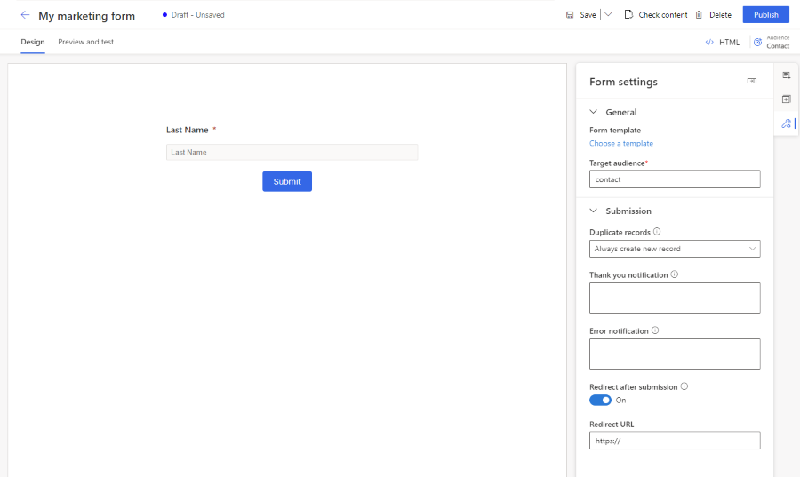

- **Duplicate records**: Choose your strategy on [how to handle duplicate records](#how-to-handle-duplicate-records).
- **Thank you notification**: This message appears if the user successfully submits the form.
- **Error notification**: This message appears if an error occurs when the form is submitted.
- **Redirect after submission**: If enabled, you can enter a URL to which the user will be redirected after the form submission.

#### How to handle duplicate records

The default approach to duplicate records is different for Contact and Lead entities.

- **Contact (default: Update contact using email)**: If the user submits a form with an existing email address, the form submission updates the existing record. There's no new record created.
- **Lead (default: Always create a new record)**: If the user submits a form with an existing email address, a new record with the same email address is created.

You can change the default strategy using the **Duplicate records** drop-down in **Forms** settings. You can also create a [custom matching strategy](#create-a-custom-matching-strategy).

#### Create a custom matching strategy

You can choose how to handle duplicate records by creating a new matching strategy.

1. Select the bottom left menu to access **Settings**.
1. Open **Form matching strategy** in the **Customer engagement** section.
1. Select the plus icon to create a new matching strategy.
1. Name the matching strategy and select the **Target entity**.
1. Save the matching strategy (don't select **Save & close** as you need to stay on this record).
1. Add matching strategy attributes (fields) that are used to check if the record exists.
1. Save your new matching strategy.
1. The newly created matching strategy can now be selected in the **Duplicate records** list in the form settings.

### Field types

Field types and formats are defined by the attribute metadata. It isn't possible to change field types and formats. You can, however, change the rendering control for field types where the format isn't defined.

| **Type**  | **Format** | **Rendering control** | **Description**|
|-----------|------------|-----------------------|----------------|
| Single line of text    | Email, Text, URL, Phone, Number         | Automatically set based on the format               | Simple input field. Validation is automatically set based on the format.                                |
| Multiple lines of text    | Text Area     | Text Area             | Text area input field that accepts all types of text values.                                |
| Option set             | n/a           | Radio Buttons         | Field with a limited number of predefined values (as defined in the database). Rendered as a set of radio buttons, with one button for each value.                                  |
| Option set             | n/a           | Drop-down              | Field with a limited number of predefined values (as defined in the database). Rendered as a drop-down list for selecting a value.                                                  |
| Two options            | n/a           | Check box              | Boolean field, which accepts a value of either true or false. It's rendered as a check box, which is selected when true and clear when false.                                              |
| Two options            | n/a           | Radio&nbsp;Buttons         | Field that accepts one of just two possible values (typically true or false). Rendered as a pair of radio buttons, with the display text for each defined in the database.           |
| Date and time          | Date Only     | Date Picker           | Date picker to select a date from a pop-up calendar display. It doesn't accept a time.                                                                           |
| Date and time          | Date and Time | Date-Time Picker      | Date and time picker to select a date from a pop-up calendar and a time from a drop-down list.                                                                   |
| Lookup field          | n/a | Lookup      | A lookup field is linked to a particular entity type, enabling you to add a drop-down list of options that were created in advance to your form. [More information](#lookup-fields). |

### Lookup fields

A lookup field is linked to a particular entity type, enabling you to add a drop-down list of options that were created in advance to your form. For example, you could use a lookup field called "Currency" to show a drop-down list of all currencies in your form.

After adding a lookup field, or if your lookup field isn't working, ensure that the service user used has permissions to configure the entities you're using with the lookup field. The Marketing Services User Extensible Role used by the form editor needs to have read access to the entity used in lookup field. You also have to enable **Make lookup data publicly viewable** in the lookup properties. All values within the lookup are available to anyone that sees the form. Ensure that sensitive data isn't exposed to the public. More information: [Adding lookup fields](marketing-fields.md#adding-lookup-fields-and-troubleshooting).

### Form validation

The validation process is automatically launched once a *draft* form is published or once a *live, editing* form is saved. The validation checks the form's content and can stop publishing if blocking **errors** are found or it can show **warnings** about potential issues.

You can launch the form validation process manually using the **Check content** button.

### Errors that block form publishing

The following conditions prevent forms from being published and display an error message:

- Is a **Submit** button included?
- Are the form fields linked to an editable attribute?
- Does the form contain duplicated fields?
- Does the form include all attributes required by the matching strategy (email field by default)?
- Is the target audience set?

### Warnings that don't stop form publishing

The following conditions don't prevent forms from being published. A warning message is displayed:

- Does the form include all fields linked to attributes of a selected entity that are mandatory to create or update a record?
- Are all required attributes labeled as required="required" in HTML?

### Advanced form customization

To open the HTML editor and display the source code of a form, select the **HTML button** in the top right corner.

- Real-time marketing forms can be [rendered using JavaScript API](./developer/realtime-marketing-form-client-side-extensibility.md#rendering-marketing-form-via-javascript-api), allowing you to load the form dynamically.
- You can [inject a marketing form into a react application](./developer/realtime-marketing-form-client-side-extensibility.md#injecting-marketing-form-into-react-application).
- It's also possible to [extend form events](./developer/realtime-marketing-form-client-side-extensibility.md#custom-events) like formLoad, formSubmit, etc.
- There are other possibilities to customize your forms. [Learn more](./developer/realtime-marketing-form-client-side-extensibility.md)

#### Customize form CSS

You can change the CSS class definitions in the HTML editor. Editing CSS allows you to achieve more advanced design customizations on top of the possibilities in the form editor.

#### Add custom JavaScript to your form

You can add custom JavaScript code to the `<head>` section of the HTML source code using the HTML editor. If the code JavaScript code is placed inside the `<body>` section, the form editor automatically removes the code without any warning.

You can apply the EventListeners to trigger actions based on events like `buttonClicked` instead of adding the reference to the JavaScript function directly on the HTML code of the button. See the following examples.

##### Example 1: Update value of form field using values of other form fields

In this example, a script is created that combines the first name and last name field values into the full name.

```js
<script>
    const firstName = document.getElementById("firstname-1679394382894"); // The field ID is unique in each form, make sure you replace it with the correct value.
    const lastName = document.getElementById("lastname-1679335991544"); // The field ID is unique in each form, make sure you replace it with the correct value.
    const fullName = document.getElementById("fullname-1679394390062"); // The field ID is unique in each form, make sure you replace it with the correct value.

    firstName.addEventListener('change', updateFullName);
    lastName.addEventListener('change', updateFullName);

    function updateFullName() {
    fullName.value = firstName.value + ' ' + lastName.value;
    }
</script>
```

##### Example 2: Populate a hidden field with a UTM parameter value from a URL

[UTM sources](real-time-marketing-utm.md) provide important information on where your new leads are coming from. This example script extracts the UTM source parameter from a URL and populates it into the value of a hidden field.

1. Create a new custom attribute of your Lead entity called "UTM source" with the logical name `utmsource`.
1. Create a new form with Lead as the target audience. You can see the custom attribute "UTM source" in the list of fields.
1. Add the UTM source field to the canvas and set it as hidden in the field properties.
1. Open the HTML editor.
1. Put the following script in the header section. Make sure your put the correct field ID into the code.

```js
<script>
    document.addEventListener("d365mkt-afterformload", updateUTMSourceField());
            
    function updateUTMSourceField() {
        const formField = document.getElementById("utmsource-1679335998029"); // The field ID is unique in each form, make sure you replace it with the correct value.        
        const urlParams = new URLSearchParams(window.location.search);
        const utmSource = urlParams.get('utm_source');
        formField.value = utmSource;
        console.log(utmSource); // for debug only, can be removed
    }
</script>
```

You can reuse this example to enrich your leads with more UTM parameters like utm_campaign, utm_medium, utm_term, utm_content.

#### Integrate a custom captcha into form

You can [integrate custom captcha](real-time-marketing-form-custom-captcha.md) bot protection services like [Google reCAPTCHA](https://www.google.com/recaptcha/about/) into your form.

#### Custom back-end validation of form submission

It's possible to build custom back-end form submission validation that prevents form submission processing. It shows an error message to the user who tried to submit the form. You can find the inspiration for this back-end validation in the article about [integrating custom captcha](real-time-marketing-form-custom-captcha.md), where the form makes back-end validation to evaluate the result of a captcha challenge.

## Troubleshooting

### My embedded form isn't visible on my page

Make sure that your domain is allowed for external form hosting. You don't need to finish the domain authentication process to enable external form hosting for your domain. Learn more about [domain authentication](domain-authentication.md).

### Publishing a form as a standalone page fails

This feature uploads a page with form on CDN. If the operation fails, try to run it again after few minutes.

### Form editor removed my custom JavaScript or other custom code from the HTML body

The form editor can remove unknown code from the body. [Learn more](#add-custom-javascript-to-your-form) about how to customize your form using JavaScript.

## Comparison of real-time and outbound marketing forms

- The main difference between real-time and outbound marketing forms is that real-time marketing forms can update only one entity (typically a Lead or Contact). Targeting a single entity makes the form configuration and maintenance easier and it allows you to build properly targeted journeys.
- There's no need to create Marketing fields for real-time marketing forms. All entity attributes are already available as fields to be used in a form. That includes all custom attributes you created for your lead or contact entities.
- You're no longer required to create a form page to embed your form into a web page. You can generate the form embedding code snippet with one action.
- Published real-time marketing forms are hosted on Content Delivery Network (CDN), which significantly reduces the form load time for the page visitor.
- Real-time marketing journey orchestration: Use the "Marketing Form Submitted" trigger for journeys based on real-time marketing forms. The trigger for outbound marketing forms has been renamed to "Marketing Form Submitted (Outbound)".
- It's not possible to edit outbound marketing forms in the real-time marketing form editor and vice versa.

### Form types comparison

The following table summarizes the types of forms currently available in real-time marketing. More form types will be available soon.

| Form type in outbound marketing | Form type in real-time marketing |  
|---|---|
| Landing page form  | Marketing form  |
| Subscription center form | Preference center (will be available as part of Consent configuration) |
| Event registration form | N/A |
| External form submission capture | N/A |
| Refer to friend | N/A |

## Security notice

Security is an important aspect of forms. Dynamics 365 Marketing takes the following precautions to avoid any security risks:

- The Marketing app accepts form submissions only from domains allowed for external form hosting.
- The Marketing app infrastructure contains necessary precautions to minimize the impact of a possible DDoS attack.
