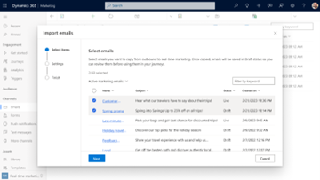
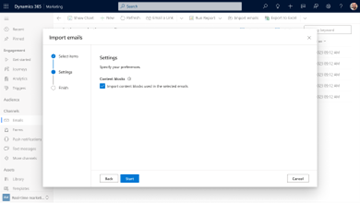
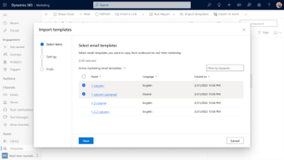
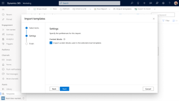
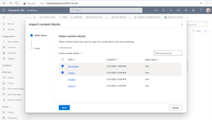

# Import outbound emails, templates, and content blocks to real-time marketing

[!INCLUDE[consolidated-sku-rtm-only](../includes/consolidated-sku-rtm-only.md)]

Save time and resources, reuse and adapt your existing outbound assets to create engaging and relevant real-time marketing experiences. Easily import your outbound marketing emails, templates, and content blocks into real-time marketing to plug them into your real-time journeys.

## Import emails from outbound marketing

To start the email import process, go to **Channels** > **Emails** and select the **Import emails** button on the top ribbon. The import wizard will appear. Follow the next steps:

1. **Select up to 50 emails** to copy from outbound to real-time marketing. You can use sorting and filtering to easily locate the emails.
   > [!div class="mx-imgBorder"]
   > 
1. In the **Settings** step you can specify if you also want to import the **content blocks** used and associated with these emails. You can skip this and the emails will be imported properly, but the association between the imported emails and content blocks will be lost.
   > [!div class="mx-imgBorder"]
   > 

> [!NOTE]
> Emails and templates that include A/B tests can't be imported and are **skipped completely** in the import process. These emails, along with any others that fail to be imported, are gathered in a downloadable file that is displayed when the import is completed.

> [!TIP]
> Emails and templates that include one or more of the following elements will be imported but these elements need to be reviewed and/or re-added manually in real-time marketing as **they are removed** during the import process:
> - Surveys
> - QR code
> - Code element
> - Compliance profile details
> - Personalization that includes #if and #else conditions
> - Content settings placeholders (except from the subscription center and company address)
> - FormDoiSubmission (used for form double opt-in)
> - Contextual message placeholders
> - View as a web page

## Import email templates from outbound marketing

Templates are imported in a similar fashion to emails. To start the template import process, go to **Assets** > **Templates** and select the **Import templates** button on the top ribbon. The import wizard will appear and the steps you need to follow are identical to those needed for emails:

1. **Select up to 50 templates** to copy from outbound to real-time marketing. You can use sorting and filtering to easily locate the templates.
   > [!div class="mx-imgBorder"]
   > 
1. In the **Settings** step you can specify if you also want to import the **content blocks** used and associated with these templates. You can skip this and the templates will be imported properly but the association between the imported templates and content blocks will be lost.
   > [!div class="mx-imgBorder"]
   > 

## Import content blocks from outbound marketing

To import content blocks from outbound marketing, go to **Assets** > **Content blocks** and selecct the **Import content blocks** button on the top ribbon. The import wizard will appear and all you need to do is to select the content blocks you’d like to copy to real-time marketing.

   > [!div class="mx-imgBorder"]
   > 

## Using imported assets in real-time marketing

Imported emails, templates, and content blocks are distinguished through the **[Outbound]** word tag they include in their title. There is also a new view, “**Imported from outbound marketing**” that can be used to filter assets down to the ones imported only.

All assets are imported in a **Draft** state and can therefore be reviewed before getting marked as ready to use. The conversion process during the import is accurate, but it is recommended to review all assets to make sure the content and settings are optimal for each one.
