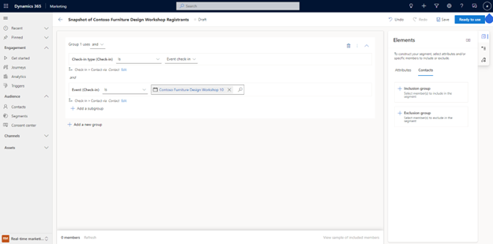
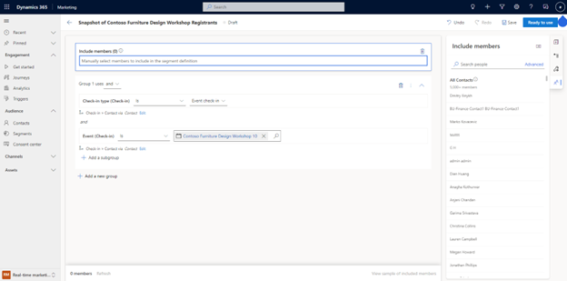

# Individually manage your customer list

Adding manual inclusions or exclusions is a powerful way to augment segment building criteria. Manually include or exclude specific people to ensure segments always reach VIP customers, or just as an easy way to build test segments for journeys.

**Example**: In addition to the event registrants for the workshop, you also want to include some of your VIP customers in this list. You can manually search for them by name and decide whether to always include them or not.

To manually add customers, go to the **Contacts** tab in the **Elements** pane. Select whether you want to include (**+Inclusion group**) or exclude (**+Exclusion group**) these members.

> [!div class="mx-imgBorder"]
> 

To add your VIP customers to your segment, search for them by name. When you find the segment members you want to add or exclude, select the plus (+) button next to their name.

> [!div class="mx-imgBorder"]
> 
