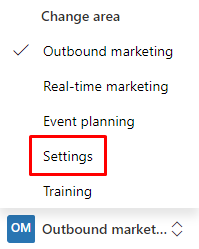
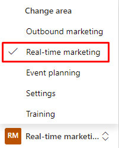

# Install the real-time marketing preview

> [!IMPORTANT]
> A preview feature is a feature that is not complete, but is made available before it’s officially in a release so customers can get early access and provide feedback. Preview features aren’t meant for production use and may have limited or restricted functionality.
> 
> Microsoft doesn't provide support for this preview feature. Microsoft Dynamics 365 Technical Support won’t be able to help you with issues or questions. Preview features aren’t meant for production use, especially to process personal data or other data that are subject to legal or regulatory compliance requirements.

Starting in the April 2021 Dynamics 365 Marketing release, you can opt in for preview feature updates and evaluate our new data and AI-powered real-time customer journey orchestration capabilities. The opt-in method detailed below is different from [traditional early access updates](/power-platform/admin/opt-in-early-access-updates).

> [!NOTE]
> Preview features are limited to North America and Europe.

## Steps to opt-in to the real-time marketing preview

1. From Dynamics 365 Marketing, switch to the **Settings** area using the area switcher on the bottom of the left navigation.

    > [!div class="mx-imgBorder"]
    > 

1. Navigate to **Overview** > **Versions**.
1. In the **Preview features** tile, select **Install**.

    > [!div class="mx-imgBorder"]
    > 

1. Installation may take over one hour to complete. The installation will continue even if you close the browser window.
1. When installation is complete, you can access real-time marketing features by selecting **Real-time marketing** in the area switcher.

    > [!div class="mx-imgBorder"]
    > 