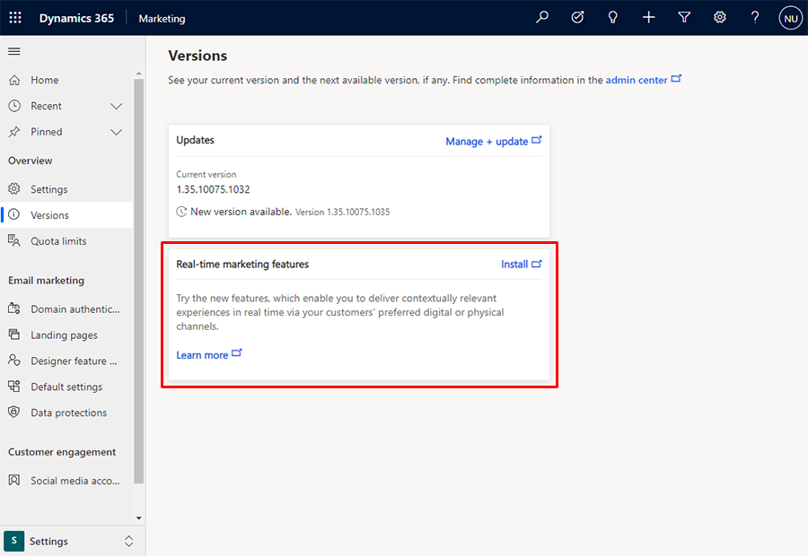

# Install real-time customer journey orchestration

Starting in the August 2021 Dynamics 365 Marketing release, you can opt in for data and AI-powered real-time customer journey orchestration capabilities.

> [!NOTE]
> Real-time customer journey orchestration features are available in the United States, Europe, the United Kingdom, and Australia. The features will be available in Canada and Asia-Pacific geographies in October. Availability in other geographies will be communicated at a later date.

## Steps to opt in to real-time marketing

1. From Dynamics 365 Marketing, switch to the **Settings** area using the area switcher at the bottom of the left navigation.

    > [!div class="mx-imgBorder"]
    > 

1. Navigate to **Overview** > **Versions**.
1. Ensure that you are using the latest version of Dynamics 365 Marketing. Select **Manage + update** if you need to update your Marketing installation.
1. In the **Real-time marketing features** tile, select **Install**.

    > [!div class="mx-imgBorder"]
    > 

1. Installation can take more than one hour to complete. The installation will continue even if you close the browser window.
1. When installation is complete, you can access real-time marketing features by selecting **Real-time marketing** in the area switcher.

    > [!div class="mx-imgBorder"]
    > 

## Next steps

- [Get to know real-time customer journey orchestration](real-time-marketing-user-guide.yml)
- [Use Customer Insights profiles and segments](real-time-marketing-ci-profile.md)
- [Create an event-based journey](real-time-marketing-event-based-journey.md)