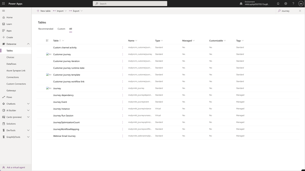
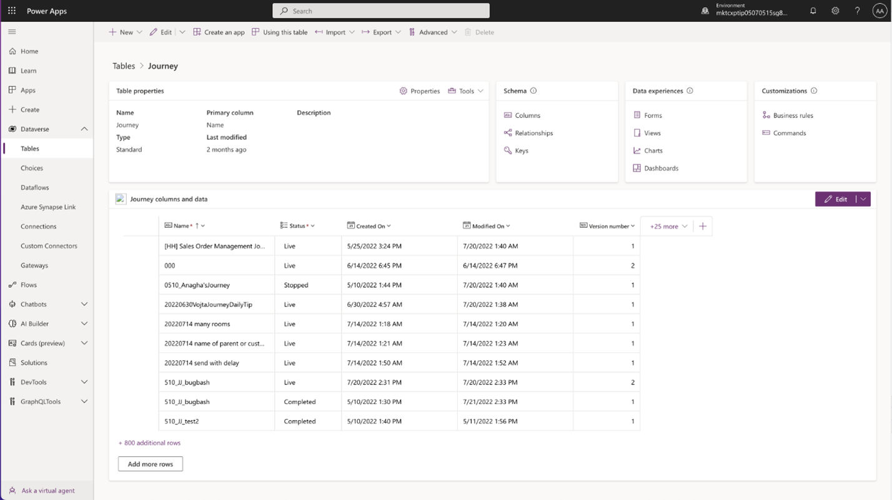
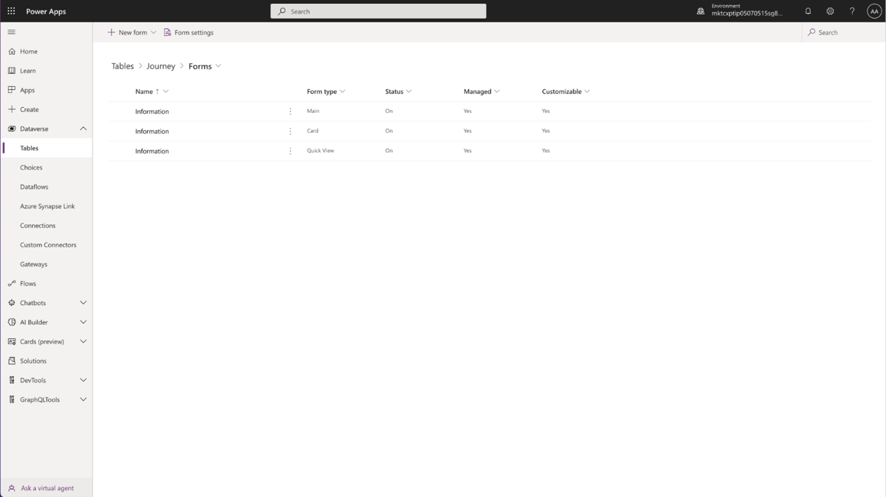
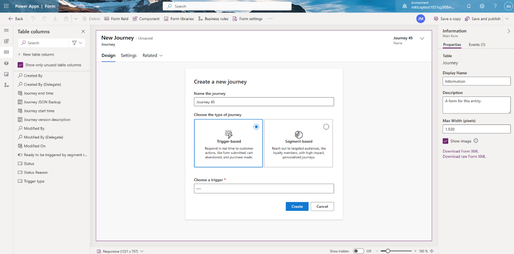
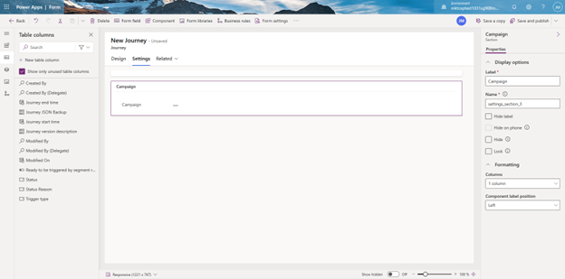

# Customize the journey designer in real-time marketing

Customization of your customer journeys is now available in Dynamics 365 real-time marketing. Not only can you use out-of-the-box Marketing capabilities to engage customers, but you can also now create personalized, flexible, and efficient solutions through Power Apps to better tailor real-time marketing to meet your specific business needs. 

For example, you can extend the real-time journey canvas, adding custom fields through Dataverse to streamline your business processes for higher efficiency. This allows you to add custom fields such as "Campaign" to your journeys to better manage your assets, collaborate amongst your team members, and give you more flexibility to create customized analytics reports.

Here's how you can achieve the above scenario through adding a campaign field in the new journey designer in Real-time Marketing:  
1.	Go to Power Apps, and find the ‘**Journey**’ table under **Dataverse -> Tables**

> [!div class="mx-imgBorder"]
> 

2.	Go to **Data experiences -> Forms** to access the new journey designer form 

> [!div class="mx-imgBorder"]
> 

3.	Choose ‘**Main**’ under ‘**Form type**’ to get started. 

> [!div class="mx-imgBorder"]
> 

4.	You can now add new fields under ‘**Settings**’ under the new journey form. 

> [!div class="mx-imgBorder"]
> 

5.	Go to ‘**Components**’ to add a new section. Select the ‘**campaign**’ field under the new section. 

> [!div class="mx-imgBorder"]
> 

6.	Your customized fields will then render under the ‘**Settings**’ pane on the journey designer. 

**Warning**: Please note that if you add a new tab on the journey designer, it will not be rendered. Only sections and fields under Settings show up on the journey canvas. 

[!INCLUDE[footer-include](../includes/footer-banner.md)]