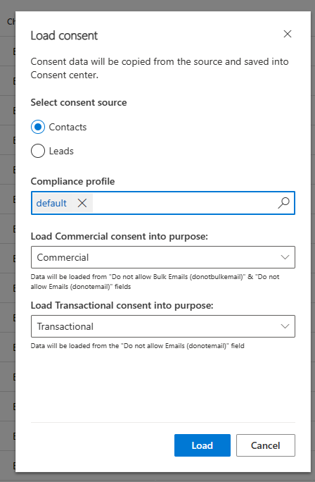

# Adding consent data to Real-time marketing

When you install real-time marketing, the real-time marketing consent center (**Real-time marketing** > **Audience** > **Consent center**) contains no records, even if you already gathered consent in outbound marketing. You don't need to re-enter contact consent data from outbound marketing if you plan to run real-time journeys for contacts. If you want to reuse contact consent data for leads or profiles, or wish to add new consents, you can use one of three methods:

- Add new consent records for email and text messages manually by selecting the corresponding option from the top ribbon.

> [!div class="mx-imgBorder"]
> 

- Import consent settings from an Excel file.

> [!TIP]
> If you don't see the **Import from Excel** option in the top ribbon, you might have to select the three dots on the right side of the ribbon to see more items.

- Load consent information that was already captured for contacts or leads in Dynamics 365 Marketing.

## Loading consent from contacts

> [!NOTE]
> The **Load consent** button loads consent information for email addresses that are stored in Contact records in Dynamics 365 Marketing and set up in the audience configuration in settings. It's not intended to load consent from other data sources.

To load consent from contacts, an administrator must select **Load consent** from the top ribbon on the **Consent center** page.

The following message appears:

> [!div class="mx-imgBorder"]
> 

To load consent from contacts or leads, the following prerequisites must be met:

1. Only one email address from a contact record will be loaded. This field is defined in the [Audience configuration](real-time-marketing-audience-data.md) and can be changed by the administrator.
1. For the Commercial purpose, the system checks whether the Contact has both the Bulk Email and Email fields set to *Allow*, meaning that if either of those fields is set to *Do Not Allow*, the contact point consent record is set to *Opted out*.
1. If two or more contacts share the same email address, consent for the email will be set to *Opted in* **only** when all contacts contain the value *Bulk email=Allow*. In all other cases, consent for the email address will be set to *Opted out*.
1. If consent for the email already exists in real-time marketing (for example, you decide to load consent from contacts or leads after some email consent items were already manually added), the above-listed rule applies. The email address is only opted in if **both** email consent values are set to *Allow* **and** all consent records from contacts that share the same email address are set to *Allow*.

Consent loaded from contacts and leads relates to the email set in audience configuration and includes the following fields: *Allow email*, *Allow bulk email*, and *Allow tracking*.

## Preview: Loading consent from contacts and leads

> [!IMPORTANT]
> A preview feature is a feature that is not complete, but is made available before it’s officially in a release so customers can get early access and provide feedback. Preview features aren’t meant for production use and may have limited or restricted functionality.
>
> Microsoft doesn't provide support for this preview feature. Microsoft Dynamics 365 Technical Support won’t be able to help you with issues or questions. Preview features aren’t meant for production use, especially to process personal data or other data that are subject to legal or regulatory compliance requirements

If you've enabled the "Multi-brand consent and customizable preference centers (preview)" feature switch, you'll have the ability to load consent from both Contacts and Leads. In addition, you are able to specify which compliance profile and purpose  or topic to load the consent information into. The same prerequisites apply as outlined above.

> [!div class="mx-imgBorder"]
> 

> [!IMPORTANT]
> If you store consent data for contacts in a field other than **Allow bulk email**, you'll need to use the **Import from Excel** option to load consent data to the consent center first. Only then will you be able to send commercial email in a real-time customer journey.

> [!IMPORTANT]
> If you restore data in real-time marketing, all consents will be returned to the state they were in at the time backup was made. This may result in consent data being obsolete. To avoid complications, export all consent data into Excel before starting the restore process and use it as a reference after the restore is completed.

[!INCLUDE[footer-include](../includes/footer-banner.md)]