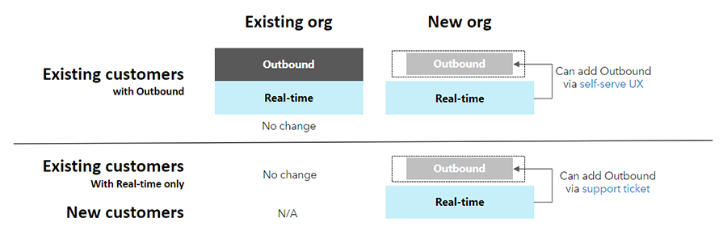

# Move from outbound to real-time marketing

[!INCLUDE[consolidated-sku-rtm-only](../includes/consolidated-sku-rtm-only.md)]

Real-time marketing is the next generation of Dynamics 365 Marketing features. As real-time marketing continues to evolve, almost all the current capabilities and features of outbound marketing will become available in real-time marketing, along with many more modern and enhanced capabilities. You should utilize real-time marketing unless there's a dependency on a specific feature or limitation that hasn't yet been addressed in real-time marketing.

Read more about the transition to real-time marketing: [Adapting to evolving customer expectations: staying ahead in the new marketing landscape](https://cloudblogs.microsoft.com/dynamics365/it/2023/07/18/transition-to-real-time-marketing-and-transform-your-customer-experience/)

## Advantages of real-time marketing + Customer Insights

The following table summarizes the benefits of using real-time marketing and Customer Insights together.

| Scenario                                                                                                                                                                                                                      | Outbound marketing                                                                                                                                                | Real-time marketing                                                                                                                                                               |
|-------------------------------------------------------------------------------------------------------------------------------------------------------------------------------------------------------------------------------|-------------------------------------------------------------------------------------------------------------------------------------------------------------------|-----------------------------------------------------------------------------------------------------------------------------------------------------------------------------------|
| Engage customer profiles directly without creating corresponding contacts in Dataverse (when using a third-party customer master/CRM or when there are more profiles in Customer Insights than there are contacts in the CRM) | Not possible                                                                                                                                                      | Seamless (using segments)                                                                                                                                                         |
| Add members from a Customer Insights segment into a new customer journey                                                                                                                                                      | Requires manual segment export from Customer Insights to Marketing; doesn't provide 100% coverage, you can only target Customer Insights profiles with contacts | Seamless: all Customer Insights segments are automatically available in Marketing                                                                                                 |
| Add members from a Customer Insights segment into an ongoing customer journey (using dynamic segments)                                                                                                                        | Not possible                                                                                                                                                      | Seamless: new members added to a Customer Insights segment are automatically added to Marketing journeys that target that segment                                                  |
| Personalize email content with segments or insights from Customer Insights                                                                                                                                                    | Not possible                                                                                                                                                      | Seamless: Customer Insights attributes, segments, and (soon) measures are automatically available for email personalization, just like any other Dataverse entity                  |
| Branch or suppress a customer journey based on a customer's attributes or segment membership (in Customer Insights)                                                                                                           | Not possible                                                                                                                                                      | Seamless: Customer Insights attributes, segments, and (soon) measures are automatically available for journey logic and suppression criteria, just like any other Dataverse entity |
| Use marketing interaction data to create segments, measures, and other insights in Customer Insights                                                                                                                          | Requires manual data integration                                                                                                                                  | (Coming soon) Marketing interactions are available in Customer Insights without the need for data integration                                                                     |

Learn more about the differences between real-time and outbound features: [Real-time vs outbound marketing journeys!](https://community.dynamics.com/blogs/post/?postid=89399977-3ba4-4650-b57d-14ab1654b020).

## Real-time marketing transition playbook

Learn about making the move from outbound to real-time marketing in the free [Transition from outbound to real-time marketing playbook](https://community.dynamics.com/blogs/post/?postid=1b4394d5-7764-4484-aba9-c7f972292c10). The playbook covers key information, including:

- Setting up and configuring Dynamics 365 real-time marketing
- Migrating your marketing artifacts
- Identifying potential challenges
- Retiring the use of outbound marketing

## Default real-time marketing installation

On September 1, 2023, Dynamics 365 Marketing will transition to focus on real-time marketing features only. To support this transition, in early August 2023, provisioning of new instances will change in the following ways:
- New customers will no longer receive the outbound marketing module when they provision the Marketing app. New customers will need to contact support to add outbound marketing features.
- Existing customers will also see the same provisioning change, but will be able to add outbound marketing features themselves using a self-serve interface available on the **Settings** > **Versions** page.

> [!div class="mx-imgBorder"]
> 

These changes only affect provisioning of new instances. Existing customers using outbound marketing will continue to have access to outbound marketing features. All new features and innovations are targeted in real-time marketing only. Learn more: [Real-time marketing transition FAQs](real-time-marketing-transition.md)
