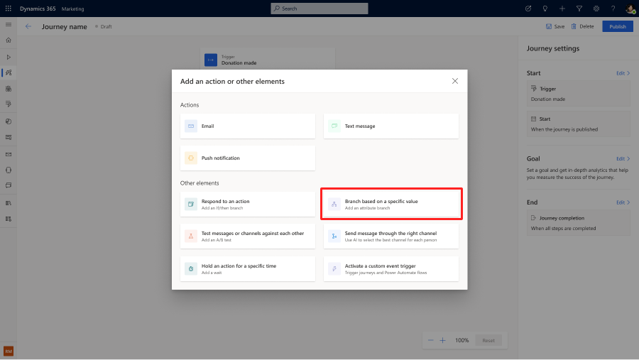
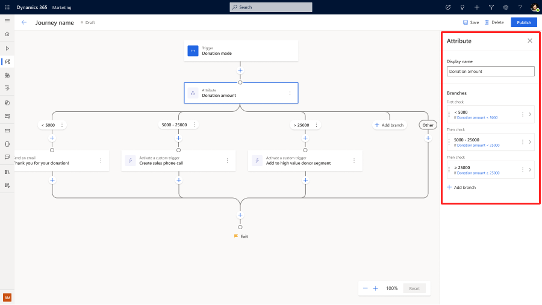
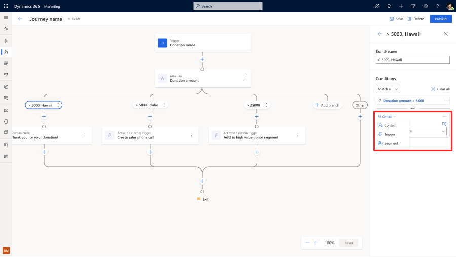
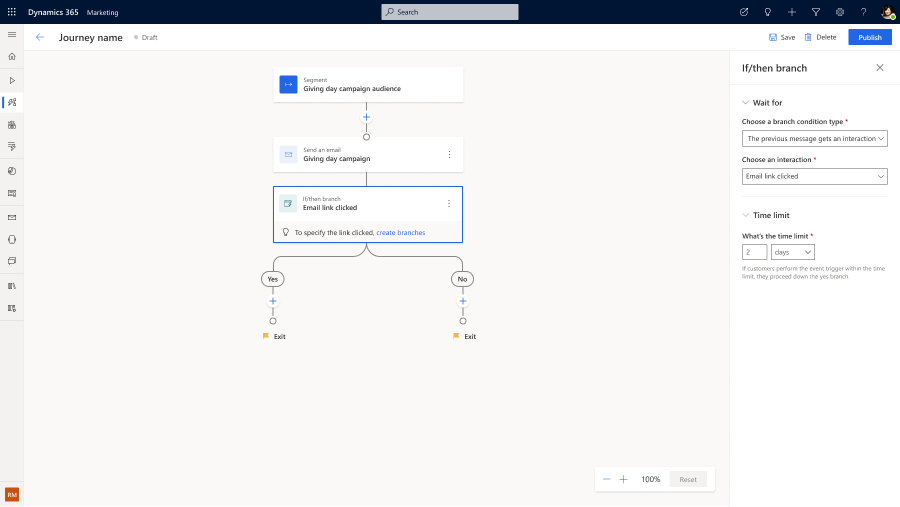
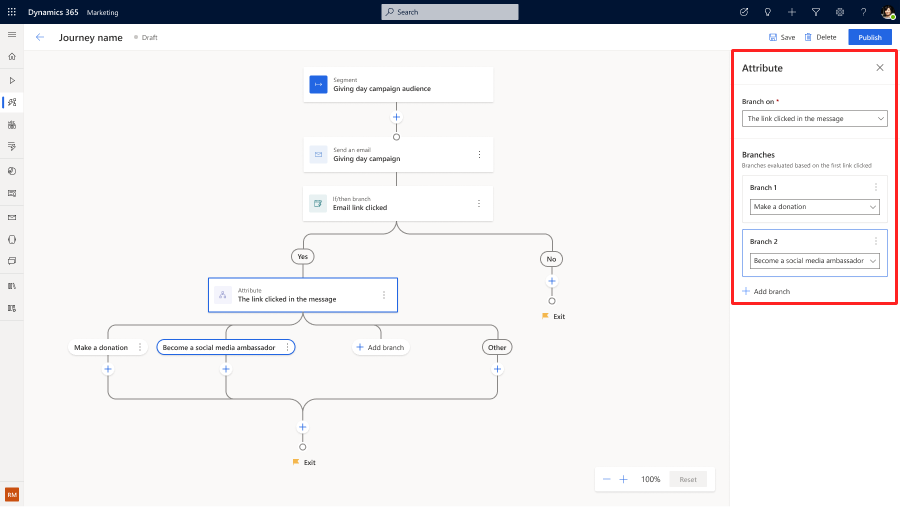

# Personalize journey variations using multiple journey branches

[!INCLUDE[consolidated-sku-rtm-only](../includes/consolidated-sku-rtm-only.md)]

Journey branches let you create personalized journeys for customers, engaging them in different ways based on who they're and their past actions. Now, you can create more than two branches at any given step in the journey, creating more fine-grained personalization and engaging each customer differently based on their unique profile and behavioral signals. This eliminates the need to make complicated nested, cascading branches and makes analyzing journeys easier. In addition, you can merge the branches back so that customers can continue the common journey steps after going through their specialized branch.

## How to create multiple journey branches based on attributes defined in triggers, segments, and audience

**Example:** Create personalized follow-up actions based on the donation amount from a "Donation Made" trigger in a customer journey. "Donation amount" is an attribute defined in the Donation Made trigger. Learn how to define a custom trigger: [Create custom triggers in real-time marketing](real-time-marketing-custom-triggers.md).

1. After you've selected a trigger to start the journey, you can create multiple branches using the enhanced **Attribute Branch** action. To add an attribute branch, select the **+** button on the canvas, then choose **Branch based on a specific value**.

    > [!div class="mx-imgBorder"]
    > 

1. Next, select the attribute and define the conditions in the right pane to create journey branches.

    > [!div class="mx-imgBorder"]
    > 

1. Toggle condition types to define attributes in segments and audience.

    > [!div class="mx-imgBorder"]
    > 

1. You can also mix and match different branching types to create more complex conditions.

    > [!div class="mx-imgBorder"]
    > 

> [!NOTE]
> Branches are evaluated in priority order. The same customer will not go down multiple branches simultaneously.

## How to create multiple journey branches based on customer interactions to a channel

**Example:** Create personalized follow-up actions after different links have been clicked in a Giving Day Campaign email.

1. When there are multiple links defined in an email, the journey will automatically prompt you to create branches based on the interactions with the email.

    > [!div class="mx-imgBorder"]
    > 

1. You can then select the different links defined in the email as branching options.

    You can also drag and drop the branches on the side panel to define a prioritized order for the branches to be evaluated. The same customer won't go down multiple branches simultaneously.

    > [!div class="mx-imgBorder"]
    > 

[!INCLUDE[footer-include](../includes/footer-banner.md)]
