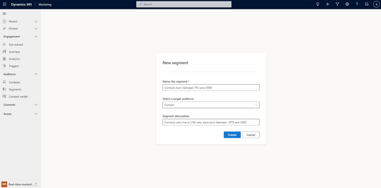
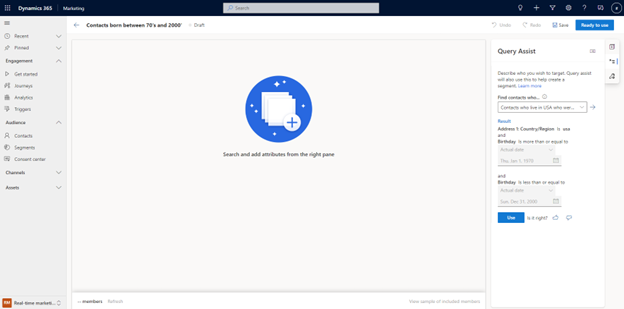

# Preview: Use natural language assist in  real-time segments 
Segment creation traditionally required extensive knowledge of the complex data structures defined by your business. To simplify creating segments in real-time marketing, you can use natural language to describe the segment definition in simple English. Natural language segment creation lets you add the results query onto the segment builder at any level of the query logic, either as a new group or as an additional condition in your existing logic. You can even improve the natural language engine by giving feedback, helping you achieve more detailed results in the future.

To create a segment using natural language assist, select the **Segments** tab under the **Audience**. Enter the segment name and select the target audience (Contact or Lead) and enter a description for your segment. The more precise you make your description; the more accurate the natural language assist segment suggestions will be.

> [!div class="mx-imgBorder"]
> 

On the right side of the next screen, you will see a **Query Assist** panel. The Query assist function uses the description you entered when creating your segment to suggest a data structure for the segment. If the suggested segment information is accurate, you can select the **Use** button to apply the suggested result to your new segment.

> [!div class="mx-imgBorder"]
> 

You can provide feedback on the suggested segment query by selecting the thumbs up or thumbs down button next to the result in the **Query Assist** pane. 

You can add further details to your segment by entering additional natural language searches into the Query assist pane. If you select the dropdown menu on the right side of the **Find contacts who…** search box, you can see previous searches and suggested searches.

If you select a new search, you will notice that the **Use** button now has a dropdown option. If you select the dropdown option on the **Use** button, you can choose to replace a group, add the new query to an existing group, or add the new query as a new group.

> [!div class="mx-imgBorder"]
> 