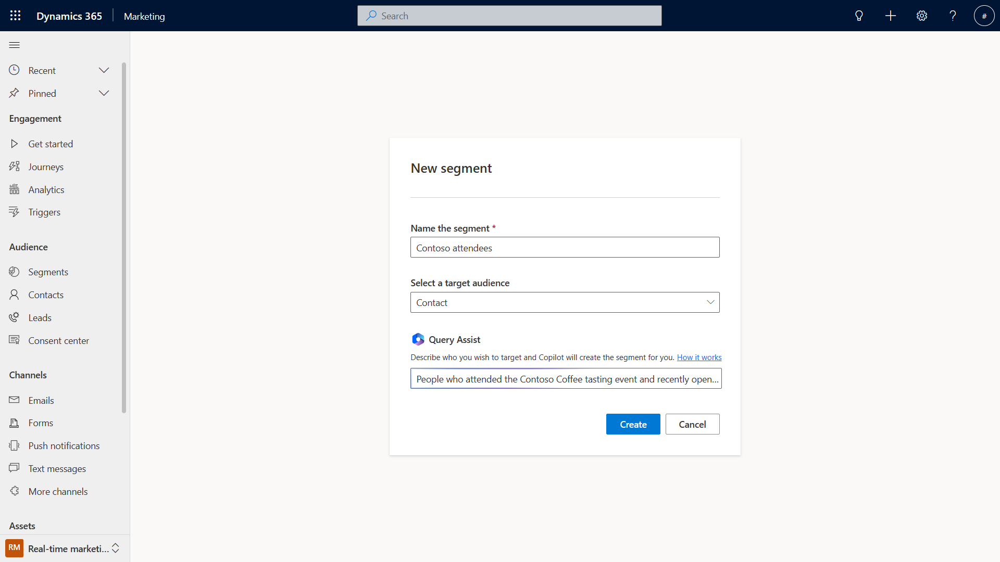
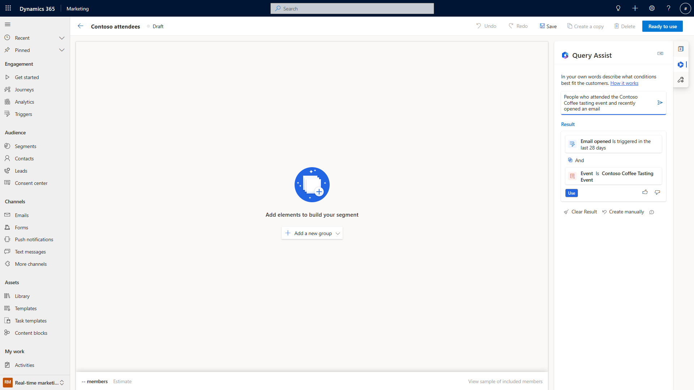
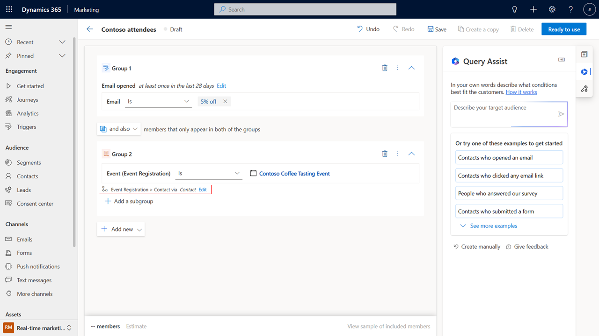
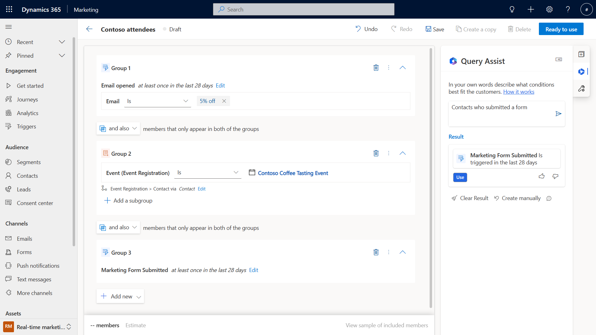

# Target the right customers using the query assist copilot

> [!VIDEO https://www.microsoft.com/videoplayer/embed/RE5csiL]

Segment creation traditionally required extensive knowledge of the complex data structures defined by your business. To simplify creating segments in real-time marketing, you can use query assist copilot to describe the segment definition in simple English. Query assist copilot lets you add the results query onto the segment builder at any level of the query logic, either as a new group or as an additional condition in your existing logic. You can even improve the copilot by giving feedback, helping you achieve more detailed results in the future.

Let’s imagine you want to create a segment that targets people who have attended one of your past events. To create a segment using query assist copilot, select the **Segments** tab under the **Audience**. Enter the segment name and select the target audience (Contact or Lead) and enter a description for your segment. Copilot understands different syntaxes – from conversational language to formal. In this example, we're using “People who attended the Contoso Coffee tasting event and recently opened an email”. Then select **Create**.

> [!div class="mx-imgBorder"]
> 

On the right side of the next screen, you'll see a **Query Assist** panel. The Query assist copilot uses the description you entered when creating your segment to suggest a data structure for the segment. If the suggested segment information is accurate, you can select the button to apply the suggested result to your new segment.

> [!div class="mx-imgBorder"]
> 

Once you select **Use**, notice the copilot built the relationship for you in the canvas. 

> [!div class="mx-imgBorder"]
> 

You can provide feedback on the segment query by selecting the thumbs up or thumbs down button next to the result in the **Query Assist** pane.

You can add further details to your segment by entering additional searches into the query assist pane. If you select **See more examples**, you can find more suggestions to help you get started. 

If you select a new search, you'll notice that by clicking the Use button it will always add the result as a new group at the bottom of what is already on the canvas. 

> [!div class="mx-imgBorder"]
> 

[!INCLUDE[footer-include](../includes/footer-banner.md)]