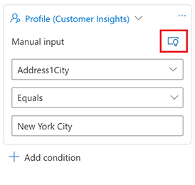
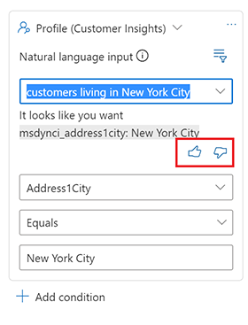

# Preview: Use natural language in real-time marketing journeys

> [!IMPORTANT]
> A preview feature is a feature that is not complete, but is made available before it’s officially in a release so customers can get early access and provide feedback. Preview features aren’t meant for production use and may have limited or restricted functionality.
>
> Microsoft doesn't provide support for this preview feature. Microsoft Dynamics 365 Technical Support won’t be able to help you with issues or questions. Preview features aren’t meant for production use, especially to process personal data or other data that are subject to legal or regulatory compliance requirements.

Natural language input enables you to use common words and phrases to describe a condition you want to include in your customer journey. The data model is built on top of Common Data Model (CDM).

## Use natural language input

1. To create a condition using natural language, go to **Real-time marketing** > **Customer engagement** > **Journeys** and open an existing journey or create a new one.
1. Select the plus sign to add an element, then add an attribute branch to branch based on a specific value.
1. A side pane titled **Attribute** will open. Enter the following information in the side pane:
    - **Display name**: To identify your attribute branch, enter a name for it.
    - The manual input will appear by default. To use natural language input, select the lightbulb icon.
        > [!div class="mx-imgBorder"]
        > 
    - Type your clauses using natural language the text box.

## Sample conditions

You can create a segment that will evaluate your Dynamics 365 organizational database for customers that meet a certain criterion. For example, customers with an annual income of $100,000.

The following are examples of simple conditional phrases using natural language:

**Search by company**

- Customers who work at Microsoft (Profile)
- People who work in a company named Contoso (Profile/Contact)

**Search by demographic**

-	Female customers (Profile)
-	Contacts in Seattle (Contacts)
-	Customers who are in Ohio (Contacts)
-	Contacts with vice president as job title (Contacts)
-	Customers with vice president as job title (Contacts/Profile)

**Search by segment membership within your organization** 

- Customers who are in Loyalty Segment

## Give us feedback

The natural language model is constantly learning. If you try a query that doesn’t work, you are always welcome to provide feedback.

To provide feedback after you've entered a natural language clause:

1. A thumbs up/thumbs down icon will appear below the text box.

    > [!div class="mx-imgBorder"]
    > 

1. Select the **thumbs down** icon.
1. Select **Send feedback**.
1. Enter a short explanation of what happened. Add comments about what you would expect the phrase to look like.

[!INCLUDE[footer-include](../includes/footer-banner.md)]