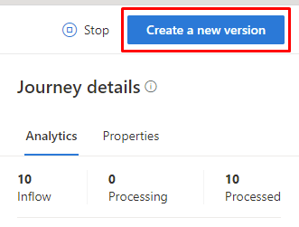
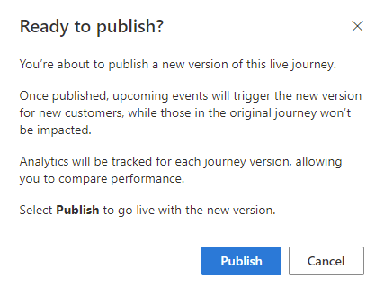

# Create a new version of a customer journey

If you want to modify a live customer journey in real-time marketing, you will need to create a new version of the journey. 

## Creating a new version

To create a new version, open the customer journey you want to modify, then select the **Create a new version** button in the top-right corner of the journey editor.

> [!div class="mx-imgBorder"]
> 

After editing the journey, select **Publish**. A window will pop up asking if you are ready to publish your changes.

> [!div class="mx-imgBorder"]
> 

- To push the changes live, select the **Publish** button.
- To discard the changes, select **Cancel** and then **Discard changes** in the journey editor.

Once you've published the journey, customers will enter the newest version of the journey. Customers who have already entered the previous version of the journey will complete their original journey.

For repeating journeys, customers will enter the latest version of the journey.

For static segment-based journeys, all customers will repeat the newest version of the journey.

## Updates to the journey status

A newly published journey version will be marked as **Live**, while the original journey version will have a **Completing** status until the last customer exits the journey. After the last customer exits, the original journey will switch to a **Completed** status.

To learn more about journey statuses, see [Publish records through the go-live process](go-live.md#real-time-marketing-go-live-operations-and-status).