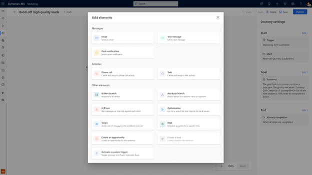
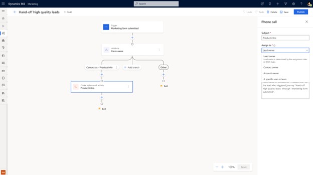
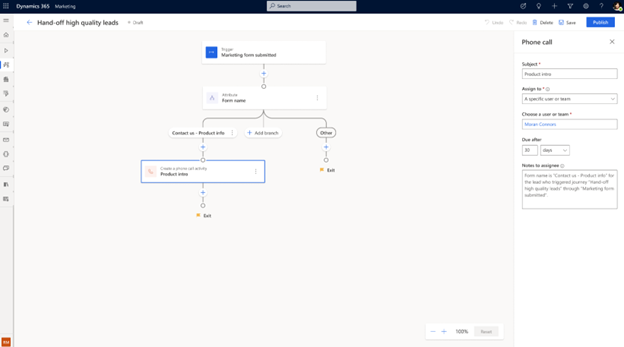
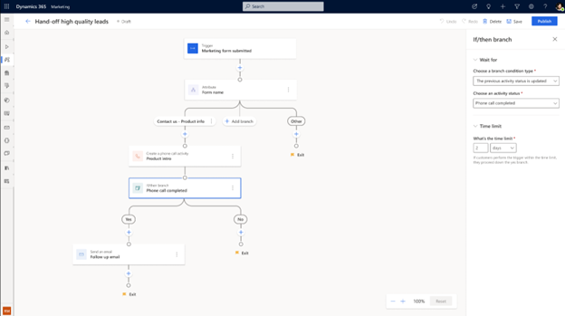
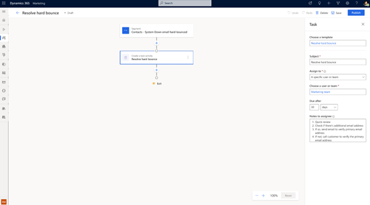
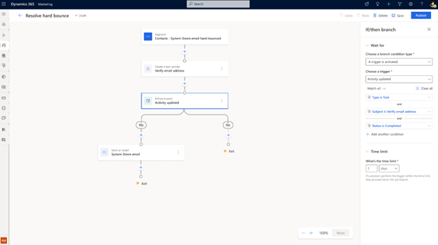
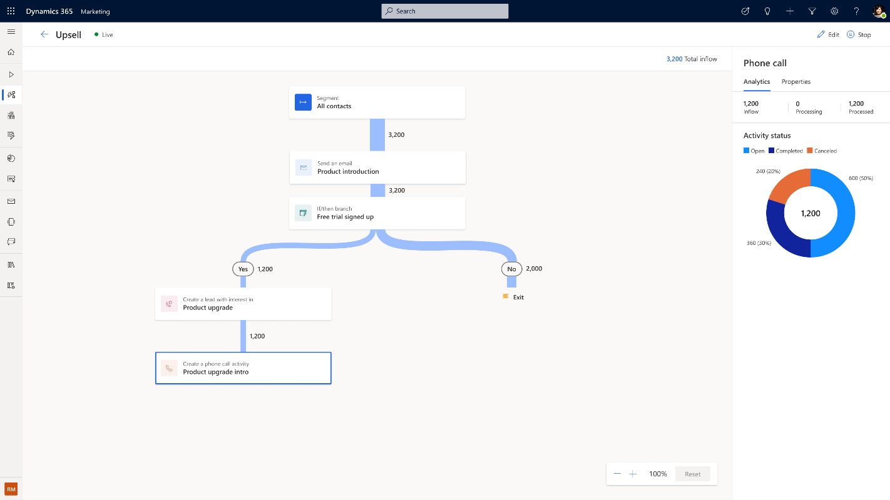

# Optimize lead management by engaging sellers right away

When using real-time journeys to nurture Leads and opportunities, it's important to pay attention to signals that may indicate a sense of urgency or interest from the Leads. Signals may include enhanced engagement with your marketing messages or increased activity on your website or social media channels.

With Dynamics 365 Marketing, you can leverage this information to create customized sales activities, such as tasks and phone calls, directly from the real-time journey. This means that you can reach out to Leads with individualized attention when they're most likely to engage and show interest in your product or service. This increases your chances of converting Leads into customers and driving revenue for your business.

This feature allows you to seamlessly integrate your marketing and sales efforts, providing a more cohesive and streamlined experience for your Leads and customers. With the ability to create sales activities directly from the real-time journey, you can better track and measure the effectiveness of your marketing and sales efforts and make data-driven decisions to optimize your campaigns for maximum impact.

## Scenario 1: Handing off high value Leads timely to drive paid conversion rate

To facilitate faster and more effective deal closures, you can create phone call records for your sales team directly from nurturing journeys when a high value action is taken. In this example, after a lead has expressed interest through submitting a form, you can create a phone call record in the journey based on the form name using the below steps:

1. Go to **Real-time marketing** > **Journeys** and select **+ New Journey** in the top toolbar.
1. Give the journey a name, select **Trigger-based** as the journey type, and search for the **Marketing form submitted** trigger.
1. Next, select the **+** sign below the Marketing form submitted trigger on the journey designer canvas to add another tile to the journey.

    > [!div class="mx-imgBorder"]
    > 

1. Create a subject for the **Phone call** and assign it to the owner. It can be the record owner itself, its Contact/Account owner, or any specific user/team in your organization.

    > [!div class="mx-imgBorder"]
    > 

1. You can also add notes for the sales agent so that they have more well-rounded information regarding where the lead came from.

    > [!div class="mx-imgBorder"]
    > 

1. To further nurture the lead, you can track the status of the phone call being completed (after the seller marks the task as **Completed** in Dynamics 365 Sales), then send a follow up email.

    > [!div class="mx-imgBorder"]
    > 

## Scenario 2: Resolve a hard bounce as a task

You can give a task to your team to look for a customer's email address after a hard bounce, like how a phone call record can be created in customer journeys. Your previously created task templates will automatically be finished on the journey canvas. 

> [!div class="mx-imgBorder"]
> 

You can also send a "System Down" email after the task has been completed by your team member.

> [!div class="mx-imgBorder"]
> 

## View analytics for your activities  

You can view the status breakdown for the phone call record created after the journey has been running for a while.

> [!div class="mx-imgBorder"]
> 