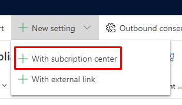
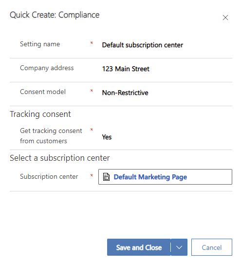
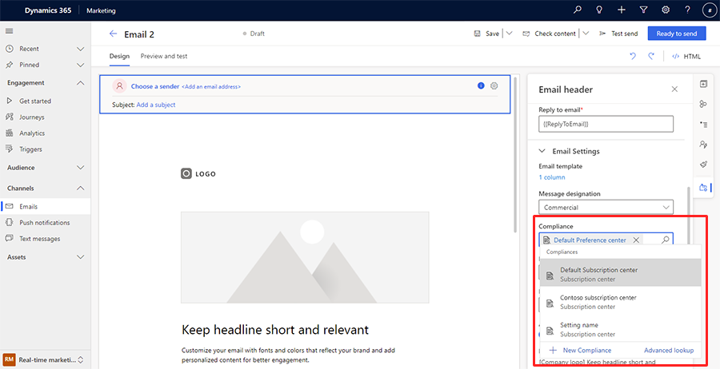

# Use outbound subscription centers in real-time journeys

This article explains how to use outbound marketing subscription centers in real-time journeys. Outbound subscription centers give you consent management flexibility, enabling you to have multiple subscription centers customized and branded to your needs.

> [!IMPORTANT]
> You can only use subscription centers in real-time journeys that target contacts. Journeys that target leads or customer profiles will continue to use the default preference page.

## Prerequisites

To use outbound subscription centers in real-time marketing, you must first create at least one subscription center in outbound marketing. You also need to make sure the configurable compliance settings feature switch is enabled.

### Create subscription centers in outbound marketing

If you haven’t already, [create your subscription centers](set-up-subscription-center.md) in outbound marketing.

### Enable configurable compliance settings

Before you can use subscription centers in real-time journeys, you must enable configurable compliance settings:

1. Go to **Settings** > **Other settings** > **Feature switches**.
1. Turn on the **Configurable compliance settings in email editor** feature switch.

> [!NOTE]
> If you enabled the "Multi-brand consent and customizable preference centers (preview)" feature switch, the "Configurable compliance settings" feature switch does not need to be enabled to create and leverage multiple compliance profiles.

## Set up subscription centers in real-time marketing

In **Settings**, connect the outbound marketing subscription center to real-time marketing compliance settings:

1. Go to **Settings** > **Customer engagement** > **Compliance**.
1. Select **+ New setting** in the top toolbar, then select **+ With subscription center** from the dropdown.

    > [!div class="mx-imgBorder"]
    > 

1. A pane titled "Quick Create: Compliance" will appear. Fill out the following settings:
    1. **Setting name**: Select a meaningful name that will be easy to identify.
    1. **Company address**: The address that is used in the email footer.
    1. **Consent model**:
        - *Restrictive*: If consent isn't specified, assume it isn't allowed.
        - *Non-restrictive*: If consent isn't specified, assume it's allowed.
    1. **Tracking consent**: Enable this option to get tracking consent from customers.
    1. **Select a subscription center**: Select the subscription center you set up in outbound marketing.

        > [!div class="mx-imgBorder"]
        > 

    1. Select **Save and close**.

## Use a subscription center in a real-time marketing email

Now you can use the subscription center you've set up in a real-time marketing email. To do so, follow the steps below.

1. Open or create a new email message in the real-time marketing email editor.
1. Select the email header and go to **Email Settings** in the right pane.
1. Under **Compliance**, select the subscription center you set up in the "Quick Create: Compliance" settings in the previous step.

    > [!div class="mx-imgBorder"]
    > 

[!INCLUDE[footer-include](../includes/footer-banner.md)]