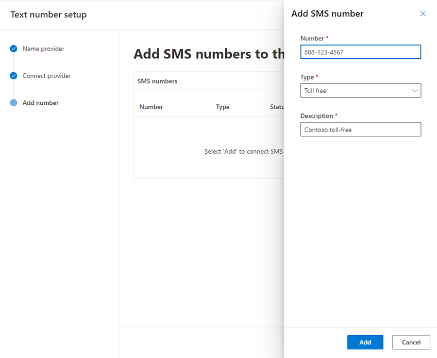
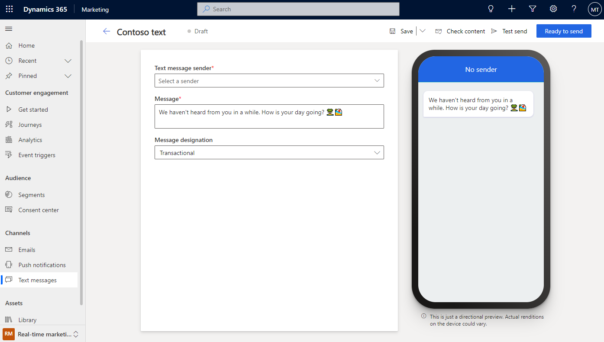

# Create outbound text messages

Text messages (SMS) allow you to reach customers directly on their mobile devices. You can send text messages from real-time marketing by generating a phone number to use within the app. This article explains how to add a phone number generated in the Azure Communication Services preview, Twilio, or TeleSign, and how to create and send text messages in real-time marketing.

> [!NOTE]
> Text messaging using a toll free number generated in the Azure Communication Services preview is only supported in the countries/regions listed below.
>
>| Supported countries/regions | Supported type | Legal designation | Range    |
>|---------------------|----------------|-------------------|----------|
>| United States                 | Toll-free      | Transactional     | Domestic |

It's important to remember that real-time marketing sends *outbound* text messages, meaning the Dynamics 365 Marketing app doesn't track responses except for compliance-related keywords such as "STOP." The Marketing app also doesn’t currently manage replies. As [discussed below](real-time-marketing-outbound-text-messaging.md#track-your-text-message-metrics-from-channel-insights), however, the app does track text messaging metrics for channel insights purposes.

## Add a sender number using the Azure Communication Services preview (US only)

To generate an Azure Communication Services preview phone number to use in real-time marketing, go to **Settings** in the area switcher menu. Then go to **Customer engagement** > **Azure SMS preview** and select **+New text message sender** on the top ribbon.

Once you agree to the *Voice and text message terms* and select your country or region, you’ll be provided with a toll-free United States phone number.

> [!div class="mx-imgBorder"]
> 

Toll-free numbers are a good option for transactional A2P messaging, which means sending automated messages to large groups. Toll-free numbers don’t require template registration, so once you get a number you can immediately start sending messages.

> [!NOTE]
> During the Azure Communication Services preview, the text message service is limited to a single toll-free phone number with a limited number of outbound messages per month. The phone number you receive will be your dedicated number for the duration of the preview.

> [!TIP]
> Carriers, just like email providers, have ways of filtering spam messages. This results in the phone number being blocked and becoming unusable. Due to carrier filtering, you should only use toll-free numbers for transactional messages (as opposed to promotional messages). You should avoid sending promotional content or misleading information. Promotional content includes free products or discount offers.

## Add a sender number from a Twilio or TeleSign account (Worldwide)

You can purchase or reuse an existing Twilio or TeleSign SMS account to send text messages in real-time marketing. **The integration works for all countries** in which a phone number can be purchased through TeleSign or Twilio.

> [!IMPORTANT]
> To ensure that third party SMS providers handle STOP commands properly, you must configure your consent settings directly with the provider.

### Sign up for and configure a Twilio account

Twilio integration uses Twilio's public APIs to send and receive text messages. You need to sign up for a Twilio account to enable real-time marketing SMS integration. To create a Twilio account:  
  
1. Go to [Twilio](https://www.twilio.com/try-twilio) and sign up for a trial account that can be upgraded to pay-as-you-go. If you expect to send high volumes of SMS traffic (more than 100,000 messages per month), contact Twilio to request an invoiced enterprise account.
1. In your Twilio account [General Settings](https://console.twilio.com/us1/account/manage-account/general-settings), note the **ACCOUNT SID** and **AUTH TOKEN** values. These values are required to create the integration between Dynamics 365 Marketing and Twilio.
1. [Purchase SMS phone numbers](https://console.twilio.com/us1/develop/phone-numbers/manage/search?frameUrl=%2Fconsole%2Fphone-numbers%2Fsearch%3Fx-target-region%3Dus1&currentFrameUrl=%2Fconsole%2Fphone-numbers%2Fsearch%3FisoCountry%3DUS%26types%255B%255D%3DLocal%26types%255B%255D%3DTollfree%26capabilities%255B%255D%3DSms%26capabilities%255B%255D%3DMms%26capabilities%255B%255D%3DVoice%26capabilities%255B%255D%3DFax%26searchTerm%3D%26searchFilter%3Dleft%26searchType%3Dnumber%26x-target-region%3Dus1%26__override_layout__%3Dembed%26bifrost%3Dtrue) through your Twilio account.

### Sign up for and configure a TeleSign account

Like Twilio, TeleSign integration uses TeleSign's public APIs to send and receive text messages. Also, like Twilio, you’ll need to sign up for a TeleSign account to enable TeleSign SMS integration. To create a TeleSign account:  
  
1. Go to [TeleSign](https://portal.telesign.com/signup) and sign up for a trial account. If you expect to send high volumes of SMS traffic (more than 100,000 messages per month), contact TeleSign to request an invoiced enterprise account.
1. In your TeleSign account [Dashboard](https://portal.telesign.com/portal/dashboard), note the **CUSTOMER ID** and **API KEY** values. These values are required to create the integration between Dynamics 365 Marketing and TeleSign.
1. Purchase SMS phone numbers through your TeleSign account.
1. On the [TeleSign SMS Settings](https://portal.telesign.com/portal/sms-settings) page, switch the **Status Callback** toggle to **Enabled.** This applies to **Standard accounts**. If you have an **Enterprise account**, you’ll need to contact TeleSign to enable the status callback setting for you.

### Set up your Twilio or TeleSign sender numbers in the Marketing app

To add a Twilio or TeleSign sender number to the Marketing app:

1. Go to **Settings** in the area switcher menu. Then go to **Customer engagement** > **SMS providers** and select **+Text number setup** in the top ribbon.
1. Add a name to associate with the number. This is for your identification purposes, so adding the provider name makes sense. Then, select the **Next** button.
1. Select the provider (TeleSign or Twilio).
1. If you selected TeleSign, enter the **CUSTOMER ID** and **API KEY** noted in the steps above. If you selected Twilio, enter the **ACCOUNT SID** and **AUTH TOKEN**. Then, select the **Next** button.
1. On the next screen, select **+Add** to add the TeleSign or Twilio number that will be used for the integration.
1. On the **Add SMS number** pane, add the number, its type, and a short description to distinguish it.
    > [!div class="mx-imgBorder"]
    > 
1. Select the **Add** button, then select **Done**. The number setup is now complete.

You can view all active provider integrations in the **SMS providers** tab. You can also edit, update, delete, or add more numbers to an existing integration.

## Create text messages

After you add your phone number, you can start authoring text messages by going to **Real-time marketing** > **Channels** > **Text messages** and selecting **+New text message** in the top ribbon. This will take you to the text messaging editor.

> [!div class="mx-imgBorder"]
> 

To create a message:

1. Select the message sender. The **Text message sender** dropdown lets you choose from the sender phone numbers (Azure Communication Services preview, Twilio, or TeleSign) you’ve added.
1. Enter your message content. You can enter text, emojis, and [personalized content](real-time-marketing-outbound-text-messaging.md#personalize-text-messages).
1. Choose whether your message designation is **Commercial** or **Transactional**. A commercial message is one that is sent to recipients who have opted-in to receive messages. An example is a coupon sent to a group of customers who opted-in to receive promotional offers from your company. A transactional message is one that is sent in response to a transaction the recipient previously started with you. An example is a response to an email inquiry.

> [!IMPORTANT]
> In the text messaging editor, the message designation is preselected as transactional for numbers that might be prone to carrier filtering if used for promotional or marketing messaging. To make sure your number isn't blocked by carriers, it's highly recommended to use this number for transactional messaging only.

Before sending your message, select the **Check content** button in the upper right. This will run an error check on the message, much like the error check functionality in the email designer.

Next, test your message by selecting the **Test send** button in the upper right. If you’re using an Azure Communication Services preview toll-free sender number, you can test send the message to any United States mobile number. If you’re using a Twilio or TeleSign sender number, you can send the message to a mobile device in any supported country. You can also add the message to a journey to see how it can be triggered by events.

## Personalize text messages

Personalizing text messages allows you to insert dynamic data that is unique to each message recipient. You might want to dynamically populate a name, an appointment time, a location, or any other unique data.

To personalize a text message:

1. Select the **Personalization**  button in the **Message** field.
1. Select **Select a data field** to choose a data source. Your data source can be based on an **Audience**, a **Trigger**, or **Compliance**.
1. After choosing the data source, you can search for the specific attribute or trigger you want.
1. Add a **Label** to quickly identify your token in the message content.

When you send the text message from a journey, it will automatically populate the token according to the attribute you selected.

## Add a Customer Voice survey to a text message

Adding a Customer Voice survey link to a text message or [push notification](real-time-marketing-push-notifications.md#add-a-customer-voice-survey-to-a-push-notification) allows you to seek feedback from customers on the channels they use the most.

To add a Customer Voice survey to a text message:

1. Select the **Customer Voice survey** button  in the **Message** field.
1. Choose a Customer Voice survey in the lookup field.
1. Select whether you want the survey to be anonymous and whether you want to track the survey link after customers click on it. If you select the **Survey is anonymous** option, no user data will be saved with the answers.
    > [!div class="mx-imgBorder"]
    > 
1. Select **Save**.

When you send the text message from a journey, it will automatically populate the token with the survey and options you selected.

## Track your text message metrics from channel insights

You can see how customers react to your text messages by checking the text message analytics in the message itself and within journeys.

> [!NOTE]
> Delivery reports for text messages are received from different carriers in every country or region. This might result in false positives or negatives at times, depending on the carrier. Consider this when you check the delivery reports of your text messages.