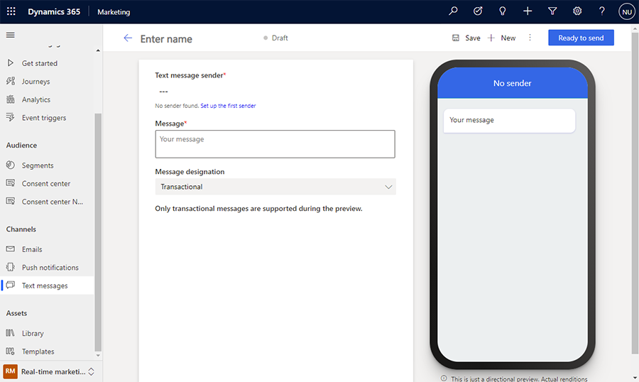

# Create outbound text messages

> [!IMPORTANT]
> A preview feature is a feature that is not complete, but is made available before it’s officially in a release so customers can get early access and provide feedback. Preview features aren’t meant for production use and may have limited or restricted functionality.
> 
> Microsoft doesn't provide support for this preview feature. Microsoft Dynamics 365 Technical Support won’t be able to help you with issues or questions. Preview features aren’t meant for production use, especially to process personal data or other data that are subject to legal or regulatory compliance requirements.

Text messages (SMS) allow you to reach customers directly on their mobile devices. You can send text messages from real-time marketing by generating a phone number to use within the app.

> [!NOTE]
> For the duration of the preview, following the roll-out of Azure Communication Services, text messaging is only supported in the countries listed below.
>
>| Supported countries | Supported type | Legal designation | Range    |
>|---------------------|----------------|-------------------|----------|
>| United States                 | Toll-free      | Transactional     | Domestic |

## Generate a sender phone number

To generate a phone number to use in real-time marketing, go to **Settings** > **Text messages** and select **+New Number** on the top ribbon.

Once you agree to the *Voice and text message terms* and select your country, you will be provided with a toll-free United States phone number.

> [!div class="mx-imgBorder"]
> 

Toll-free numbers are usually a good option for transactional A2P messaging, which means sending automated messages to large groups. They do not require template registration, therefore, once you get a number you can immediately start sending messages.

> [!NOTE]
> During preview, the text message service is limited to a single toll-free phone number with a limited number of outbound messages per month. The phone number you receive will be your dedicated number for the duration of the preview.

> [!TIP]
> Carriers, just like email providers, have ways of filtering spam
messages. This results in the phone number being blocked and becoming unusable. Due to carrier filtering, you should only use toll-free numbers for transactional messages (as opposed to promotional messages). We recommend avoiding sending any promotional content or any misleading information. Promotional content includes any free products or discount offers.

## Create text messages

After you create your phone number, you start authoring text messages by going to **Real-time marketing** > **Channels** > **Text messages** and selecting **+New text message** in the top ribbon. This will take you to the text messaging editor.

> [!div class="mx-imgBorder"]
> 

> [!IMPORTANT]
> In the text messaging editor, the message designation is pre-selected as transactional for numbers that might be prone to carrier filtering if used for promotional or marketing messaging. To make sure that your number is not blocked by carriers, it is highly recommended to use this number for transactional messaging only.

To test your message, try test sending it to any United States mobile number. You can also add it to a journey to see how it can be triggered by events.

## Personalize test messages

Personalizing text messages allows you to insert dynamic data that is unique to each message recipient. You may want to dynamically populate a name, an appointment time, a location, or any other unique data.

To personalize a text message:
- Select the **Personalization** button  in the **Message** field.
- Choose a **Data source**. Your data source can be based on **Compliance**, **Events**, or a **Customer Insights** profile.
- After choosing the data source, you can search for the specific attribute you are looking for.
- Add a **Label** to quickly identify your token in the content.

When you send the text message from a journey, it will automatically populate the token according to the attribute you selected.

## Track your text message metrics from channel insights

You can see how customers reacted to your text messages by checking the text message analytics in the message itself and within journeys.

> [!NOTE]
> Delivery reports for text messages are received from different carriers in every country. This may result in false positives or negatives from time to time, depending on the carrier. Consider this when you are checking the delivery reports of your text messages.