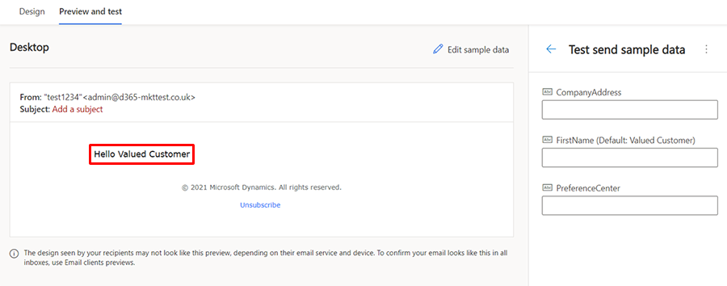
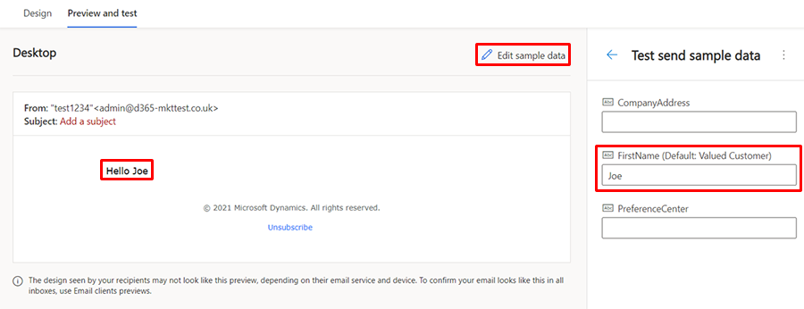
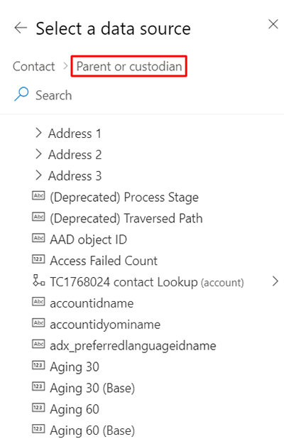

# Personalize content

Dynamics 365 Marketing's real-time marketing features offer powerful personalization capabilities. In this article, you'll learn how to set default values for personalized data, preview personalized content, personalize text messages and push notifications, and use advanced personalization features like related tables and conditional content.

## Default values

Use default values to ensure your message always has appropriate content, even if the data is missing or blank. For example, if you are personalizing your message with a customer’s first name, you can add “customer” as the default value. That way your message will always be complete.

To set a default value:

1. Add a personalized element.
1. Enter the default content in the **Default value** field.

> [!div class="mx-imgBorder"]
> 

## Preview personalized content

You can preview your personalized content in the **Preview and test** view. By default, preview will display the default content for that placeholder:

> [!div class="mx-imgBorder"]
> 

You can also add content in the **Test send sample data** field to preview how it will look in your email:

> [!div class="mx-imgBorder"]
> 

## Personalize text messages and push notifications

You can add personalized content to your messages by selecting the  icon:

> [!div class="mx-imgBorder"]
> 

## Advanced personalization features

### Related tables

Related tables are signified with the  icon. For example: 

Select this field to navigate to the related table:

> [!div class="mx-imgBorder"]
> 

You can also search for fields in the related table (only the currently selected table will return results).

> [!div class="mx-imgBorder"]
> 

Once you’ve selected a field, the full path to that field is displayed in the data binding.

> [!div class="mx-imgBorder"]
> 

### Conditional content

Conditional (if-then-else) statements display content depending on whether one or more conditional expressions resolve to true or false. You can add the code required to create these statements by placing it within a text element, or by placing custom-code elements between the other design elements. You can then use the placeholder dialog to specify the condition to be evaluated.

```
{{#if placeholderName}}
   Content displayed when the expression is true
{{else if placeholderName2}}
   Content displayed when the first expression is false and the second one is true
.
.
.
{{else}}
   Content displayed when all expressions are false
{{/if}}
```

In the code, you only specify the placeholder name. To set up the condition, go to the **Personalize** tab in the **Toolbox**:

Then, select the placeholder name to configure. From this, you select a field and the condition to compare:

For example, you can add code to personalize a greeting based on country:

```
<p>{{#if ckForDenmark}}
    Hej
{{else}}
    Hi
{{/if}} {{contact.firstname}}!</p>
```

Next, configure the condition to check the contact’s address for Denmark:

You can preview the different content in **Preview and test** by changing the sample data for the conditions to true:

