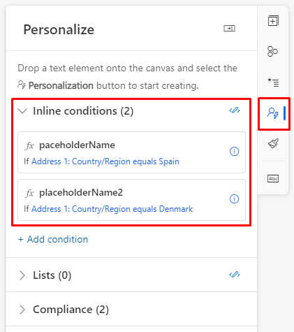
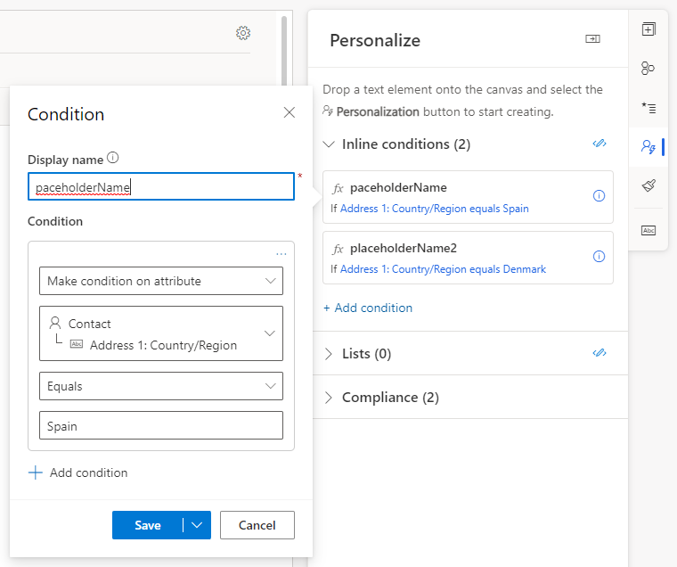
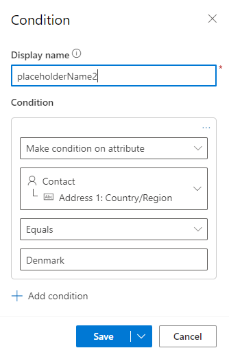
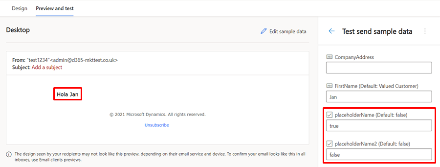
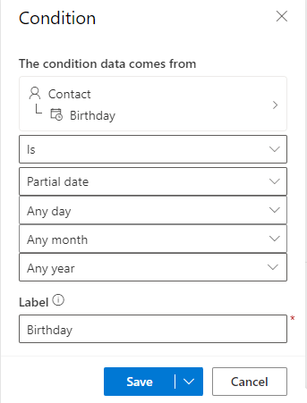
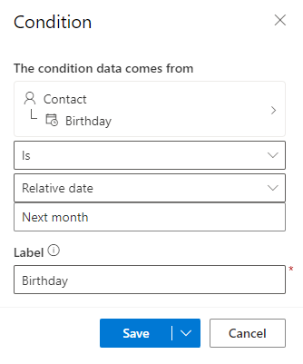

# How to use inline conditions

Conditional (if-then-else) statements display content depending on whether one or more conditional expressions resolve to true or false. You can add the code required to create conditional statements in the designer or the HTML view. You can then use the placeholder dialog to specify the condition to be evaluated. Below is an example of conditional expressions using placeholders to specify conditions.

```
{{#if placeholderName}}
   Content displayed when the expression is true
{{else if placeholderName2}}
   Content displayed when the first expression is false and the second one is true
.
.
.
{{else}}
   Content displayed when all expressions are false
{{/if}}
```

If you're adding code to HTML, make sure to put comments around the code:

```
<!-- {{#if placeholderName}} -->
    <h1>Content displayed when the expression is true</h1>
<!-- {{/if}} -->
```

In the code, you only specify the placeholder name. To set up the condition, go to the **Personalize** tab in the real-time marketing email designer:

> [!div class="mx-imgBorder"]
> 

For example, you can add code to personalize a greeting based on country:

```
{{#if placeholderName}}
    Hola
{{else if placeholderName2}}
    Hallo
{{else}}
    Hi
{{/if}} {{contact.firstname}}!
```

Then, select the placeholder name to configure. Next, select a field and the condition to compare. In this example, the first placeholder will activate the condition if the contact's address is in Spain:

> [!div class="mx-imgBorder"]
> 

Next, configure another condition to check the contact’s address for Denmark:

> [!div class="mx-imgBorder"]
> 

You can preview the effect of the conditions in **Preview and test** by changing the sample data for the conditions to true. Placeholder one true:

> [!div class="mx-imgBorder"]
> 

Placeholder two true:

> [!div class="mx-imgBorder"]
> 

### Partial and relative dates in conditional content

You can use relative and partial dates when defining a condition that uses dates, allowing you to create more flexible personalized content.

#### Partial dates

Partial dates allow you to define conditions such as "Birthday is Today" or "Birthday is this month." The available options for partial dates are as follows:

- Day can be checked for any day, today, a specific day (such as the 15th), or a day (or days) of the week (such as Monday and Wednesday).
- Month can be checked for any month, this month, or a specific month (such as February).
- Year can be checked for any year, this year, or a specific year (1922-2027).

> [!div class="mx-imgBorder"]
> 

#### Relative dates

Relative dates allow you to define conditions such as "Birthday is next month" or "Birthday was 2 days before today." Options here include the ability to specify the number of days, months, or years "from today" or "before today."

> [!div class="mx-imgBorder"]
> 
