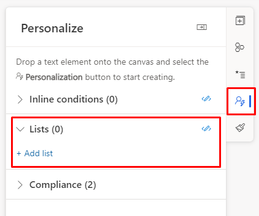
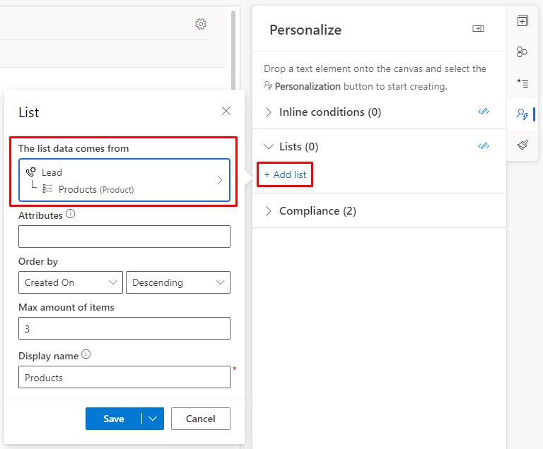
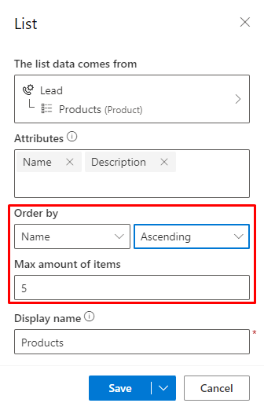
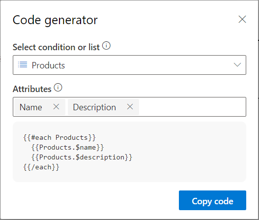
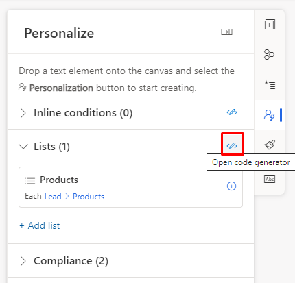
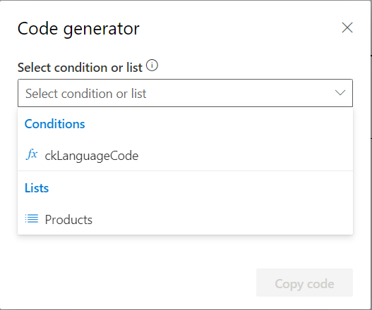
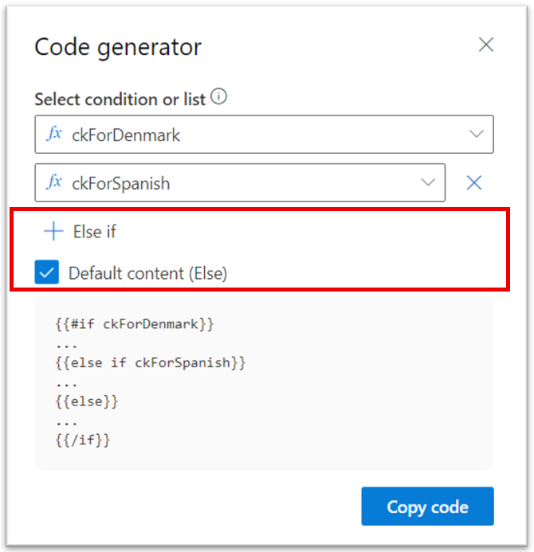
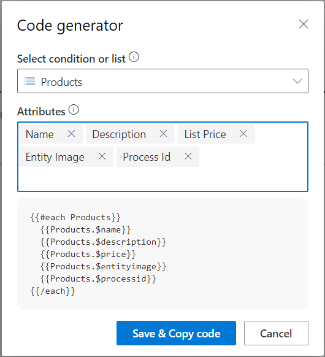
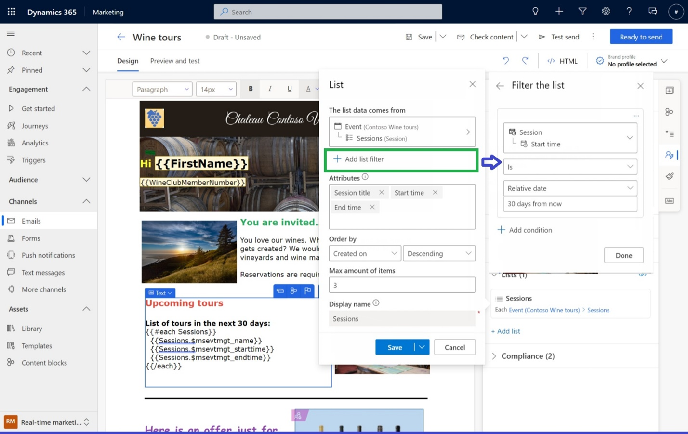

# Personalize lists of content in emails

Lists (each) statements allow you to format and display repeated content for a given table. You can add the code required to create these statements in the designer or in the HTML view. You can then use the placeholder dialog to specify the list to be evaluated including the number of rows to display and the order to display them in.

```
{{#each placeholderName}}
   Repeated content to display
{{/each}}
```

If you're adding code to HTML, make sure to put comments around the code:

```
<!-- {{#each placeholderName }} -->
    <h1>Repeated content to display</h1>
<!-- {{/each}} -->
```

In the code, you only specify the placeholder name. To set up the list, go to the **Personalize** tab in the real-time marketing email designer:

> [!div class="mx-imgBorder"]
> 

## List set up example

Let's say you want to create an email with a list of products the customer has.

First, create a list placeholder and select the table you what to use for the list:

> [!div class="mx-imgBorder"]
> 

Next, add any attributes you want to display as the repeated content in the list:

> [!div class="mx-imgBorder"]
> 

You can also specify which attribute to order the list by and how many items you want displayed:

> [!div class="mx-imgBorder"]
> 

Finally, select the drop-down arrow on the right side of the **Save** button to save the list and use the code generator to copy the list code to the designer:

> [!div class="mx-imgBorder"]
> 

## Code generator

You can use the code generator tool to create code for your condition and list placeholders to copy.

To access the code generator, go to the **Personalize** tab in the real-time marketing email designer:

> [!div class="mx-imgBorder"]
> 

You can select either a condition or list placeholder to build your code for:

> [!div class="mx-imgBorder"]
> 

For conditions, you can add additional else cases or a default case:

> [!div class="mx-imgBorder"]
> 

For lists, you can add or delete additional attributes (these changes will be saved to your list placeholder):

> [!div class="mx-imgBorder"]
> 

## Define a list filter

> [!NOTE]
> This feature is available only in Real-time marketing.

Sometimes when creating a list in an email, you'd like to only include items that meet certain conditions. For example, a confirmation email about an order may be most effective if it separately lists items that are back ordered or need special handling. Similarly, communication about a multi-session conference is easier to consume if the sessions are organized by topic or track, filtering the list of sessions based on certain criteria.

> [!VIDEO https://www.microsoft.com/videoplayer/embed/RW10RFA]

To filter a list, select a list you've already created in an email. In this example, the email contains a list of winery tours:

> [!div class="mx-imgBorder"]
> 

If you don’t add a filter to this list, the entire list will be included in the email (subject to the maximum number of items specified). In this case, the email would list all upcoming tours.

To add a filter condition, select **+Add list filter** in the list editing pane. The conditional statement can include one condition, for simple filtering, or many conditions for complex filtering. Here, the list is filtered to display only tours coming up in the next 30 days:

> [!div class="mx-imgBorder"]
> 

With this condition defined, only the items that meet the condition will be included. Note that the generated code for the list doesn’t change as the filter condition is stored within the list definition and isn't needed as inline code.
