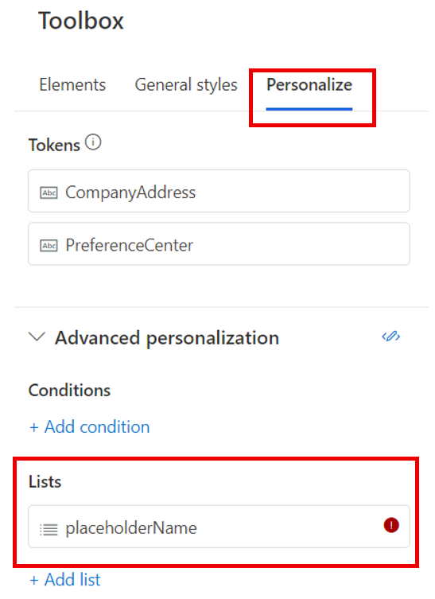
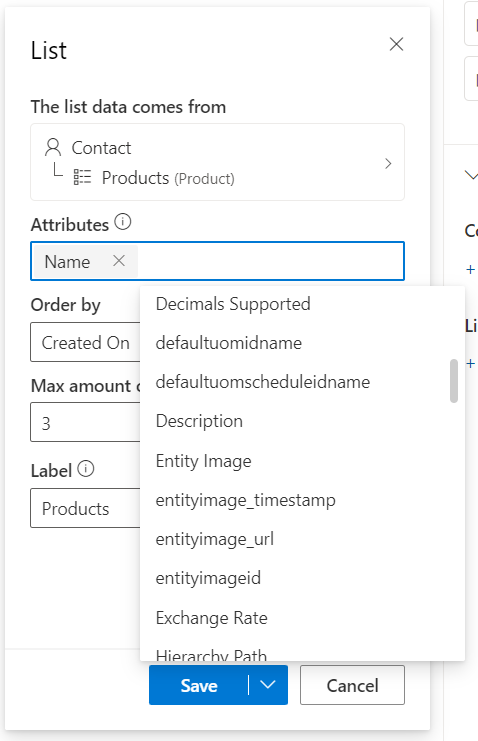
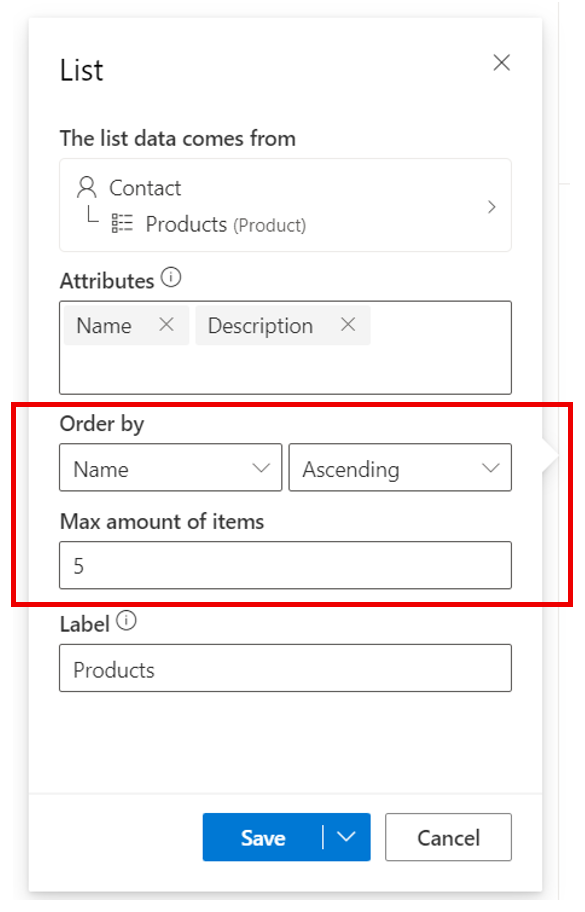
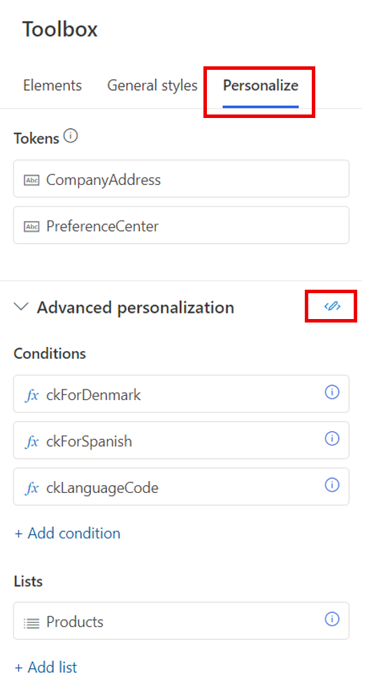
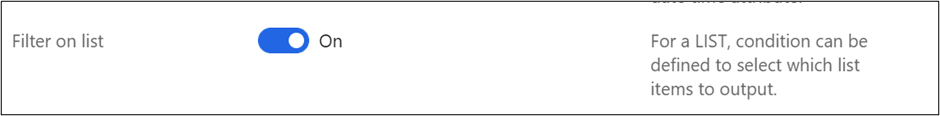

# Lists of content

Lists (each) statements allow you to format and display repeated content for a given table. You can add the code required to create these statements in the designer or in the HTML view. You can then use the placeholder dialog to specify the list to be evaluated including the number of rows to display and the order to display them in.

```
{{#each placeholderName}}
   Repeated content to display
{{/each}}
```

If you are adding code to HTML, make sure to put comments around the code:

```
<!-- {{#each placeholderName }} -->
    <h1>Repeated content to display</h1>
<!-- {{/each}} -->
```

In the code, you only specify the placeholder name. To set up the list, go to the **Personalize** tab in the **Toolbox**:

> [!div class="mx-imgBorder"]
> 

For example, you want to create an email with a list of products the customer has.

First, create a list placeholder and select the table you what to use for the list:

> [!div class="mx-imgBorder"]
> 

Next, add any attributes you want to display as the repeated content in the list:

> [!div class="mx-imgBorder"]
> 

You can also specify which attribute to order the list by and how many items you want displayed:

> [!div class="mx-imgBorder"]
> 

Finally, save and use the Code generator to copy the list code to the designer:

> [!div class="mx-imgBorder"]
> 

## Code generator

You can use the Code generator tool to create code for your condition and list placeholders to copy.

To access the Code generator, go to the **Personalize** tab in the **Toolbox**:

> [!div class="mx-imgBorder"]
> 

You can select either a condition or list placeholder to build your code for:

> [!div class="mx-imgBorder"]
> 

For conditions, you can add additional else cases or a default case:

> [!div class="mx-imgBorder"]
> 

For lists, you can add or delete additional attributes (these changes will be saved to your list placeholder):

> [!div class="mx-imgBorder"]
> 

## Filter on list

## More effective communication with selective output of a list

### How to enable the preview for more data for personalization 

This article refers to a feature that is in preview and may not be enabled in your environment. If you don’t see this feature in your app, contact your admin who can activate it by going to **Settings > Overview > Feature switches**, scrolling to **Personalization** area, enabling the **Filter on list** feature switch, and saving the setting by clicking on **“Save”** on the top right corner. 

> [!div class="mx-imgBorder"]
> 

**Note**: This feature is available only in Real-time marketing.  

### Defining a List filter

Including an entire list is certainly a common scenario but there are times when it is more effective to only include items from the list that meet certain conditions. For example, a confirmation email about an order may be more effective if it separately lists items that are back ordered or need special handling. Similarly, communication about a multi-session conference is easier to consume if the sessions are organized by topic, track, etc. – essentially filtering the list of sessions based on certain criteria. 
 
This is easy to do in Real-time with use of LIST – access the Personalization area from the quick access tool bar and then define a LIST

> [!div class="mx-imgBorder"]
> 

If you don’t add a filter to this list, the entire list will be included (subject to maximum number of items specified in the UX). Click on “+Add list filter” to add a condition (this conditional can be a simple condition or a more complex using multiple conditions)

> [!div class="mx-imgBorder"]
> 

With this condition defined, only those items will be included that meet this condition. Note that the generated code for the LIST doesn’t change as the filter condition is stored within the LIST definition and not needed as inline code.