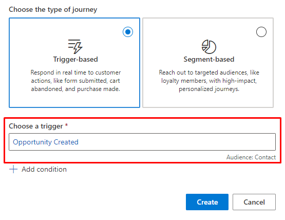
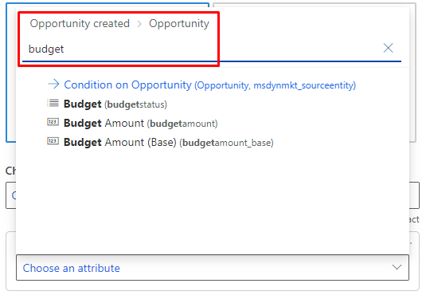
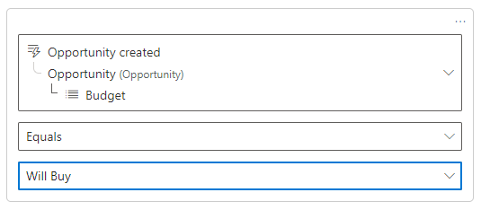

# Personalize triggers using conditions

[!INCLUDE[consolidated-sku-rtm-only](../includes/consolidated-sku-rtm-only.md)]

You can deliver more personalized experiences by accessing a rich set of trigger data for defining the journey entry/exit criteria, conditions/branches, and wait for branches. When you add any of these elements to the journey, you can use data attributes not only from the trigger’s core entity/table, but also from entities/tables directly related to those attributes.

For example, let’s create a journey to nurture new opportunities (using the “Opportunity created” trigger).

In the **Choose a trigger** dialogue, select the **Opportunity created** trigger.

> [!div class="mx-imgBorder"]
> 

Then, select **+Add condition** and search for the **budget** attribute from the Opportunity table.

> [!div class="mx-imgBorder"]
> 

This enables you to create [journey variations](real-time-marketing-edit-journey.md) for opportunities that are more likely to buy.

> [!div class="mx-imgBorder"]
> 

[!INCLUDE[footer-include](../includes/footer-banner.md)]
