# Personalize content using pre-defined dynamic text

Personalized messages help marketers drive engagement. A common way to personalize content is to use dynamic text (also known as placeholder text) that is automatically replaced with recipients' personal details when the message is sent. For example, rather than using a generic greeting like “Dear customer,” you can use dynamic text (“Dear ``{{FirstName}}``”) that is replaced with the customer name (“Dear John”) upon sending the message.

An instance of placeholder text such as ``{{Firstname}}`` is called pre-defined dynamic text. Before you can use dynamic text, you need to define three pieces of information:

1. **Data binding**: Where the replacement data for the dynamic text will come from (for example, the “firstname” attribute of a “Contact” table).
1. **Label**: How the dynamic text is referred to within the message text (for example, ``{{Firstname}}``).
1. **Default value**: What text to use if the source data is empty.

Defining data binding requires some understanding of the [Dataverse data model](/powerapps/maker/data-platform/data-platform-intro) to correctly connect the dynamic text to the right data source.

Pre-defined dynamic text is text that has already been defined by someone else and is ready to be used. Marketing ships with a set of commonly used pieces of pre-defined dynamic text. More can be added by you or your teammates (see [Creating and sharing pre-defined dynamic text](real-time-marketing-predefined-dynamic-text.md#creating-and-sharing-pre-defined-dynamic-text)).

## Using pre-defined dynamic text

Select **Personalize** in the email or text message editor to see a list of pre-defined dynamic text fragments. Next, select some pre-defined dynamic text from the list to insert it into the message:

**Email editor**:

> [!div class="mx-imgBorder"]
> 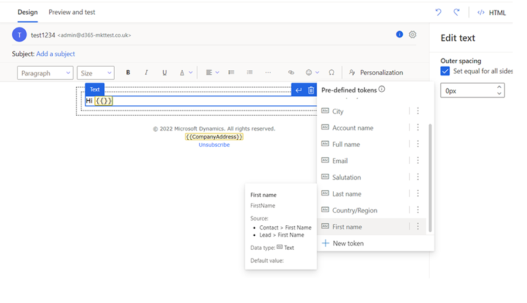

**Text message editor**:

> [!div class="mx-imgBorder"]
> 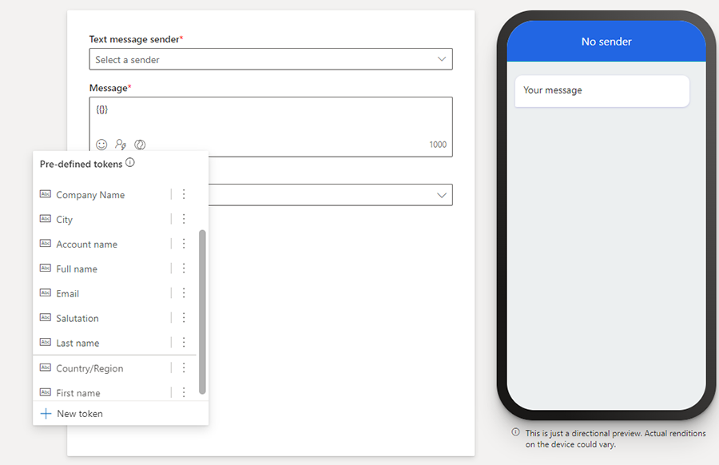

The pre-defined dynamic text list may be different than shown here because it's dynamic. As your admin and other users create and share more pre-defined dynamic text, the fragments will be added to the list. The top 10 items on the list are sorted by org-wide usage. If there are more than 10 items in the list, you'll see the remaining items sorted by alphabetical order after the top 10 items.

> [!div class="mx-imgBorder"]
> 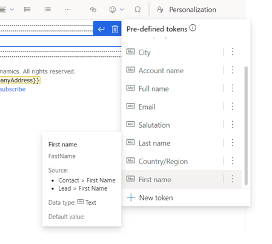

You can hover on dynamic text in the pre-defined list to see its details. Alternatively, you can select the vertical ellipses next to the dynamic text's name and then select **More info**.

### Changing the default value for the current message

Most of the time you should be able to use pre-defined dynamic text as-is, but sometimes you may need to change a default value. For example, the default value “Customer” may not work if your email is to non-customers. In this case, you can change the default value by selecting the pre-defined dynamic text in the editor canvas and then selecting the **Personalization** menu. After changing the default value, make sure to save it. It will save an updated version of the pre-defined dynamic text, *but only for the current message*.

### Changing the default value globally

If the default value provided isn't appropriate for your situation (for example, you may refer to your customers as “clients” or “guests” rather than “customer”), you can change the default value for everyone. To change the global default value, select the vertical ellipses next to the pre-defined dynamic text's name and then select **Update pre-defined dynamic text**. It will update the pre-defined dynamic text for the current message and globally for future usage of the dynamic text in new messages (existing messages aren't affected).

> [!div class="mx-imgBorder"]
> 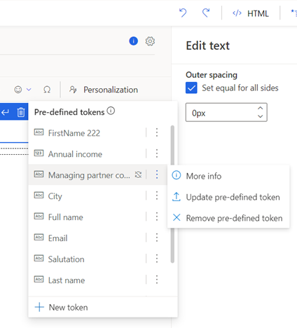

> [!IMPORTANT]
> The **Update pre-defined dynamic text** command only applies to the current message and future messages. It does not retroactively change previous uses of the dynamic text.

## Creating and sharing pre-defined dynamic text

You aren't limited to the pre-defined dynamic text that is included with the Marketing app. Any user can create new pre-defined dynamic text fragments and share them with their team by adding them to the pre-defined dynamic text list.

To define and share new pre-defined dynamic text, follow these steps:

1. Place your cursor in an empty space in the text box and then select **Personalization** from the menu bar that pops up. This opens the pre-defined personalization list.
1. Select **New dynamic text** at the bottom of the pre-defined dynamic text menu and complete steps to define the new dynamic text.

    > [!div class="mx-imgBorder"]
    > 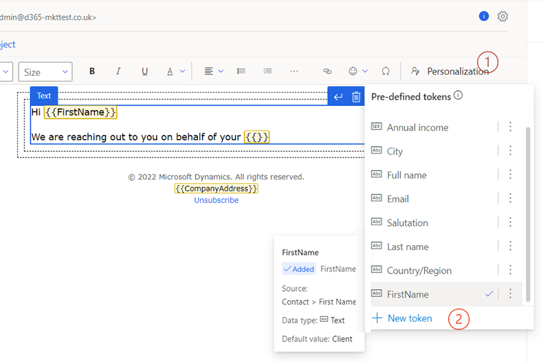

1. Select the down-facing carat next to the **Save** button and choose the **Save & add to pre-defined list** option.

    > [!div class="mx-imgBorder"]
    > 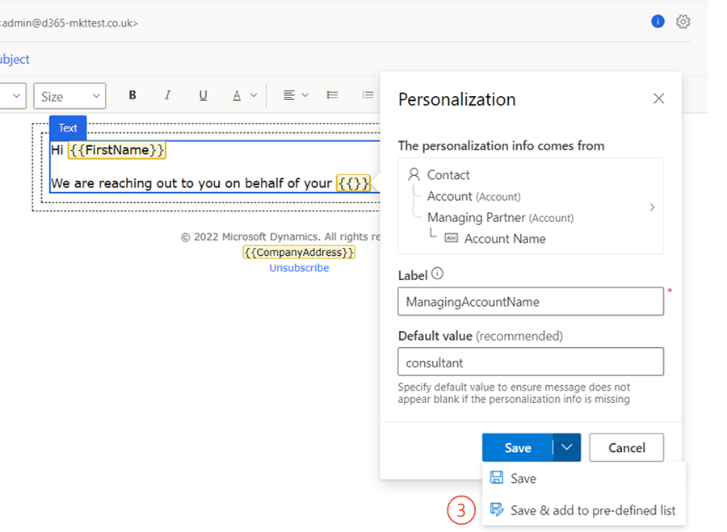

## Removing pre-defined dynamic text

To remove pre-defined dynamic text:

1. Place your cursor in an empty space in the text box and then select **Personalization** from the menu bar that pops up.
1. Select the vertical ellipses next to the dynamic text name.
1. Select **Remove pre-defined dynamic text** from the menu.

    > [!div class="mx-imgBorder"]
    > 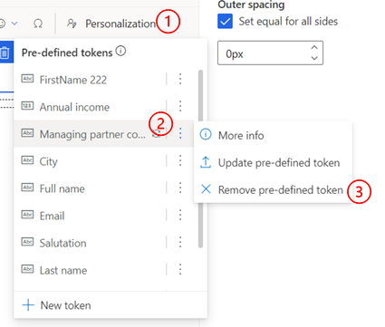

## Clearly communicate date and time using variety of formats

### Date and time formats

While working with multiple geographies and languages, communicating date and time clearly and unambiguously requires one to use the right format to match recipient's expectations. Real time marketing makes it easy to achieve this as it supports various date and time formats. 

Whenever a dynamic text is defined using a datetime type attribute, more set of options becomes available to select a datetime format that is readable and consistent with the locale (language and region) of the audience. If desired, the locale and time zone can also be changed to match the audience. Marketing will automatically convert the stored date/time into the selected time zone.

Available format options include three ways to present information - date and time, date only, and time only. Withing each way, there are multiple options to cover various use cases (Note: If the attribute is of type Date only, you won't see date and time only options).

> [!div class="mx-imgBorder"]
> 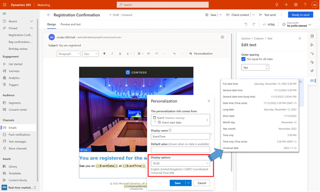

When you select a specific display option, it's applied to that specific dynamic text only. Marketing does remember the last format used (and selects it automatically for the next dynamic text to help drive consistency) but it can be changed easily so flexibility of presenting date and time in different formats within the same email is still possible. 

If needed, you can also change the language and region setting along with time zone by clicking on the “Edit” option. When language and region are changed, Marketing will automatically convert the stored date, and time into the selected time zone (note: this may result in a date change).

> [!div class="mx-imgBorder"]
> 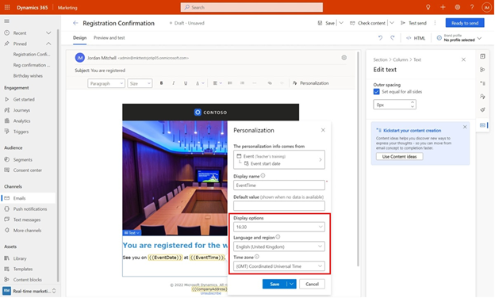

### Access even more data for personalization

#### How to enable the preview for more data for personalization

This article refers to a feature that is in preview and may not be enabled in your environment. If you don’t see this feature in your app, contact your admin who can activate it by going to **Settings > Overview > Feature switches**, scrolling to **Personalization** area, enabling the **Access more data for personalization** feature switch, and saving the setting by clicking on “Save” on the top right corner. 

> [!div class="mx-imgBorder"]
> 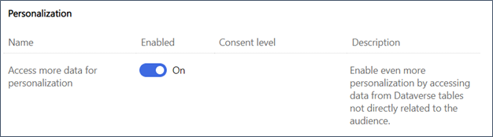

**Note**: This feature is available only in Real-time marketing.

#### Using data from additional tables in dynamic text

Most of the time, Dynamic text is used to personalize messages using data from Audience (for example, Contact or Lead), Triggers. Dynamic text can also use data from Dataverse tables that can be reached through relationships with Audience or Triggers. However, there are times when you need to use data from tables that don't have established or usable relationship with the Audience or triggers. For example, you may want to include information about a company building available in the Dataverse table “Building" that has no direct or usable relationship with Contact or Lead. In such case, your starting point for defining Dynamic text will be in “Other tables” part.

> [!div class="mx-imgBorder"]
> 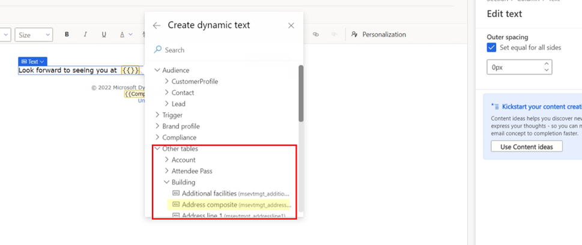

The “Other tables” area includes some of the most commonly used Dataverse tables (for example, Event planning related tables). When you search for attributes, the search includes these tables as well. You can define dynamic text using these tables just like you do with Audience or Triggers - use an attribute directly or follow relationships from these tables to other related tables until you find the needed attribute. There's one notable difference when you define a dynamic text starting with “Other tables” – before the message can be made “ready to send”, you must select a specific record from the selected table. If there is Audience or Trigger, the specific record is provided by the journey context (that is, Contact that is actually going through the journey). In case of these tables, we need to provide that information at the design time since they don't have a direct relationship with Audience or Triggers. For example, if you select an attribute from Events table, you'll be asked to select a specific event.

> [!div class="mx-imgBorder"]
> 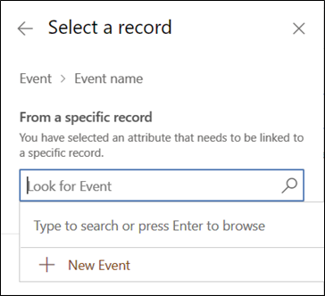

#### Using data from additional tables in advanced personalization 

Similar to Dynamic text, these data from these additional tables can also be used to define Conditions and Lists in Advanced personalization

> [!div class="mx-imgBorder"]
> 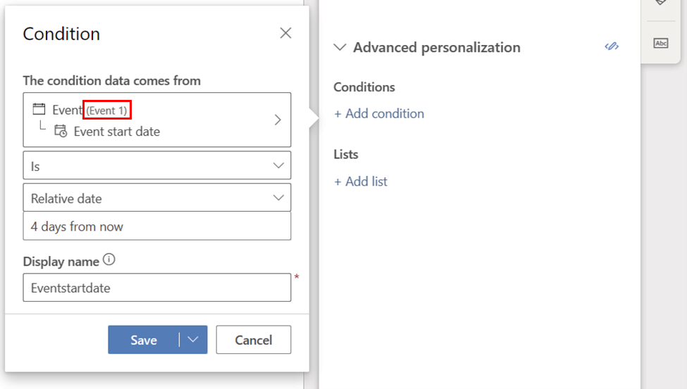

> [!div class="mx-imgBorder"]
> 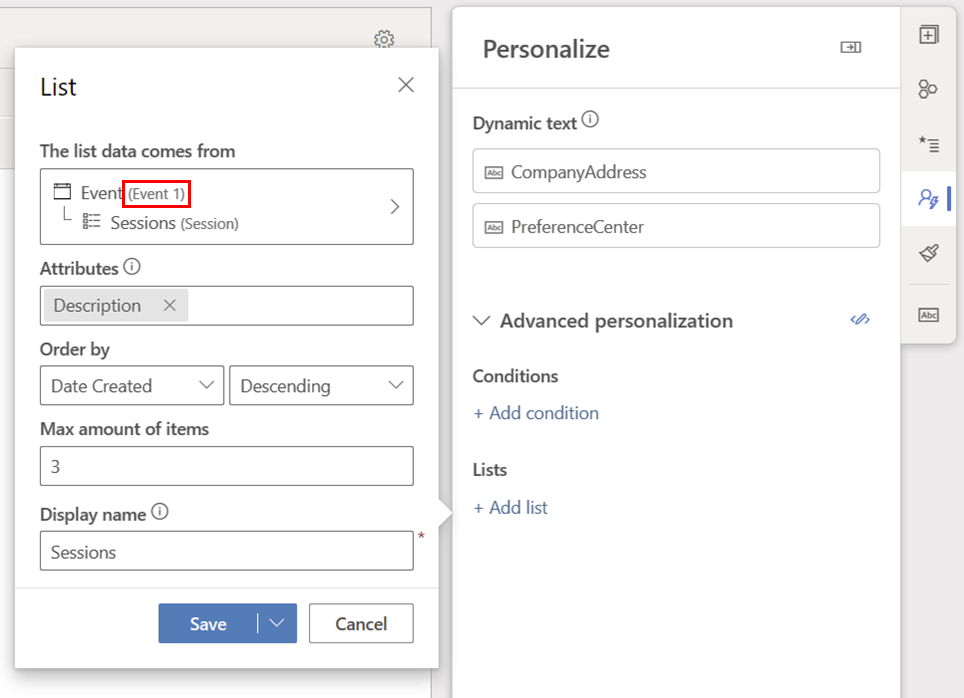

#### Validating and finalizing

While you can decide not to select a specific record right away, this selection must be done before the message can be made “ready to send”. Leaving record selection for later can be a useful approach to separate content design phase from content use (and reuse) phase. This is also how templates can be created. For example, a generic event invitation message like below can be created where all of the event related dynamic text don't have an event selected. 

> [!div class="mx-imgBorder"]
> 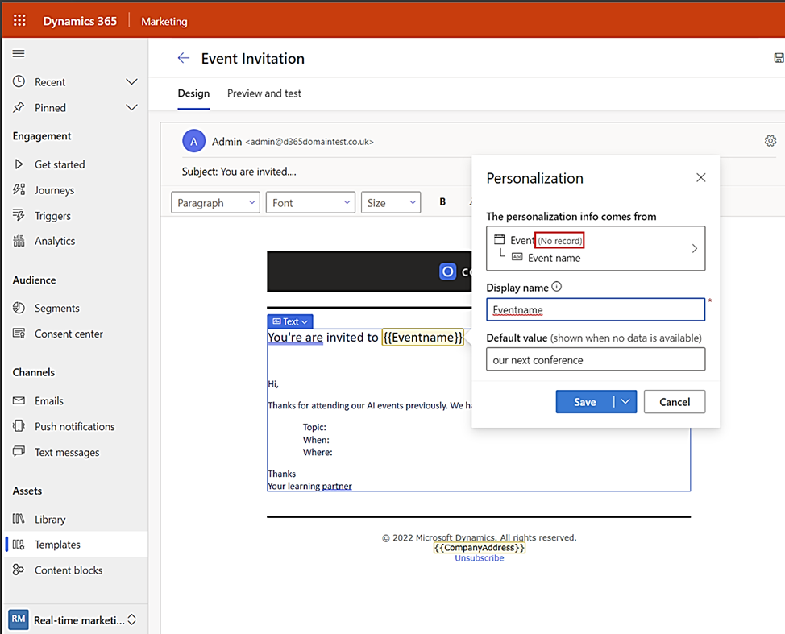

The event selection step can then be completed when the message created from this template is ready to be used in a journey.  If one tries to make the message “Ready to send” without completing this step, validation will give an error message. Even without running the validation step, one can see what needs to be done in the personalization tab

> [!div class="mx-imgBorder"]
> 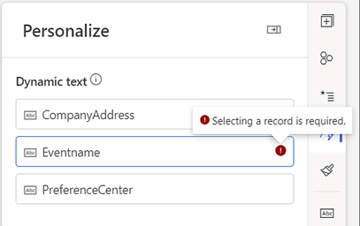

#### Limitations

1.	The list of tables is limited to commonly used pre-defined tables and can't be changed.
2.	The additional tables are not available to define conditions for [Conditional content](/docs.microsoft.com/dynamics365/marketing/conditional-content) or [Journey conditions](/learn.microsoft.com/dynamics365/marketing/real-time-marketing-tile-reference?source=recommendations#attribute-branch)

> [!TIP]
> Removing dynamic text only removes it from the pre-defined list, it does not remove it from the messages that are already using it.

> [!NOTE]
> The pre-defined dynamic text feature has a few known issues. To learn more, refer to [Known issues in real-time marketing](real-time-marketing-known-issues.md#personalization).