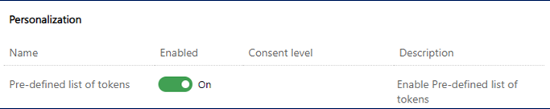

# Preview: Personalize content using pre-defined tokens

> [!IMPORTANT]
> A preview feature is a feature that is not complete, but is made available before it’s officially in a release so customers can get early access and provide feedback. Preview features aren’t meant for production use and may have limited or restricted functionality.
> 
> Microsoft doesn't provide support for this preview feature. Microsoft Dynamics 365 Technical Support won’t be able to help you with issues or questions. Preview features aren’t meant for production use, especially to process personal data or other data that are subject to legal or regulatory compliance requirements.

Personalized messages help marketers drive engagement. A common way to personalize content is to use dynamic text (also known as placeholder text or tokens) that is automatically replaced with recipients' personal details when the message is sent. For example, rather than using a generic greeting like “Dear customer,” you can use dynamic text (“Dear ``{{FirstName}}``”) that is replaced with the customer name (“Dear John”) upon sending the message.

An instance of placeholder text such as ``{{Firstname}}`` is called a token. Before you can use tokens, you need to define three pieces of information:

1. **Data binding**: Where the replacement data for the token will come from (for example, the “firstname” attribute of a “Contact” table).
1. **Label**: How the token is referred to within the message text (for example, ``{{Firstname}}``).
1. **Default value**: What text to use if the source data is empty.

Defining data binding requires some understanding of the [Dataverse data model](/powerapps/maker/data-platform/data-platform-intro) to correctly connect a token to the right data source.

Pre-defined tokens are tokens that have already been defined by someone else and are ready to be used. Marketing ships with a set of commonly used pre-defined tokens. More can be added by you or your teammates (see [Creating and sharing tokens](real-time-marketing-predefined-tokens.md#creating-and-sharing-tokens)).

> [!NOTE]
> Pre-defined tokens are currently available only in English. They will be available in all languages at the time of general availability.

## Enable the pre-defined tokens preview

This content refers to a feature that is in preview and may not be enabled in your environment. If you don’t see this feature in your app, contact your admin who can enable it by going to **Settings** > **Feature switches** > **Personalization** and enabling the **Pre-defined list of tokens** feature switch.

> [!div class="mx-imgBorder"]
> 

## Using pre-defined tokens

Select **Personalize** in the email or text message editor to see a list of pre-defined tokens. Next, select a token from the list to insert it into the message:

**Email editor**:

> [!div class="mx-imgBorder"]
> 

**Text message editor**:

> [!div class="mx-imgBorder"]
> 

The pre-defined token list may be different than shown here because it's dynamic. As your admin and other users create and share additional tokens, they'll be added to the list. The top 10 items on the list are sorted by org-wide usage. If there are more than 10 items in the list, you'll see the remaining items sorted by alphabetical order after the top 10 items.

> [!div class="mx-imgBorder"]
> 

You can hover on a token in the pre-defined list to see its details. Alternatively, you can select the vertical ellipses next to the token's name and then select **More info**.

### Changing the default value for the current message

Most of the time you should be able to use pre-defined tokens as-is, but sometimes you may need to change a default value. For example, the default value “Customer” may not work if your email is to non-customers. In this case, you can change the default value by selecting the token in the editor canvas and then selecting the **Personalization** menu. After changing the default value, make sure to save it. This will save an updated version of the token, *but only for the current message*.

### Changing the default value globally

If the default value provided isn't appropriate for your situation (for example, you may refer to your customers as “clients” or “guests” rather than “customer”), you can change the default value for everyone. To change the global default value, select the vertical ellipses next to the token's name and then select **Update pre-defined token**. This will update the pre-defined token for the current message and globally for future usage of the token in new messages (existing messages aren't affected).

> [!div class="mx-imgBorder"]
> 

> [!IMPORTANT]
> The **Update pre-defined token** command only applies to the current message and future messages. It does not retroactively change previous uses of the token.

## Creating and sharing tokens

You aren't limited to the pre-defined tokens that are included with the Marketing app. Any user can create a new token and share it with their team by adding it to the pre-defined tokens list.

To define and share a new token, follow these steps:

1. Place your cursor in an empty space in the text box and then select **Personalization** from the menu bar that pops up. This opens the pre-defined personalization list.
1. Select **New token** at the bottom of the pre-defined tokens menu and complete steps to define the new token.

    > [!div class="mx-imgBorder"]
    > 

1. Select the down-facing carat next to the **Save** button and choose the **Save & add to pre-defined list** option.

    > [!div class="mx-imgBorder"]
    > 

## Removing pre-defined tokens

To remove a pre-defined token:

1. Place your cursor in an empty space in the text box and then select **Personalization** from the menu bar that pops up.
1. Select the vertical ellipses next to the token name.
1. Select **Remove pre-defined token** from the menu.

    > [!div class="mx-imgBorder"]
    > 

> [!TIP]
> Removing a token only removes it from the pre-defined list, it does not remove it from the messages that are already using it.

> [!NOTE]
> The pre-defined tokens preview feature has a few known issues. To learn more, refer to [Known issues in real-time marketing](real-time-marketing-known-issues.md#personalization).