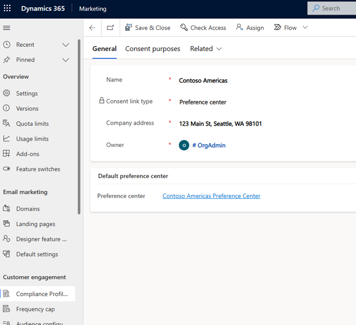

# Real-time marketing preference centers

Preference centers in real-time marketing allow you to provide customers with branded experiences to sign up for communications and fine-tune their preferences to ensure they receive the right communications.

## Creating preference centers

In real-time marketing, each compliance profile starts with a default preference center that you can configure. To setup the preference center, go to **Settings** > **Customer engagement** > **Compliance profiles** and select the compliance profile with the preference center to update. Follow the link to the preference center to make updates.

> [!div class="mx-imgBorder"]
> 

> [!NOTE]
> Customers who have used real-time marketing preference pages prior to the introduction of the preference center will have a compliance profile already created with the previously configured preference page in place of a preference center. There is no change to those existing preference pages.

The default preference center includes options for users to opt in or opt out of the **Commercial** and **Tracking** purposes, along with the default contact point of the user’s email address. You can update how the purposes capture consent in various ways to ensure you capture consent appropriately:

- Update the contact point(s) for which consent is captured
- Update the page directly to change the text displayed for each purpose to make it clear to the user
- Change whether checking the box opts the user in or out of communications
- Add or remove a purpose so the preference center collects the right information
- Add topics to the form to capture more granular preferences

:::image type="content" source="media/real-time-marketing-preference-center.png" alt-text="Preference center screenshot." lightbox="media/real-time-marketing-preference-center.png":::

In addition, you can add content and update the branding and styling of the page to make the experience seamless for your users.

> [+NOTE]
> Real-time marketing preference centers will update the contact point consent record for the email and phone number channels. It will not make updates to the DoNotEmail and DoNotBulkEmail fields on the contact or lead record. This is because there is no mapping between Real-time marketing purposes and topics to the fields on the contact or lead.

### See also

[Manage user compliance settings in real-time marketing](real-time-marketing-compliance-settings.md)
[Manage consent for email and text messages in real-time marketing](real-time-marketing-email-text-consent.md)
[Outbound marketing compliance settings](privacy-use-features.md)

[!INCLUDE[footer-include](../includes/footer-banner.md)]